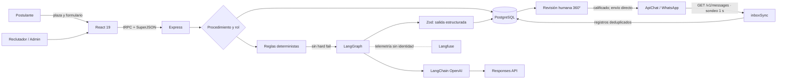
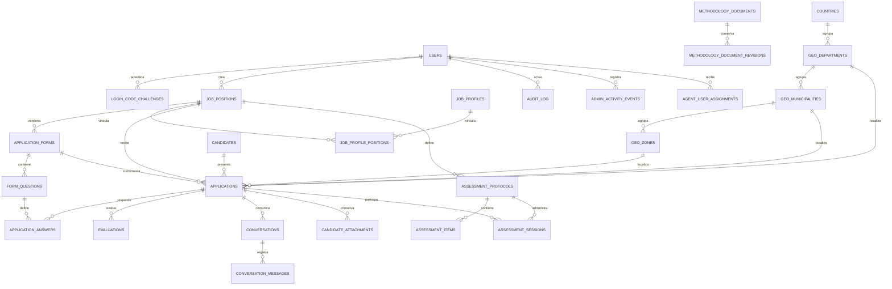

<!-- Documento académico-comercial auditado el 11 de septiembre de 2026. -->

<p align="justify">
  
</p>

<h1 align="justify">Empleos de Energia Solar en Guatemala | Talento AISA · JARVI RH 2.0.135</h1><p></p>

<p>Empleos de energia solar en guatemala, bolsa de empleo líder en Guatemala especializada en energía solar, refrigeración ecoeficiente y sistemas de bombeo agrícola. Conectamos talento técnico e ingenieros expertos en proyectos fotovoltaicos aplicados a la industria de alimentos y agro guatemalteco.</p>
<p></p>
<p align="left">
  
  
  
  
  
  
  
  
  
  
</p>

<p align="center">
  
  <br />
  <sub>Agente JARVI RH 2.0.135 de Talento AISA (IA Evaluadora).</sub>
</p>

Talento AISA vincula capacidades técnicas con proyectos industriales, energéticos, alimentarios y agrícolas de Alternativas Inteligentes, S. A. JARVI RH integra plazas, formularios y protocolos versionados, evaluación asistida por IA, revisión humana, conversaciones ApiChat, solicitud controlada de currículum y auditoría administrativa. Automatiza trabajo repetitivo sin transferir al modelo la responsabilidad institucional de contratar, fijar remuneración o atribuir rasgos psicológicos: el personal autorizado conserva la decisión.

## 1. Reglas configuradas, salida estructurada, cambios humanos, mensajes y eventos de bitácora

ACTUALIZACIÓN DE LA VERSIÓN

<!-- release-history:start -->

### 14SEP2026 · JARVI RH 2.0.135

- Un proyecto vincula múltiples plazas con lista de verificación que escanea las plazas configuradas; «Guardar proyecto» persiste las relaciones y la vista de plazas administra los proyectos de cada RAG.
- La migración `0017` conserva el vínculo anterior en `knowledge_project_positions` sin pérdida de relaciones.

Descripción: vinculación múltiple de plazas al RAG del proyecto desde ambas vistas administrativas.

### 14SEP2026 · JARVI RH 2.0.134

- MST-EIR se convierte en Administrador de Proyectos: múltiples proyectos con carpetas, carga por arrastre, visores integrados y metadatos de procedencia.
- PDF y Word generan un resumen de 66 palabras y un análisis de 325 que alimentan el RAG del proyecto, fuente de aprendizaje del Agente de IA.
- Extensiones y peso máximo se administran en Configuración; las alertas citan esos valores. La migración `0016` conserva proyectos, carpetas, archivos y análisis.

Descripción: base de conocimiento RAG por proyecto con visores multimedia en una sola página responsive.

### 14SEP2026 · JARVI RH 2.0.133

- n8n queda retirado; el puente `inboxSync` rellena la bandeja cada segundo desde el historial del proveedor con deduplicación por identificador.
- Configuración administra los siete endpoints oficiales ApiChat con interruptores auditados; la bandeja añade burbujas con hora y ticks, punteo IA y etiqueta humano/agente.
- Borrar una versión de prueba exige un código temporal de seis dígitos por correo; la migración `0015` conserva desafío y auditoría.
- La actividad ISO compone títulos de 11 palabras y resúmenes de 33, con mapa ISO/IEC 20000-1.

Descripción: operación directa con ApiChat sin n8n y trazabilidad ISO reforzada; la decisión humana permanece.

### 11SEP2026 · JARVI RH 2.0.132

- En los modos oscuros, los textos rojos y rosados (aviso de regla salarial, insignias de configuración y errores) adoptan el amarillo de atención institucional sobre las superficies grafito; el tema claro conserva la semántica original.
- El color acompaña al icono y a la etiqueta, y no sustituye el significado del estado.

Descripción: legibilidad del texto de advertencia en temas oscuros, sin alterar la semántica del tema claro.

### 11SEP2026 · JARVI RH 2.0.131

- Langfuse migra del cliente heredado al SDK modular 5.11.1 y OpenTelemetry: inicializa antes de aceptar tráfico, instrumenta el grafo, las generaciones OpenAI, la normalización editorial, ApiChat, solicitudes de currículum, bandeja y audio, y vacía la cola durante un cierre ordenado.
- La configuración administrativa activa trazas en vivo, región cerrada, ambiente, modo de protección y muestreo. Las credenciales permanecen cifradas en PostgreSQL; guardarlas o rotarlas recarga el procesador sin reiniciar y “Verificar” crea una traza diagnóstica visible de inmediato.
- La política predeterminada transmite solo metadatos seudónimos. Un filtro previo a la salida bloquea credenciales y datos personales; las rutas conservan latencia, modelo, consumo, resultado, error clasificado y versión sin almacenar textos privados en el repositorio.
- La validación incorpora pruebas de caja negra para ausencia de credenciales, región incorrecta, redacción, rotación, trazas jerárquicas, fallo cerrado de política y continuidad de la operación cuando la telemetría no está disponible.

Descripción: observabilidad operacional en vivo con aislamiento de secretos, minimización de datos y degradación segura; la telemetría apoya la auditoría y no sustituye la decisión humana ni acredita certificación ISO/DORA.

### 11SEP2026 · JARVI RH 2.0.130

- La actividad administrativa incorpora un resumen transversal por hoja, títulos deterministas de 11 palabras, resúmenes de 35 palabras, mapa anual con drilldown y actualización por sondeo; JARVI HR se identifica con `adminit@aisa.com.gt` y puede asignarse a un usuario activo.
- La bandeja de entrada reúne diez conversaciones de la última hora, consulta histórica de hasta 30 resultados, filtros, semáforo textual, ficha de candidato, acceso desde Revisión Humana, traspaso auditado y teclado humano sujeto a precondiciones. El receptor normalizado deduplica únicamente texto entrante por identificador del proveedor; la cuarentena conserva huellas HMAC y no el mensaje ni el teléfono.
- El módulo Pruebas psicométricas incorpora protocolos e ítems versionados, cuatro niveles y un catálogo de 64 criterios de gobierno no verificados automáticamente. La activación comprueba longitud y vocabulario declarativo; no verifica validez psicométrica ni aprobación externa.
- Agente de IA permite seleccionar modelos especializados, voz y cuotas para Responses, transcripción y TTS con endpoints cerrados; una instrucción fija y filtros léxicos bloquean patrones conocidos de oferta económica. En mensajes entrantes normalizados, la expectativa permanece en cero sin declaración explícita y solo se conserva un monto nuevo cuando es menor que el registrado.
- La migración `0014` amplía conversaciones, adjuntos, actividad, asignación y evaluación sin eliminar estructuras anteriores; el protocolo DORA/ISO documenta rollback, brechas operativas, privacidad y caja negra sin afirmar certificación.

Descripción: gobierno cognitivo trazable, comunicación humana controlada y base preparatoria para resiliencia, sujeta a validación operativa, telemetría de despliegues e incidentes y ejercicios de recuperación.

### 10SEP2026 · JARVI RH 2.0.129

- Configuración > WhatsApp administra modo, endpoint, conexión, webhook, Client ID, token e ID heredado; los secretos se cifran con AES-256-GCM y la interfaz solo recibe máscaras.
- El envío y el reintento consultan exclusivamente PostgreSQL; se elimina la caída silenciosa a variables ApiChat de EasyPanel y la ruta genérica deja de aceptar secretos.
- La verificación usa el endpoint de estado de la API nativa sin enviar mensajes ni exponer códigos QR; la migración `0013` inicializa valores públicos y filas secretas vacías.

Descripción: almacén central de credenciales ApiChat con control administrativo, auditoría, rotación y consumo seguro en servidor.

### 10SEP2026 · JARVI RH 2.0.128

- La landing corrige el mensaje institucional a «Plataforma Laboral No.1».
- La prueba de caja negra bloquea específicamente el sufijo retirado «de Guatemala».

### 10SEP2026 · JARVI RH 2.0.127

- La landing sustituye la descripción secundaria por «Plataforma Laboral No.1 de Guatemala».
- La prueba de caja negra exige el texto aprobado y bloquea la frase anterior.

### 10SEP2026 · JARVI RH 2.0.126

- Las responsabilidades de las plazas publicadas exigen una oración autónoma, verbo en infinitivo y puntuación; la poscondición rechaza fragmentos aunque cumplan el esquema JSON.
- La política versionada renueva la evidencia y audita las plazas al iniciar, sin consumir OpenAI durante las visitas.

### 10SEP2026 · JARVI RH 2.0.125

- Vista 360° del Candidato pagina la evaluación en bloques estáticos: tres tarjetas en escritorio y una en ancho reducido, con texto íntegro y navegación exclusiva por botonera superior.
- La navegación de resultados sube al encabezado; la columna fija usa contraste propio en Day y Dark, reduce su ancho y muestra únicamente nombre y plaza.

### 10SEP2026 · JARVI RH 2.0.124

- Un control editorial transversal con GPT-4.1 mini revisa plazas, perfiles, objetivos, responsabilidades, requisitos, formularios, preguntas, ayudas, opciones y mensajes públicos configurables antes de guardarlos, activarlos o publicarlos.
- La validación recompone fragmentos en una idea completa por línea, preserva variables y condiciones, rota credenciales, falla de forma cerrada y registra evidencia reutilizable; al iniciar, un barrido controlado alcanza las plazas públicas ya existentes.
- El build audita también los textos institucionales fijos y bloquea cualquier ruta que pierda el control editorial.

### 10SEP2026 · JARVI RH 2.0.123

- GPT-4.1 mini corrige ortografía, gramática, redacción y estructura antes de publicar; la evidencia se reutiliza sin consumir tokens durante las visitas.
- La portada dice «Cada candidato merece una evaluación a su medida», acorta el enlace jurídico y presenta a Talento AISA como plataforma tecnológica de oportunidades laborales.

### 10SEP2026 · JARVI RH 2.0.122

- Perfiles laborales preserva `position_ids`; Publicar repara el vínculo por nombre y muestra el error si está incompleto.
- Ejecutivo de Negocios (Ventas) conserva la primera posición de la landing.

### 10SEP2026 · JARVI RH 2.0.121

- La landing consume objetivo, responsabilidades y requisitos del perfil; los enlaces externos abren pestañas paralelas y JARVI duplica su escala.

### 10SEP2026 · JARVI RH 2.0.120

- Los 20 títulos `h1` y el encabezado jurídico usan blanco semántico en temas oscuros; un oráculo CSS impide regresiones.

### 10SEP2026 · JARVI RH 2.0.119

- Tratamiento institucional «usted» homologado en portal, formularios, administración, correo y WhatsApp.

### 10SEP2026 · JARVI RH 2.0.118

- Página interna, responsive y temática de privacidad, términos y condiciones.
- Hipervínculo abre una pestaña paralela, conserva el formulario y publica metadata canónica.

### 10SEP2026 · JARVI RH 2.0.117

- Tres confirmaciones obligatorias y compactas incorporadas a todos los formularios públicos.
- Cliente y endpoint bloquean omisiones; `audit_log` conserva texto, versión y aceptación.

### 10SEP2026 · JARVI RH 2.0.116

- Body, tarjetas, menús, formularios y retícula consumen tokens compilados como variables dinámicas; las superficies estructurales usan gris grafito.
- El build impide regresar a colores claros fijos.

### 10SEP2026 · JARVI RH 2.0.115

- Day, Dark Dimmed y Dark High Contrast forman un sistema de visualización alternativa; no garantiza una reducción clínica de fatiga visual.

### 10SEP2026 · JARVI RH 2.0.114

- Teléfono normalizado; Zona 1–25, departamento y municipio obligatorios.

### 10SEP2026 · JARVI RH 2.0.113

- Revisión Humana 360° compactada, con navegación asistida y logotipo transparente.
- Tema oscuro acromático inicial, reemplazado por los tokens semánticos de 2.0.115.

<!-- release-history:end -->

El objeto sociotécnico no es “la IA” aislada, sino el ensamblaje persona/plaza/formulario/evidencia/regla/modelo/revisor. La pregunta rectora es: **¿cómo acelerar la preclasificación de talento especializado manteniendo procedencia, seguridad, posibilidad de refutación y autoridad humana?** La unidad de análisis es una postulación; las unidades de evidencia son respuestas, reglas configuradas, salida estructurada, cambios humanos, mensajes y bitácora.

La validez de construcción exige que los campos representen competencias; la interna, que el dictamen derive de evidencia; la externa, que los criterios se sostengan entre plazas; y la operacional, que transacciones, permisos y pruebas ejecuten el contrato. El software aporta trazabilidad, no prueba justicia laboral ni validez predictiva; ello requiere datos longitudinales y revisión experta.

## 2. Arquitectura y dependencias

La solución es una aplicación web TypeScript de tres capas. React 19, Wouter, TanStack Query, Tailwind CSS y componentes Radix construyen la experiencia pública y administrativa; Express publica el artefacto y monta `/api/trpc`; tRPC y Zod definen contratos y autorización; PostgreSQL conserva el estado; Drizzle documenta el esquema y sus migraciones. LangGraph 1.4.14 coordina una llamada acotada mediante LangChain OpenAI 1.5.11 y OpenAI SDK 7.13.0 sobre Responses API. Langfuse es observabilidad opcional; ApiChat, SMTP y almacenamiento S3 prefirmado son adaptadores externos.



| Módulo | Función especializada | Evidencia principal |
| --- | --- | --- |
| Portal público | Expone plazas con perfil completo, normaliza teléfono y exige ubicación catalogada. | `Home.tsx`, `Apply.tsx`, `publicJobs.*`, `geo.*` |
| Administración | Usuarios y roles, plazas, perfiles, geografía INE, formularios y configuración. | `App.tsx`, `routers.ts` |
| Evaluación IA | Reglas críticas, política salarial, seis bloques, salida tipada, respaldo de credencial y persistencia. | `agentEvaluator.ts`, `salaryPolicy.ts`, `evaluation.ts` |
| Revisión 360° | Matriz dinámica, filtros, última evaluación, respuestas, acceso a WhatsApp y decisión humana. | `HumanReview.tsx`, `candidates.reviewWorkspace` |
| Comunicación | Bandeja completa, sincronización cada segundo, catálogo de siete endpoints, traspaso humano y envío directo con estado local. | `Inbox.tsx`, `inbox.ts`, `inboxSync.ts`, `apiChatSettings.ts` |
| Protocolos | Administra versiones, preguntas ordenadas, evidencia metodológica y 64 criterios de gobierno sin estado automático de cumplimiento. | `Assessments.tsx`, `assessmentGovernance.ts` |
| Conocimiento | Proyectos, carpetas, carga por arrastre, visores multimedia, resumen de 66 palabras, análisis de 325 y RAG para el agente. | `MstEir.tsx`, `knowledge.ts`, `knowledgeRoutes.ts` |
| Audio | Ofrece helpers aislados de cuota, formato, transcripción y TTS con rotación; no existe aún ingesta productiva de medios de candidatos. | `voiceTranscription.ts`, `agentSettings.ts` |
| Gobierno | Proyecta actividad por hoja, drilldown anual, release, bitácora y puerta CI. | `activityAudit.ts`, `shared/release.ts`, `.github/workflows/black-box.yml` |

Las dependencias no equivalen a capacidades logradas. LangGraph contiene un grafo lineal `START → evaluate → END`: frontera de orquestación, no un agente autónomo con múltiples herramientas. Drizzle tipa entidades, mientras varias consultas operativas usan SQL parametrizado directo. El envío ApiChat se ejecuta en el backend con los siete endpoints oficiales; la recepción la resuelve el puente `inboxSync` con deduplicación por identificador del proveedor. n8n quedó retirado en 2.0.133.

El puente recorre en turnos, refresca el catálogo cada 60 segundos y se repliega 60 segundos ante un límite de tasa. La deduplicación impide registros dobles; la entrega exactamente una vez sigue sin demostrarse.

## 3. Proceso funcional y evaluación especializada de IA

1. El administrador relaciona plaza, perfil, versión de formulario y preguntas. Cada pregunta puede definir respuestas aceptadas, rango, criterio, prompt y `hard_fail`.
2. El postulante envía identidad, zona, departamento, municipio y respuestas. El servidor normaliza el teléfono con `+502`, valida la relación geográfica activa y evita duplicar la misma persona telefónica en una plaza.
3. El evaluador normaliza y ejecuta reglas deterministas. Un incumplimiento indispensable finaliza como `no_calificado` sin consumir el modelo.
4. Si las reglas pasan, el servidor reúne plaza, perfil, preguntas y respuestas; agrega, si fueron habilitados, los documentos institucionales SIERA y MST-EIR y la base de conocimiento RAG del proyecto vinculado.
5. LangChain solicita a Responses API una estructura validada por Zod: seis bloques únicos, razonamientos, resumen, motivo, evidencia, brechas y posible descalificación crítica. Si falla la clave principal, intenta la de respaldo.
6. El servidor, no el modelo, calcula el total ponderado: ajuste 10 %, experiencia 20 %, competencias 25 %, disponibilidad 10 %, riesgos/brechas 20 % y dictamen 15 %. Los intervalos son 90–100 prioritario, 80–89 precalificado, 70–79 condicionado, 60–69 revisión humana y 0–59 no precalificado.
7. Un bloqueo consultivo PostgreSQL impide evaluar simultáneamente la misma postulación. Resultado, payload, modelo, reglas, resumen y evento se guardan en transacción.
8. Reclutamiento revisa evidencia y modifica el estado con comentario. Solo la transición humana a `calificado` prepara la solicitud de CV. La clave `cv_request:{applicationId}` evita duplicados; un resultado incierto no se reintenta automáticamente.

Este diseño combina automatización simbólica y generativa. Las reglas son falsables y repetibles; el modelo interpreta evidencia abierta, pero su salida permanece probabilística. Structured Outputs restringe la forma, no garantiza la verdad; la explicación es justificación auditable, no prueba causal del modelo. Por ello la prueba adecuada compara entradas, reglas, salidas y decisiones posteriores, e incluye casos adversos, cambio de modelo y revisión de falsos positivos/negativos.

## 4. Ontología, epistemología y fenomenología

**Ontología.** La persona real no es idéntica al registro `candidate`; este representa contacto, mientras `application` representa su participación situada en una plaza. `job_position` expresa la oferta; `job_profile`, el constructo organizacional esperado; `application_form` fija un instrumento y versión; `question` operacionaliza un criterio; `answer` conserva una afirmación; `evaluation` es un juicio derivado y revisable. Esta distinción evita reificar el puntaje como propiedad esencial de la persona. Para Gruber (1993), es una conceptualización local, no una ontología universal del talento.

**Epistemología.** JARVI conoce únicamente lo persistido y configurado. Una respuesta es testimonio, no verificación de experiencia; una ausencia es brecha, no evidencia negativa. El sistema separa resultado determinista, evidencia citada, inferencia, resumen y decisión humana. La posibilidad de revisar o contradecir el dictamen aproxima una racionalidad crítica: una recomendación útil debe poder fallar de forma observable (Popper, 2002). Sin referencia etiquetada, acuerdo interevaluador, calibración y monitoreo de deriva, el puntaje es apoyo ordinal, no probabilidad científica de desempeño.

La interacción escrita adopta **usted** como forma institucional. Se sustituyó el tuteo en instrucciones, preguntas, errores, confirmaciones, correo y WhatsApp. El oráculo `scripts/verify-formal-spanish.mjs` detiene el release ante tratamientos informales; la migración `0012_dear_lifeguard.sql` corrige solo valores predeterminados y conserva textos libres.

**Fenomenología.** La postulación es también una experiencia vivida: la persona interpreta preguntas, expone trayectoria y enfrenta una interfaz que distribuye poder; el puntaje no agota el fenómeno (Husserl, 2012; Moustakas, 1994). Reducir esa experiencia a seis números puede invisibilizar contexto o desigualdad de acceso. La revisión 360° reabre el horizonte mostrando respuesta, pregunta, brecha, motivo e historial. Una práctica responsable añade aviso de uso de IA, accesibilidad y canal de impugnación. La eficiencia comercial es legítima únicamente cuando conserva dignidad, agencia y responsabilidad institucional (UNESCO, 2021).

## 5. Diseño de datos y procedencia para auditoría



La auditoría primaria reside en `audit_log`: actor, tipo e identificador de entidad, acción, estado anterior/posterior, comentario y tiempo. `admin_activity_events` agrega ruta, resultado, acción esperada/real y correlación; su representación transversal usa exactamente 11 palabras de título y 33 de resumen. `evaluations` conserva ejecuciones múltiples; `conversation_messages` añade una clave local de deduplicación, intentos, proveedor, error y estado. `knowledge_files` conserva nombre, peso, extensión, autor, resumen y análisis de cada carga. Protocolos e ítems preservan versión y orden. Índices por aplicación, estado, plaza y entidad soportan reconstrucción.

Persisten riesgos de procedencia. Las respuestas apuntan a preguntas mutables y no guardan instantánea de etiqueta, criterio y prompt. `audit_log` y `admin_activity_events` no son criptográficamente inmutables; las fechas usan reloj de base sin firma y no hay retención ejecutable. La evolución recomendada: snapshots de instrumento y perfil, hash encadenado o WORM, catálogo de base legal y borrado programado.

## 6. Matriz de alineación ISO y seguridad

| Marco | Evidencia existente | Brecha o prueba requerida |
| --- | --- | --- |
| ISO/IEC 25010:2023 | Separación modular, contratos tipados, cuotas, transacciones, interfaz adaptable y build reproducible. | Definir medidas para las nueve características, SLO, accesibilidad completa, carga, recuperación y mantenibilidad. |
| ISO/IEC 27001:2022 / 27002:2022 | Roles, SQL parametrizado, OTP scrypt, JWT `httpOnly`, secretos AES-256-GCM, cabeceras de sincronización autenticadas y minimización. | SGSI formal, inventario, evaluación de riesgos, retención, respaldo, incidentes, proveedores y revisión de accesos. |
| ISO 22301:2019 | Rotación de credenciales, timeouts, deduplicación de mensajes entrantes, fallo cerrado y migración expansiva compatible con rollback de aplicación. | BIA, RTO/RPO aprobados, plan de continuidad, restauración probada, simulacros y modos degradados. |
| ISO/IEC 20000-1:2018 | Mapa de controles de gestión del servicio en Actividad y control ISO y cambios de configuración auditados. | SGS formal, catálogo acordado, capacidad/demanda y mejora continua. |
| ISO/IEC/IEEE 29119-1:2022 | Casos Vitest, caja negra versionada y CI con release, regresión, tipos y build. | Trazabilidad requisito–riesgo–caso, cobertura, seguridad dinámica, E2E y evidencia firmada. |
| ISO/IEC 42001, 25059 y 23894 / NIST AI RMF | Autoridad humana, modelo y reglas configurables, política salarial, evidencia, límites psicométricos y telemetría minimizada. | AIMS formal, inventario de impactos, benchmark por plaza, sesgo, deriva, apelación, incidentes y retiro seguro del modelo. |
| DORA | Versionado, migraciones, pruebas y build como capacidades preparatorias. | Integrar despliegues e incidentes para calcular las cinco métricas; el mapa de contribuciones no las sustituye. |

Esta matriz documenta referencias metodológicas y no constituye certificación, conformidad acreditada ni dictamen independiente de cumplimiento.

El acceso usa códigos de seis dígitos de diez minutos, máximo cinco intentos, espera de reenvío y respuesta uniforme para reducir enumeración. Los secretos del agente y ApiChat se cifran, y el navegador recibe máscaras. Langfuse se inicia con OpenTelemetry antes de aceptar tráfico y, en su política predeterminada, traza identificadores HMAC, modelo, uso, latencia, puntaje, clasificación y estado sin nombre, teléfono, correo, CV ni respuestas literales. Todavía faltan rate limiting global, protección CSRF explícita, escaneo de dependencias, cabeceras de seguridad y cobertura configurada. Son hallazgos de riesgo, no evidencia de explotación.

## 7. Verificación, despliegue y reproducibilidad

```bash
pnpm install --frozen-lockfile
pnpm release:verify
pnpm test:black-box
pnpm test
pnpm check
pnpm build
```

`package.json` es la fuente canónica de versión. Cada push a `main` incrementa exactamente un release; GitHub Actions verifica metadata, comparación Git, caja negra, regresión, TypeScript y build. La base requiere `DATABASE_URL`; producción configura `JWT_SECRET`, SMTP y `AGENT_SETTINGS_ENCRYPTION_KEY`. Las credenciales de ApiChat y del agente se administran cifradas desde la interfaz. Las migraciones `0014` a `0016` se aplican con respaldo, revisión SQL y segregación de funciones. Guías complementarias: [observabilidad Langfuse 2.0.131](docs/OBSERVABILIDAD_LANGFUSE_2.0.131.md), [análisis cognitivo y DORA 2.0.130](docs/ANALISIS_COGNITIVO_DORA_2.0.130.md), [implementación](docs/IMPLEMENTACION.md), [instalación](docs/INSTALLATION.md), [ApiChat directo](docs/APICHAT_DIRECTO.md), [agente evaluador](docs/AGENTE_EVALUADOR.md), [revisión humana](docs/REVISION_HUMANA_360.md), [gobierno](docs/RELEASE_GOVERNANCE.md) y [caja negra 2.0.135](docs/PRUEBAS_CAJA_NEGRA_2.0.135.md).

## 8. Capa cognitiva, resiliencia y alcance verificable

La migración `0014` incorpora actividad transversal, bandeja, protocolos versionados, expectativa salarial y preferencias de transcripción/TTS. La migración `0015` añade `protocol_delete_challenges`: borrar una versión de prueba exige un código temporal de seis dígitos por correo. La migración `0016` añade proyectos, carpetas y archivos de conocimiento con resumen y análisis de IA; el directorio de almacenamiento se configura con `KNOWLEDGE_STORAGE_DIR`. Los helpers de audio aceptan una extensión declarada permitida o un MIME mapeado, aplican cuota administrativa y rotación principal/respaldo; no detectan el tipo por contenido. La recepción productiva de medios y documentos sigue pendiente de integrar con descarga, detección real de tipo, antivirus, bucket, previsualización y retención.

La guía DORA define cinco métricas: entrega, frecuencia de despliegue, recuperación, fallos y retrabajo. El repositorio no ingiere despliegues e incidentes suficientes para calcularlas; el mapa «Contribuciones a Talento AISA este año» no las sustituye.

Los protocolos de evaluación son infraestructura de gobierno y autoría; no son instrumentos psicométricos validados. La activación técnica exige evidencia documental, pero únicamente un estudio para la población y uso previstos puede sostener validez y confiabilidad. El análisis completo, query de ApiChat sin secretos, checklist de despliegue, rollback y brechas está en [ANALISIS_COGNITIVO_DORA_2.0.130.md](docs/ANALISIS_COGNITIVO_DORA_2.0.130.md); el protocolo operacional nuevo está en [OBSERVABILIDAD_LANGFUSE_2.0.131.md](docs/OBSERVABILIDAD_LANGFUSE_2.0.131.md).

## 9. Protocolo de Ingeniería de Software

La contribución de JARVI RH no debe medirse por incorporar un modelo de lenguaje, sino por la calidad del artefacto sociotécnico completo. Desde la ciencia del diseño, su utilidad inicial reside en convertir criterios dispersos en un proceso explícito, repetible y susceptible de inspección. El conocimiento producido es prescriptivo: propone que una preclasificación laboral puede combinar reglas, interpretación generativa, cálculo controlado, persistencia y revisión humana. Sin embargo, la eficacia técnica observada en pruebas unitarias no prueba eficacia organizacional. Tampoco permite concluir que el sistema seleccione mejor, más justamente o con menor costo que el procedimiento anterior. Esas afirmaciones requieren investigación empírica independiente.

Se plantean cuatro proposiciones contrastables. **P1:** la estructura híbrida reduce el tiempo medio de revisión sin disminuir el acuerdo con especialistas. **P2:** mostrar evidencia, brechas y reglas mejora la detección de errores frente a mostrar solo una puntuación. **P3:** la recomendación varía más por la calidad del perfil e instrumento que por cambios menores de modelo. **P4:** una vía de revisión comprensible mejora la justicia procedimental percibida. Ninguna proposición se considera validada.

El protocolo recomendado comienza con un corpus seudonimizado, estratificado por plaza y periodo. Dos o más especialistas etiquetan cada caso de forma ciega y construyen un patrón de referencia mediante adjudicación. Para clasificación se medirían precisión, exhaustividad, macro-F1, matriz de confusión y falsos negativos; para puntaje, error absoluto y calibración ordinal; para operación, latencia, disponibilidad y proporción de decisiones humanas que revocan al agente. Los resultados se desagregan solo por atributos lícitos, necesarios y protegidos.

Las amenazas incluyen sesgo del corpus, criterios discriminatorios históricos, dependencia entre evaluadores y automatización del juicio. Se mitigan con preregistro, separación desarrollo–evaluación, réplica temporal y revisión ética. README, pruebas y bitácora aportan trazabilidad, no validación empírica.

## Referencias

Las páginas técnicas evolutivas se consultaron el 14 de septiembre de 2026. La presentación se adapta a Markdown y conserva los elementos autor, fecha, título y fuente de APA 7.

### API, infraestructura y modelos

1. Drizzle Team. (s. f.). _Drizzle migrations fundamentals_. https://orm.drizzle.team/docs/migrations
2. GitHub. (s. f.). _Workflow syntax for GitHub Actions_. https://docs.github.com/actions/reference/workflows-and-actions/workflow-syntax
3. International Organization for Standardization. (2022). _ISO/IEC 27002:2022 Information security, cybersecurity and privacy protection: Information security controls_. https://www.iso.org/standard/75652.html
4. International Organization for Standardization. (2023a). _ISO/IEC 23894:2023 Information technology: Artificial intelligence: Guidance on risk management_. https://www.iso.org/standard/77304.html
5. International Organization for Standardization. (2023b). _ISO/IEC 25059:2023 Software engineering: SQuaRE: Quality model for AI systems_. https://www.iso.org/standard/80655.html
6. LangChain. (s. f.-a). _ChatOpenAI integration_. https://docs.langchain.com/oss/javascript/integrations/chat/openai
7. LangChain. (s. f.-b). _Graph API overview_. https://docs.langchain.com/oss/javascript/langgraph/graph-api
8. Langfuse. (s. f.). _Masking sensitive LLM data_. https://langfuse.com/docs/observability/features/masking
9. ApiChat. (s. f.). _OpenAPI oficial de la API de mensajería_. https://panel.apichat.io/docs/swagger
10. International Organization for Standardization. (2018). _ISO/IEC 20000-1:2018 Information technology: Service management: Part 1: Service management system requirements_. https://www.iso.org/standard/70636.html
11. Node.js. (s. f.). _Crypto_. https://nodejs.org/api/crypto.html
12. OpenAI. (s. f.-a). _Create a model response_. https://developers.openai.com/api/reference/resources/responses/methods/create
13. OpenAI. (s. f.-b). _Structured model outputs_. https://developers.openai.com/api/docs/guides/structured-outputs
14. PostgreSQL Global Development Group. (s. f.-a). _Explicit locking: Advisory locks_. https://www.postgresql.org/docs/current/explicit-locking.html#ADVISORY-LOCKS
15. PostgreSQL Global Development Group. (s. f.-b). _JSON types_. https://www.postgresql.org/docs/current/datatype-json.html
16. React Team. (s. f.). _lazy_. https://react.dev/reference/react/lazy
17. tRPC. (s. f.). _Authorization_. https://trpc.io/docs/server/authorization
18. Vite. (s. f.). _Building for production_. https://vite.dev/guide/build
19. Vitest. (s. f.). _Writing tests_. https://vitest.dev/guide/learn/writing-tests
20. GitHub. (s. f.). _Managing your theme settings_. https://docs.github.com/en/get-started/accessibility/managing-your-theme-settings
21. Intaruk, R., Kongnun, J., Kwanchainond, S., & Pichaiyongwongdee, S. (2025). Immediate effects of light mode and dark mode features on visual fatigue in tablet users. _International Journal of Environmental Research and Public Health, 22_(4), 609. https://doi.org/10.3390/ijerph22040609
22. World Wide Web Consortium. (2024). _Web Content Accessibility Guidelines (WCAG) 2.2_. https://www.w3.org/TR/WCAG22/

### Normativa aplicada

23. American Psychological Association. (2020). _Publication manual of the American Psychological Association_ (7th ed.). American Psychological Association. https://www.apa.org/pubs/books/publication-manual-7th-edition-paperback
24. Gruber, T. R. (1993). A translation approach to portable ontology specifications. _Knowledge Acquisition, 5_(2), 199–220. https://doi.org/10.1006/knac.1993.1008
25. Hevner, A. R., March, S. T., Park, J., & Ram, S. (2004). Design science in information systems research. _MIS Quarterly, 28_(1), 75–105. https://doi.org/10.2307/25148625
26. Husserl, E. (2012). _Ideas: General introduction to pure phenomenology_ (W. R. Boyce Gibson, Trans.). Routledge. (Original work published 1913). https://doi.org/10.4324/9780203120330
27. International Organization for Standardization. (2022a). _ISO/IEC 27001:2022 Information security, cybersecurity and privacy protection: Information security management systems: Requirements_. https://www.iso.org/standard/27001
28. International Organization for Standardization. (2022b). _ISO/IEC/IEEE 29119-1:2022 Software and systems engineering: Software testing: Part 1: General concepts_. https://www.iso.org/standard/81291.html
29. International Organization for Standardization. (2023a). _ISO/IEC 25010:2023 Systems and software engineering: SQuaRE: Product quality model_. https://www.iso.org/standard/78176.html
30. International Organization for Standardization. (2023b). _ISO/IEC 42001:2023 Information technology: Artificial intelligence: Management system_. https://www.iso.org/standard/42001
31. Kitchenham, B., & Charters, S. (2007). _Guidelines for performing systematic literature reviews in software engineering_ (EBSE-2007-01). Keele University & Durham University.
32. Moustakas, C. (1994). _Phenomenological research methods_. SAGE. https://doi.org/10.4135/9781412995658
33. National Institute of Standards and Technology. (2023). _Artificial intelligence risk management framework (AI RMF 1.0)_ (NIST AI 100-1). https://doi.org/10.6028/NIST.AI.100-1
34. National Institute of Standards and Technology. (2024). _Artificial intelligence risk management framework: Generative artificial intelligence profile_ (NIST AI 600-1). https://doi.org/10.6028/NIST.AI.600-1
35. Peffers, K., Tuunanen, T., Rothenberger, M. A., & Chatterjee, S. (2007). A design science research methodology for information systems research. _Journal of Management Information Systems, 24_(3), 45–77. https://doi.org/10.2753/MIS0742-1222240302
36. Popper, K. R. (2002). _The logic of scientific discovery_. Routledge. (Original work published 1959). https://doi.org/10.4324/9780203994627
37. Raji, I. D., Smart, A., White, R. N., Mitchell, M., Gebru, T., Hutchinson, B., Smith-Loud, J., Theron, D., & Barnes, P. (2020). Closing the AI accountability gap. In _Proceedings of the 2020 Conference on Fairness, Accountability, and Transparency_ (pp. 33–44). ACM. https://doi.org/10.1145/3351095.3372873
38. Selbst, A. D., Boyd, D., Friedler, S. A., Venkatasubramanian, S., & Vertesi, J. (2019). Fairness and abstraction in sociotechnical systems. In _Proceedings of FAT '19_ (pp. 59–68). ACM. https://doi.org/10.1145/3287560.3287598
39. UNESCO. (2021). _Recommendation on the ethics of artificial intelligence_. https://unesdoc.unesco.org/ark:/48223/pf0000381137
40. Real Academia Española & Asociación de Academias de la Lengua Española. (s. f.-a). _Las formas de tratamiento (II). Sustantivos y grupos nominales_. https://www.rae.es/gram%C3%A1tica/sintaxis/las-formas-de-tratamiento-ii-sustantivos-y-grupos-nominales
41. Real Academia Española & Asociación de Academias de la Lengua Española. (s. f.-b). _Tutear_. En _Diccionario de la lengua española_. https://dle.rae.es/tutear

### Fuentes primarias incorporadas en 2.0.132

- Langfuse. (s. f.). _JavaScript/TypeScript observability SDK_. https://langfuse.com/docs/observability/sdk/overview
- Langfuse. (s. f.). _Data regions and availability_. https://langfuse.com/security/data-regions
- DORA. (2026). _Software delivery performance metrics_. https://dora.dev/guides/dora-metrics/
- International Organization for Standardization. (2019). _ISO 22301:2019 Security and resilience: Business continuity management systems: Requirements_. https://www.iso.org/standard/75106.html
- AERA, APA, & NCME. (2014). _Standards for Educational and Psychological Testing_. https://www.testingstandards.net/
- American Psychological Association. (2017). _Professional practice guidelines for occupationally mandated psychological evaluations_. https://www.apa.org/practice/guidelines/psychological-evaluations.html
- U.S. Equal Employment Opportunity Commission. (2007). _Employment tests and selection procedures_. https://www.eeoc.gov/laws/guidance/employment-tests-and-selection-procedures
- OpenAI. (s. f.). _Create transcription_. https://developers.openai.com/api/reference/cli/resources/audio/subresources/transcriptions/methods/create
- OpenAI. (s. f.). _Create speech_. https://developers.openai.com/api/reference/cli/resources/audio/subresources/speech/methods/create

### Fuentes primarias incorporadas en 2.0.133

- ApiChat. (s. f.). _OpenAPI oficial de la API de mensajería_. https://panel.apichat.io/docs/swagger
- International Organization for Standardization. (2018). _ISO/IEC 20000-1:2018: Service management system requirements_. https://www.iso.org/standard/70636.html

### Fuentes primarias incorporadas en 2.0.135

- pdf-parse. (s. f.). _Pure JavaScript PDF parsing_. https://www.npmjs.com/package/pdf-parse
- Mammoth. (s. f.). _Convert .docx documents to HTML_. https://www.npmjs.com/package/mammoth

## Licencia y alcance

Código distribuido bajo [licencia MIT](LICENSE). La documentación académica orienta evaluación y mejora continua; cualquier uso real debe observar legislación laboral, privacidad, no discriminación y políticas aplicables en Guatemala. Última revisión documental: **14 de septiembre de 2026**. Todos los derechos reservados por Alternativas Inteligentes, S.A.
