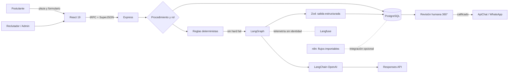
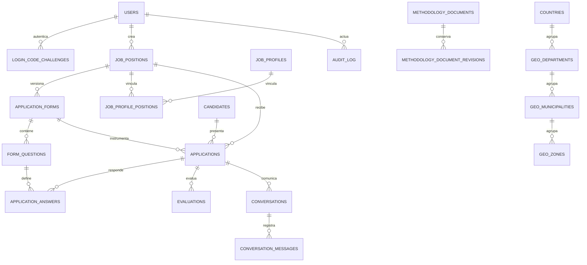

<!-- Documento académico-comercial auditado el 10 de septiembre de 2026. -->

<p align="center">
  
</p>

<h1 align="center">Empleos de Energia Solar en Guatemala | Talento AISA · JARVI RH 2.0.112</h1>

<p align="center">
  
  
  
  
  
    
</p>

<p align="center">
  
  <br />
  <sub>Agente JARVI RH 2.0.112 de Talento AISA (IA Evaluadora).</sub>
</p>

> **Empleos de energia solar en guatemala, bolsa de empleo líder en Guatemala especializada en energía solar, refrigeración ecoeficiente y sistemas de bombeo agrícola. Conectamos talento técnico e ingenieros expertos en proyectos fotovoltaicos aplicados a la industria de alimentos y agro guatemalteco** 

Empleos de energia solar en guatemala, Talento AISA es la plataforma especializada de reclutamiento de Alternativas Inteligentes, S. A. para vincular capacidades técnicas con proyectos industriales, energéticos, alimentarios y agrícolas. JARVI RH 2.0.112 integra publicación de plazas, formularios versionados, evaluación asistida por inteligencia artificial (IA), revisión humana, solicitud controlada de currículum por WhatsApp y evidencia de auditoría. Su propuesta comercial es reducir trabajo repetitivo sin transferir a un modelo estadístico la responsabilidad institucional de contratar. La automatización produce una recomendación explicada; el personal autorizado conserva la decisión.

Este README funciona como introducción comercial y base académica reproducible. Describe el sistema observado en el repositorio, no una arquitectura aspiracional. La alineación con ISO/IEC 25010:2023, ISO/IEC 27001:2022 e ISO/IEC/IEEE 29119-1:2022 es metodológica: **no constituye certificación, declaración de conformidad ni auditoría de tercera parte**. Las referencias siguen APA 7.ª, edición oficial vigente en septiembre de 2026; denominarla “APA 8” sería académicamente inexacto (American Psychological Association, 2020).

## 1. Reglas configuradas, salida estructurada, cambios humanos, mensajes y eventos de bitácora

El objeto sociotécnico no es “la IA” aislada, sino el ensamblaje persona/plaza/formulario/evidencia/regla/modelo/revisor. La pregunta rectora es: **¿cómo acelerar la preclasificación de talento especializado manteniendo procedencia, seguridad, posibilidad de refutación y autoridad humana?** Se aplicó investigación de ciencia del diseño: inspección estática de código, reconstrucción del modelo de datos, análisis de dependencias, pruebas de comportamiento observable y contraste normativo. La unidad de análisis es una postulación; las unidades de evidencia son respuestas declaradas, reglas configuradas, salida estructurada, cambios humanos, mensajes y eventos de bitácora.

La validez se separa en cuatro planos. La validez de construcción pregunta si los campos representan realmente experiencia y competencias; la interna, si el dictamen deriva de la evidencia y no de atributos protegidos; la externa, si los criterios se sostienen en distintas plazas; y la operacional, si transacciones, permisos y pruebas ejecutan el contrato. El software aporta trazabilidad, pero no demuestra por sí solo justicia laboral, ausencia de sesgo o validez predictiva. Esas hipótesis requieren datos longitudinales, revisión experta y métricas desagregadas.

## 2. Arquitectura y dependencias

La solución es una aplicación web TypeScript de tres capas. React 19, Wouter, TanStack Query, Tailwind CSS y componentes Radix construyen la experiencia pública y administrativa; Express publica el artefacto y monta `/api/trpc`; tRPC y Zod definen contratos y autorización; PostgreSQL conserva el estado; Drizzle documenta el esquema y sus migraciones. LangGraph 1.4.14 coordina una llamada acotada mediante LangChain OpenAI 1.5.11 y OpenAI SDK 7.13.0 sobre Responses API. Langfuse es observabilidad opcional; ApiChat, SMTP, n8n y almacenamiento S3 prefirmado son adaptadores externos.



| Módulo         | Función especializada                                                                   | Evidencia principal                                    |
| -------------- | --------------------------------------------------------------------------------------- | ------------------------------------------------------ |
| Portal público | Lista plazas publicadas, resuelve token y registra aplicación única por teléfono/plaza. | `Home.tsx`, `Apply.tsx`, `publicJobs.*`                |
| Administración | Usuarios y roles, plazas, perfiles, geografía INE, formularios y configuración.         | `App.tsx`, `routers.ts`                                |
| Evaluación IA  | Reglas críticas, seis bloques, salida tipada, respaldo de credencial y persistencia.    | `agentEvaluator.ts`, `evaluation.ts`                   |
| Revisión 360°  | Matriz dinámica, filtros, última evaluación, respuestas y decisión humana.              | `HumanReview.tsx`, `candidates.reviewWorkspace`        |
| Comunicación   | Plantilla de CV, entrega idempotente, estados `pending/sending/sent/failed/unknown`.    | `cvRequest.ts`, `apichat.ts`                           |
| Gobierno       | Release único, bitácora, Vitest, TypeScript, build y puerta CI.                         | `shared/release.ts`, `.github/workflows/black-box.yml` |

Las dependencias no equivalen a capacidades automáticamente logradas. LangGraph contiene hoy un grafo lineal `START → evaluate → END`; ofrece una frontera explícita de orquestación, pero no un agente autónomo con múltiples herramientas. Drizzle tipa entidades, mientras varias consultas operativas usan SQL parametrizado directo. n8n contiene cuatro workflows importables (ingesta, evaluador por plaza, espera humana y WhatsApp), pero su activación depende de credenciales y webhooks del despliegue.

## 3. Proceso funcional y evaluación especializada de IA

1. El administrador relaciona plaza, perfil, versión de formulario y preguntas. Cada pregunta puede definir respuestas aceptadas, rango, criterio, prompt y `hard_fail`.
2. El postulante envía identidad de contacto y respuestas. Una restricción única evita duplicar la misma persona telefónica en una plaza.
3. El evaluador normaliza y ejecuta reglas deterministas. Un incumplimiento indispensable finaliza como `no_calificado` sin consumir el modelo.
4. Si las reglas pasan, el servidor reúne plaza, perfil, preguntas y respuestas; agrega, si fueron habilitados, los documentos institucionales SIERA y MST-EIR.
5. LangChain solicita a Responses API una estructura validada por Zod: seis bloques únicos, razonamientos, resumen, motivo, evidencia, brechas y posible descalificación crítica. Si falla la clave principal, intenta la de respaldo.
6. El servidor, no el modelo, calcula el total ponderado: ajuste 10 %, experiencia 20 %, competencias 25 %, disponibilidad 10 %, riesgos/brechas 20 % y dictamen 15 %. Los intervalos son 90–100 prioritario, 80–89 precalificado, 70–79 condicionado, 60–69 revisión humana y 0–59 no precalificado.
7. Un bloqueo consultivo PostgreSQL impide evaluar simultáneamente la misma postulación. Resultado, payload, modelo, reglas, resumen y evento se guardan en transacción.
8. Reclutamiento revisa evidencia y modifica el estado con comentario. Solo la transición humana a `calificado` prepara la solicitud de CV. La clave `cv_request:{applicationId}` evita duplicados; un resultado incierto no se reintenta automáticamente.

Este diseño combina automatización simbólica y generativa. Las reglas son falsables y repetibles; el modelo interpreta evidencia abierta, pero su salida permanece probabilística. Structured Outputs restringe la forma, no garantiza la verdad del contenido. La explicación es una justificación textual auditable, no una prueba causal del proceso interno del modelo. Por ello la prueba adecuada compara entradas, reglas, salidas y decisiones posteriores, e incluye casos adversos, cambio de modelo y revisión de falsos positivos/negativos.

## 4. Ontología, epistemología y fenomenología

**Ontología.** La persona real no es idéntica al registro `candidate`; este representa contacto, mientras `application` representa su participación situada en una plaza. `job_position` expresa la oferta; `job_profile`, el constructo organizacional esperado; `application_form` fija un instrumento y versión; `question` operacionaliza un criterio; `answer` conserva una afirmación; `evaluation` es un juicio derivado y revisable. Esta distinción evita reificar el puntaje como propiedad esencial de la persona. En términos de Gruber (1993), el esquema es una especificación explícita de una conceptualización local, no una ontología universal del talento.

**Epistemología.** JARVI conoce únicamente lo persistido y configurado. Una respuesta es testimonio, no verificación de experiencia; una ausencia es brecha, no evidencia negativa. El sistema mejora la criticabilidad al separar resultado determinista, evidencia citada, inferencia, resumen, modelo y decisión humana. La posibilidad de revisar o contradecir el dictamen aproxima una racionalidad crítica: una recomendación útil debe poder fallar de forma observable (Popper, 2002). Sin conjunto de referencia etiquetado, acuerdo interevaluador, calibración y monitoreo de deriva, el puntaje debe interpretarse como apoyo ordinal, no probabilidad científica de desempeño.

**Fenomenología.** La postulación es también una experiencia vivida: la persona interpreta preguntas, expone trayectoria y enfrenta una interfaz que distribuye poder. Desde la reducción fenomenológica, el análisis debe suspender la presunción de que el puntaje agota el fenómeno y volver a cómo la decisión aparece ante quien postula (Husserl, 2012; Moustakas, 1994). Reducir esa experiencia a seis números puede invisibilizar contexto, aprendizaje o desigualdad de acceso. La revisión 360° reabre el horizonte mostrando respuesta, pregunta, brecha, motivo e historial en vez de presentar solo el total. Una práctica responsable añade aviso comprensible de uso de IA, accesibilidad, canal de corrección/impugnación y lenguaje no estigmatizante. La eficiencia comercial es legítima únicamente cuando conserva dignidad, agencia y responsabilidad institucional (UNESCO, 2021).

## 5. Diseño de datos y procedencia para auditoría



La auditoría primaria reside en `audit_log`: actor, tipo e identificador de entidad, acción, estado anterior/posterior, comentario y tiempo. `evaluations` conserva ejecuciones múltiples en lugar de sobrescribir; `conversation_messages` añade clave idempotente, intentos, proveedor, error y estado; las revisiones metodológicas preservan cada versión. Índices por aplicación, estado, plaza y entidad soportan reconstrucción. Las restricciones únicas protegen teléfono, slug, código, versión de formulario, pregunta por formulario y mensaje lógico.

Persisten riesgos de procedencia. Las respuestas apuntan a preguntas mutables y no guardan una instantánea completa de etiqueta, criterio y prompt; un cambio posterior podría alterar la lectura histórica. `audit_log` es append-oriented por convención, no criptográficamente inmutable. Fechas usan reloj de base sin firma, no hay política de retención documentada y `integration_settings` mezcla configuración general con secretos. La evolución recomendada es crear snapshots de instrumento y perfil por aplicación, hash encadenado o almacenamiento WORM para eventos críticos, `correlation_id`, catálogo de base legal/consentimiento, borrado programado y evidencia de restauración.

## 6. Matriz de alineación ISO y seguridad

| Marco                                      | Evidencia existente                                                                                                 | Brecha o prueba requerida                                                                                                                                                                            |
| ------------------------------------------ | ------------------------------------------------------------------------------------------------------------------- | ---------------------------------------------------------------------------------------------------------------------------------------------------------------------------------------------------- |
| ISO/IEC 25010:2023                         | Separación modular, contratos tipados, manejo transaccional, interfaz adaptable, build reproducible.                | Definir métricas para las nueve características, SLO, accesibilidad, carga, recuperación y mantenibilidad.                                                                                           |
| ISO/IEC 27001:2022 / 27002:2022            | Roles `admin/reclutador`, SQL parametrizado, OTP scrypt, JWT en cookie `httpOnly`, claves IA AES-256-GCM, bitácora. | ISMS formal, inventario, evaluación de riesgos, retención, respaldo, respuesta a incidentes y revisión de proveedores. Exigir `JWT_SECRET`; el fallback de desarrollo no es aceptable en producción. |
| ISO/IEC/IEEE 29119-1:2022                  | Casos Vitest, caja negra versionada y CI con release, regresión, tipos y build.                                     | Plan/niveles de prueba, trazabilidad requisito–riesgo–caso, cobertura, seguridad dinámica, pruebas E2E y evidencia firmada.                                                                          |
| ISO/IEC 42001, 25059 y 23894 / NIST AI RMF | Intervención humana, configuración, evidencia, brechas, modelo registrado y telemetría minimizada.                  | Inventario de impactos, benchmark por plaza, sesgo desagregado, umbrales aprobados, deriva, apelación y retiro seguro del modelo.                                                                    |

El acceso usa códigos de seis dígitos de diez minutos, máximo cinco intentos, espera de reenvío y respuesta uniforme para reducir enumeración. Los secretos del agente se cifran y el navegador recibe máscara; Langfuse traza identificador de aplicación, modelo, puntaje y clasificación sin nombre, teléfono, correo ni respuestas. No obstante, marcar `is_secret` en configuraciones ApiChat solo oculta la lectura: el esquema actual no demuestra cifrado equivalente. Tampoco hay rate limiting global, protección CSRF explícita, escaneo de dependencias, cabeceras de seguridad o cobertura configurada. Son hallazgos de riesgo, no evidencia de explotación.

## 7. Verificación, despliegue y reproducibilidad

```bash
pnpm install --frozen-lockfile
pnpm release:verify
pnpm test:black-box
pnpm test
pnpm check
pnpm build
```

`package.json` es la fuente canónica de versión. Cada push a `main` incrementa exactamente un release; GitHub Actions verifica metadata, comparación Git, caja negra, regresión, TypeScript y build. La base requiere `DATABASE_URL`; producción debe configurar `JWT_SECRET`, SMTP, ApiChat y, para IA, `AGENT_SETTINGS_ENCRYPTION_KEY` más credenciales administradas desde la interfaz. `pnpm db:push` genera y aplica migraciones; debe ejecutarse con respaldo, revisión SQL y segregación de funciones. Guías complementarias: [implementación](docs/IMPLEMENTACION.md), [instalación](docs/INSTALLATION.md), [agente evaluador](docs/AGENTE_EVALUADOR.md), [revisión humana](docs/REVISION_HUMANA_360.md), [gobierno](docs/RELEASE_GOVERNANCE.md) y [caja negra 2.0.112](docs/PRUEBAS_CAJA_NEGRA_2.0.112.md).

## 8. Discusión doctoral y protocolo de investigación

La contribución de JARVI RH no debe medirse por incorporar un modelo de lenguaje, sino por la calidad del artefacto sociotécnico completo. Desde la ciencia del diseño, su utilidad inicial reside en convertir criterios dispersos en un proceso explícito, repetible y susceptible de inspección. El conocimiento producido es prescriptivo: propone que una preclasificación laboral puede combinar reglas, interpretación generativa, cálculo controlado, persistencia y revisión humana. Sin embargo, la eficacia técnica observada en pruebas unitarias no prueba eficacia organizacional. Tampoco permite concluir que el sistema seleccione mejor, más justamente o con menor costo que el procedimiento anterior. Esas afirmaciones requieren investigación empírica independiente.

Se plantean cuatro proposiciones contrastables. **P1:** la estructura híbrida reduce el tiempo medio de revisión sin disminuir el acuerdo con especialistas. **P2:** mostrar evidencia, brechas y reglas incrementa la capacidad del revisor para detectar y corregir errores frente a mostrar solo una puntuación. **P3:** la calidad de la recomendación varía más por la calidad del perfil y del instrumento que por cambios menores de modelo. **P4:** una vía de revisión comprensible mejora la percepción de justicia procedimental de postulantes y reclutadores. Ninguna proposición se considera validada por este análisis documental.

El protocolo recomendado comienza con un corpus seudonimizado, estratificado por plaza y periodo, cuya base legal y retención hayan sido aprobadas. Dos o más especialistas deben etiquetar cada caso de forma ciega, registrar desacuerdos y construir un patrón de referencia mediante adjudicación. Para clasificación se medirían precisión, exhaustividad, macro-F1, matriz de confusión y tasas de falsos negativos; para puntaje, error absoluto, estabilidad ante reformulaciones equivalentes y calibración ordinal; para operación, latencia, disponibilidad, costo, reintentos y proporción de decisiones humanas que revocan al agente. Los resultados deben desagregarse solo por atributos cuya recolección sea lícita, necesaria y protegida, evitando convertir la auditoría de sesgo en una nueva exposición de datos.

Un diseño cuasiexperimental por etapas compararía proceso manual, reglas sin IA y sistema híbrido, conservando un conjunto temporal posterior para detectar sobreajuste y deriva. Las versiones de prompt, perfil, formulario, modelo y código deben congelarse por corrida. Casos metamórficos cambiarían orden o redacción sin alterar significado; casos adversos probarían instrucciones maliciosas, datos ausentes, contradicciones, idioma, valores límite y fallos de proveedores. La prueba fenomenológica complementaría las métricas con entrevistas semiestructuradas y análisis temático de claridad, dignidad, posibilidad de corrección y confianza, sin confundir aceptación subjetiva con exactitud técnica.

Las amenazas principales son sesgo de selección del corpus, criterios históricos discriminatorios, baja frecuencia de algunas plazas, dependencia entre evaluadores, cambio de contexto laboral y efecto de automatización sobre el juicio humano. La mitigación exige preregistro de hipótesis y umbrales, separación entre desarrollo y evaluación, réplica temporal, revisión ética, documentación de exclusiones y publicación de resultados negativos. README, pruebas y bitácora aportan trazabilidad, pero no sustituyen esa evaluación empírica.

## 9. Acerca de Talento AISA

1. Empleos de energia solar en guatemala
2. Tecnico en refrigeracion solar guatemala
3. Plazas de bombeo solar guatemala
4. Ingeniero fotovoltaico guatemala
5. Instalador de paneles solares empleo guatemala
6. Mantenimiento industrial alimentario panales solares
7. Trabajo energias renovables guatemala
8. Proyectos solares agricolas plazas
9. Tecnico hvac solar guatemala
10. Bolsa de empleo tecnico industrial guatemala

## Referencias

Las páginas técnicas evolutivas se consultaron el 10 de septiembre de 2026. La presentación se adapta a Markdown y conserva los elementos autor, fecha, título y fuente de APA 7.

### API, infraestructura y modelos (19 de 36; 52,8 %)

1. Drizzle Team. (s. f.). _Drizzle migrations fundamentals_. https://orm.drizzle.team/docs/migrations
2. GitHub. (s. f.). _Workflow syntax for GitHub Actions_. https://docs.github.com/actions/reference/workflows-and-actions/workflow-syntax
3. International Organization for Standardization. (2022). _ISO/IEC 27002:2022 Information security, cybersecurity and privacy protection: Information security controls_. https://www.iso.org/standard/75652.html
4. International Organization for Standardization. (2023a). _ISO/IEC 23894:2023 Information technology: Artificial intelligence: Guidance on risk management_. https://www.iso.org/standard/77304.html
5. International Organization for Standardization. (2023b). _ISO/IEC 25059:2023 Software engineering: SQuaRE: Quality model for AI systems_. https://www.iso.org/standard/80655.html
6. LangChain. (s. f.-a). _ChatOpenAI integration_. https://docs.langchain.com/oss/javascript/integrations/chat/openai
7. LangChain. (s. f.-b). _Graph API overview_. https://docs.langchain.com/oss/javascript/langgraph/graph-api
8. Langfuse. (s. f.). _Masking sensitive LLM data_. https://langfuse.com/docs/observability/features/masking
9. n8n. (s. f.-a). _Export and import workflows_. https://docs.n8n.io/workflows/export-import/
10. n8n. (s. f.-b). _Wait node documentation_. https://docs.n8n.io/integrations/builtin/core-nodes/n8n-nodes-base.wait/
11. Node.js. (s. f.). _Crypto_. https://nodejs.org/api/crypto.html
12. OpenAI. (s. f.-a). _Create a model response_. https://developers.openai.com/api/reference/resources/responses/methods/create
13. OpenAI. (s. f.-b). _Structured model outputs_. https://developers.openai.com/api/docs/guides/structured-outputs
14. PostgreSQL Global Development Group. (s. f.-a). _Explicit locking: Advisory locks_. https://www.postgresql.org/docs/current/explicit-locking.html#ADVISORY-LOCKS
15. PostgreSQL Global Development Group. (s. f.-b). _JSON types_. https://www.postgresql.org/docs/current/datatype-json.html
16. React Team. (s. f.). _lazy_. https://react.dev/reference/react/lazy
17. tRPC. (s. f.). _Authorization_. https://trpc.io/docs/server/authorization
18. Vite. (s. f.). _Building for production_. https://vite.dev/guide/build
19. Vitest. (s. f.). _Writing tests_. https://vitest.dev/guide/learn/writing-tests

### Normativa y literatura académica (17 de 36; 47,2 %)

20. American Psychological Association. (2020). _Publication manual of the American Psychological Association_ (7th ed.). American Psychological Association. https://www.apa.org/pubs/books/publication-manual-7th-edition-paperback
21. Gruber, T. R. (1993). A translation approach to portable ontology specifications. _Knowledge Acquisition, 5_(2), 199–220. https://doi.org/10.1006/knac.1993.1008
22. Hevner, A. R., March, S. T., Park, J., & Ram, S. (2004). Design science in information systems research. _MIS Quarterly, 28_(1), 75–105. https://doi.org/10.2307/25148625
23. Husserl, E. (2012). _Ideas: General introduction to pure phenomenology_ (W. R. Boyce Gibson, Trans.). Routledge. (Original work published 1913). https://doi.org/10.4324/9780203120330
24. International Organization for Standardization. (2022a). _ISO/IEC 27001:2022 Information security, cybersecurity and privacy protection: Information security management systems: Requirements_. https://www.iso.org/standard/27001
25. International Organization for Standardization. (2022b). _ISO/IEC/IEEE 29119-1:2022 Software and systems engineering: Software testing: Part 1: General concepts_. https://www.iso.org/standard/81291.html
26. International Organization for Standardization. (2023a). _ISO/IEC 25010:2023 Systems and software engineering: SQuaRE: Product quality model_. https://www.iso.org/standard/78176.html
27. International Organization for Standardization. (2023b). _ISO/IEC 42001:2023 Information technology: Artificial intelligence: Management system_. https://www.iso.org/standard/42001
28. Kitchenham, B., & Charters, S. (2007). _Guidelines for performing systematic literature reviews in software engineering_ (EBSE-2007-01). Keele University & Durham University.
29. Moustakas, C. (1994). _Phenomenological research methods_. SAGE. https://doi.org/10.4135/9781412995658
30. National Institute of Standards and Technology. (2023). _Artificial intelligence risk management framework (AI RMF 1.0)_ (NIST AI 100-1). https://doi.org/10.6028/NIST.AI.100-1
31. National Institute of Standards and Technology. (2024). _Artificial intelligence risk management framework: Generative artificial intelligence profile_ (NIST AI 600-1). https://doi.org/10.6028/NIST.AI.600-1
32. Peffers, K., Tuunanen, T., Rothenberger, M. A., & Chatterjee, S. (2007). A design science research methodology for information systems research. _Journal of Management Information Systems, 24_(3), 45–77. https://doi.org/10.2753/MIS0742-1222240302
33. Popper, K. R. (2002). _The logic of scientific discovery_. Routledge. (Original work published 1959). https://doi.org/10.4324/9780203994627
34. Raji, I. D., Smart, A., White, R. N., Mitchell, M., Gebru, T., Hutchinson, B., Smith-Loud, J., Theron, D., & Barnes, P. (2020). Closing the AI accountability gap. In _Proceedings of the 2020 Conference on Fairness, Accountability, and Transparency_ (pp. 33–44). ACM. https://doi.org/10.1145/3351095.3372873
35. Selbst, A. D., Boyd, D., Friedler, S. A., Venkatasubramanian, S., & Vertesi, J. (2019). Fairness and abstraction in sociotechnical systems. In _Proceedings of FAT '19_ (pp. 59–68). ACM. https://doi.org/10.1145/3287560.3287598
36. UNESCO. (2021). _Recommendation on the ethics of artificial intelligence_. https://unesdoc.unesco.org/ark:/48223/pf0000381137

## Licencia y alcance

Código distribuido bajo [licencia MIT](LICENSE). La documentación académica orienta evaluación y mejora continua; cualquier uso real debe observar legislación laboral, privacidad, no discriminación y políticas aplicables en Guatemala. Última revisión documental: **10 de septiembre de 2026**.
