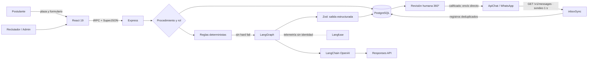
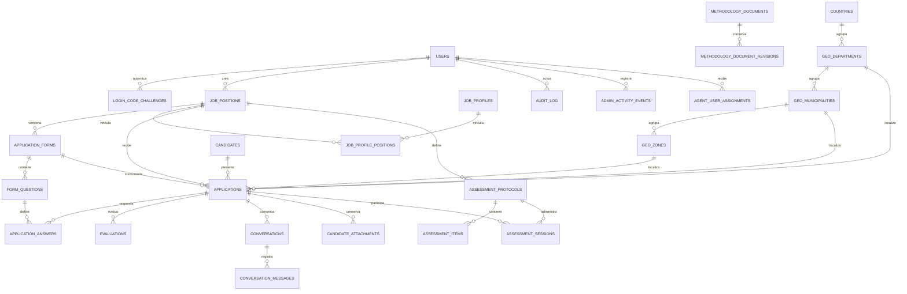

<!-- Documento académico-comercial auditado el 11 de septiembre de 2026. -->

<p align="justify">
  
</p>

<h1 align="justify">Empleos de Energia Solar en Guatemala | Talento AISA · JARVI RH 2.0.183</h1><p></p>

<p>Empleos de energia solar en guatemala, bolsa de empleo líder en Guatemala especializada en energía solar, refrigeración ecoeficiente y sistemas de bombeo agrícola. Conectamos talento técnico e ingenieros expertos en proyectos fotovoltaicos aplicados a la industria de alimentos y agro guatemalteco.</p>
<p></p>
<p align="left">
  
  
  
  
  
  
  
  
  
  
</p>

<p align="center">
  
  <br />
  <sub>Agente JARVI RH 2.0.183 de Talento AISA (IA Evaluadora).</sub>
</p>

Talento AISA vincula capacidades técnicas con proyectos industriales, energéticos, alimentarios y agrícolas de Alternativas Inteligentes, S. A. JARVI RH integra plazas, formularios y protocolos versionados, evaluación asistida por IA, revisión humana, conversaciones ApiChat, solicitud controlada de currículum y auditoría administrativa. Automatiza trabajo repetitivo sin transferir al modelo la responsabilidad institucional de contratar, fijar remuneración o atribuir rasgos psicológicos: el personal autorizado conserva la decisión.

## 1. Reglas configuradas, salida estructurada, cambios humanos, mensajes y eventos de bitácora

ACTUALIZACIÓN DE LA VERSIÓN

<!-- release-history:start -->

### 17SEP2026 · JARVI RH 2.0.183

- La hoja de Candidatos abre por la evaluación: el orden pasa a Evaluación IA, Motivo, Comentario humano, Estado / acción e Ingreso; la identidad y las respuestas quedan después. Sin migración.
- Un filtro configurado devuelve la matriz a la mejor calificación; retirar los filtros devuelve el registro a su fecha.
- Una revisión guardada por una persona sella la fila con un botón rosa de hora y fecha, derivado del asiento de esa revisión.

### 17SEP2026 · JARVI RH 2.0.182

- El conducto del adjunto deja de ser un punto ciego: la Auditoría de ApiChat publica la cola de recepción y el trabajo documental abierto con su código de error.
- La bandeja y el motor leen el mismo manifiesto de adjuntos, que la ficha no leía.
- La extracción documental deja de depender del interruptor del diálogo. Sin migración.

### 17SEP2026 · JARVI RH 2.0.181

- La bandeja adjunta sin pegar direcciones: arrastrar y soltar o elegir el archivo del equipo, grabar la nota de voz con el micrófono y compartir la ubicación del dispositivo. El contenido viaja en base64, el servidor lo verifica y lo publica con una capacidad firmada antes de anunciarlo al proveedor. Sin migración.

### 17SEP2026 · JARVI RH 2.0.180

- Repara el conducto de adjuntos de ApiChat: adaptador canónico del callback `messages[]`, recepción durable antes del acuse, identidad común de adjunto y enlace de bandeja verificable. PDF, Word y audio pasan a extracción, transcripción u OCR. Migraciones `0036` y `0037`.

### 17SEP2026 · JARVI RH 2.0.179

- La ficha de Revisión Humana fija su orden de lectura: encabezado, feed de WhatsApp, matriz, agente del reclutador y RAG Personal al cierre.
- Traza del conducto: el receptor registra la forma del cuerpo que envía ApiChat —claves, tipos y tamaños— y su desenlace, incluidos los siete descartes que antes no dejaban rastro. Sin contenido del candidato: los campos de archivo se sustituyen por su peso y su huella. Migración `0035`.

### 17SEP2026 · JARVI RH 2.0.178

- La Vista 360° del Candidato reordena la ficha: la matriz de evaluación y la acción de re-evaluar quedan arriba, y los cinco bloques de lectura comparten una grilla de dos columnas con barras idénticas y arranque plegado.

### 17SEP2026 · JARVI RH 2.0.177

- Auditoría de ApiChat, debajo del Agente de IA LangGraph: clasifica el conducto en verificado, con pérdidas, con fallos de envío o sin evidencia, y cierra el log de errores del mecanismo de comunicación.
- El fallo anterior a la fila de mensaje —dirección pública ausente, contenido ilegible— deja de ser invisible.

### 17SEP2026 · JARVI RH 2.0.176

- Paneles plegables en la ficha de evaluación: los cinco bloques de lectura se pliegan por sección y por operador, y la matriz de evaluación queda a la vista.

### 17SEP2026 · JARVI RH 2.0.175

- Agente del reclutador bajo el encabezado del candidato: analiza solo ese expediente, no modifica ninguna opción de la interfaz y su modelo se elige en la conversación dentro del catálogo institucional.
- Resiliencia DORA: si la credencial principal falla responde con la de respaldo y la insignia declara cuál respondió; el historial pertenece al candidato y los documentos adjuntos alimentan su RAG personal.

### 17SEP2026 · JARVI RH 2.0.174

- Roles de Seguridad: el permiso se concede por usuario, con vista, lectura, escritura, edición y eliminación sobre el menú y los dominios de la base.
- El ojito retira la entrada del menú y toda asignación exige un código por correo.

### 17SEP2026 · JARVI RH 2.0.173

- Capacidad firmada para entregar archivos al proveedor, y receptor que resuelve el adjunto en cualquier campo, incluido base64 sin sobre.

### 17SEP2026 · JARVI RH 2.0.172

- Registro de códecs: veinticinco entradas por familia, entregadas activadas.

### 17SEP2026 · JARVI RH 2.0.170–2.0.171

- Evaluación automática con contadores derivados y conducto de adjuntos con estado declarado.

### 17SEP2026 · JARVI RH 2.0.169

- Se corrige el defecto que impedía encender el ciclo automático: el asiento de auditoría entregaba la clave de configuración al identificador entero de la traza, y una prueba nueva comprueba la forma del asiento.

### 17SEP2026 · JARVI RH 2.0.168

- El ciclo de pruebas ejecuta el protocolo por ítem con la determinación del servidor, y el cierre dispara la re-evaluación automática; la traza del acto queda registrada con identidad única.
- El ciclo es el acto único de la evaluación psicométrica, y el artefacto único de despliegue reúne las migraciones `0022` a `0030`.

### 17SEP2026 · JARVI RH 2.0.167

- Concluir el ciclo de pruebas dispara la re-evaluación de forma automática, con el perfil laboral de la plaza, el RAG del proyecto y el expediente del candidato.
- El cierre es idempotente y evaluado: un ciclo ya concluido no vuelve a evaluarse y un fallo del proveedor no deja el ciclo a medias.

### 17SEP2026 · JARVI RH 2.0.166

- Pruebas psicométricas estrena el interruptor del ciclo automático: encendido registra el inicio treinta segundos después del formulario y apagado el agente no contacta por el webhook.
- El ciclo abre la conversación con el saludo del protocolo de la plaza y queda declarado como evento listo tras la solicitud del CV.

### 17SEP2026 · JARVI RH 2.0.165

- La esencia del CV se genera por fragmentos con el límite configurado, se persiste con su estado y alimenta al agente evaluador como capa declarada.
- La ficha estrena el panel de análisis de CV junto a las respuestas de formularios, con la re-evaluación que actualiza el puntaje.

### 17SEP2026 · JARVI RH 2.0.164

- La configuración de comunicación pasa a llamarse Evaluación de CV con IA y reúne el agradecimiento, el aviso de contacto y la extensión de la esencia del CV.
- El agente incorpora ese cierre al mensaje que despacha al confirmar el formulario, sin consultas adicionales y con la guardia salarial evaluada antes de tocar la base.

### 17SEP2026 · JARVI RH 2.0.163

- La ficha retira la caja de solicitud de CV y el resumen de conversación sin contenido, y monta la bitácora en la columna de la decisión.
- El reenvío manual de la solicitud de CV se conserva y solo aparece cuando es accionable.

### 17SEP2026 · JARVI RH 2.0.162

- El método de evaluación —pesos, bandas, criterios y directrices— deja de distribuirse en el paquete del cliente y se sirve en la respuesta autenticada de configuración.
- La ficha recibe la etiqueta de cada bloque resuelta por el servidor y la puerta de release audita la frontera de propiedad intelectual.

### 17SEP2026 · JARVI RH 2.0.161

- La ficha integra la caja de Vista 360° del Candidato —matriz por bloques, nota IA y motivo— arriba del resumen de perfil y de la decisión.
- La matriz muestra tres bloques a la vez con su contador y flechas de recorrido, y la ficha deja de repetirla más abajo.

### 17SEP2026 · JARVI RH 2.0.160

- El encabezado de identidad pasa a Revisión Humana: persona, plaza, contacto, punteo IA y la decisión con comentario encabezan la ficha.
- La búsqueda de Candidatos deja de alojar el encabezado y el visor: cada evidencia del resultado abre la ficha en Revisión Humana.

### 17SEP2026 · JARVI RH 2.0.159

- Candidatos se convierte en el explorador de búsqueda y Revisión Humana recibe la ficha completa de la postulación, con el botón «Detalle» en cada resultado.
- El expediente del RAG Personal y la bandeja de WhatsApp del candidato permanecen bajo la ficha, en la misma hoja.

### 17SEP2026 · JARVI RH 2.0.158

- El resumen de actividad y control ISO cierra cada hoja administrativa: deja de encabezar la vista y pasa al pie.

### 17SEP2026 · JARVI RH 2.0.157

- Revisión Humana sustituye la conversación compacta por la bandeja de WhatsApp del candidato, con historial completo, herramientas y expediente del RAG Personal.

### 17SEP2026 · JARVI RH 2.0.156

- Revisión Humana estrena el RAG Personal del candidato: arrastre, árbol de documentos, visor y análisis de IA de 66 y 325 palabras.
- El expediente se alimenta también por el webhook de ApiChat y comparte la configuración de extensiones y peso con el RAG de proyectos.

### 17SEP2026 · JARVI RH 2.0.155

- El RAG transporta en base64 y reconstruye el archivo con su extensión final verificada por contenido; una discordancia se corrige y se audita.
- El visor reproduce sin novedad imagen, video, audio, PDF, Word, CSV, hoja de cálculo y texto, con vale de acceso firmado y cabeceras que impiden la descarga forzada.

### 16SEP2026 · JARVI RH 2.0.154

- Los adjuntos del candidato llegan a la bandeja con visor sobre el mismo volumen del RAG.

### 16SEP2026 · JARVI RH 2.0.153

- La bandeja advierte con «⚠» los mensajes nuevos sin abrir; al abrirla, la marca se despeja.

### 16SEP2026 · JARVI RH 2.0.152

- La burbuja exhibe «↩» con el texto original citado.

### 16SEP2026 · JARVI RH 2.0.151

- La recepción incorpora el canal push del webhook.

### 16SEP2026 · JARVI RH 2.0.150

- La bandeja incorpora «Sincronizar bandeja» con asiento auditado.

### 16SEP2026 · JARVI RH 2.0.149

- La recepción lee el feed global y clasifica por reconciliación.

### 16SEP2026 · JARVI RH 2.0.148

- La auditoría de recepción valida configuración, endpoints y activación.

### 16SEP2026 · JARVI RH 2.0.147

- La rehidratación ya no duplica y adopta la clave canónica.

### 16SEP2026 · JARVI RH 2.0.146

- La recepción recorre el catálogo por páginas.

### 16SEP2026 · JARVI RH 2.0.145

- Un script deja la base lista: `database/005_servicio_conversacional_listo.sql`, autocertificado.

### 16SEP2026 · JARVI RH 2.0.144

- La activación conversacional se gobierna desde `Configuración › WhatsApp`; `0024` la preactiva y cada interruptor queda auditado.

### 16SEP2026 · JARVI RH 2.0.143

- El administrador de endpoints declara por interruptor capacidad, consumidores e indispensable para el agente.

### 16SEP2026 · JARVI RH 2.0.142

- El servicio conversacional se despliega separado por capacidad: recepción, razonamiento y envío, cada uno con su ciclo propio.
- La migración `0023` crea la cola `conversation_outbox` con reclamo `FOR UPDATE SKIP LOCKED`, tres esquemas de privilegio mínimo y la vista de reconciliación.

### 16SEP2026 · JARVI RH 2.0.141

- JARVI HR conversa con hilo propio en PostgreSQL; el contexto suma cuatro capas: marco del proyecto, RAG personal, comparación plaza-declaración y memoria.
- Revisión Humana muestra ubicación, expectativa salarial con monto y, bajo la matriz IA, el hilo con el conocimiento vigente; la migración `0022` agrega turnos, ciclos y RAG personal.

### 14SEP2026 · JARVI RH 2.0.140

- Toda postulación solicita el CV por WhatsApp de forma automática al pulsar «Enviar formulario», sin estado previo exigido y con `cv_request:<id>` como único envío por postulación.

### 14SEP2026 · JARVI RH 2.0.139

- Gobierno, Observabilidad y Monitoreo agrupa las políticas por categoría con su contador de trazas auditadas; ApiChat normaliza toda operación a `/v1/`.

### 14SEP2026 · JARVI RH 2.0.138

- Cada formulario recibe un enlace propio con interruptor, preguntas y vista previa; el mismo WhatsApp conserva un candidato y una postulación al completar variantes.

### 14SEP2026 · JARVI RH 2.0.137

- Plazas y anuncios administra múltiples formularios por plaza, creados o importados desde Excel/CSV, con el WhatsApp como identidad del candidato y participaciones registradas.

### 14SEP2026 · JARVI RH 2.0.136

- «Guardar análisis» declara `::varchar` explícito y el resumen se acomoda bajo el nombre del proyecto.

### 14SEP2026 · JARVI RH 2.0.135

- Un proyecto vincula múltiples plazas con lista de verificación; la migración `0017` conserva el vínculo anterior.

### 14SEP2026 · JARVI RH 2.0.134

- MST-EIR se convierte en Administrador de Proyectos; PDF y Word generan resúmenes que alimentan el RAG del proyecto con la migración `0016`.

### 14SEP2026 · JARVI RH 2.0.133

- n8n queda retirado; el puente `inboxSync` rellena la bandeja cada segundo desde el historial del proveedor con deduplicación por identificador.
- Configuración administra los siete endpoints oficiales ApiChat con interruptores auditados; la bandeja añade burbujas con hora y ticks, punteo IA y etiqueta humano/agente.
- Borrar una versión de prueba exige un código temporal de seis dígitos por correo; la migración `0015` conserva desafío y auditoría.

### 11SEP2026 · JARVI RH 2.0.132

- En los modos oscuros, los textos rojos y rosados adoptan el amarillo de atención institucional sobre las superficies grafito.

### 11SEP2026 · JARVI RH 2.0.131

- Langfuse migra al SDK modular 5.11.1 con OpenTelemetry y trazas jerárquicas en todo el sistema.

### 11SEP2026 · JARVI RH 2.0.130

- Actividad administrativa, bandeja, cuarentena HMAC, protocolos psicométricos versionados y agente con voz; migración `0014` sin eliminar estructuras.

### 10SEP2026 · JARVI RH 2.0.129

- Configuración > WhatsApp administra modo, endpoint, conexión, webhook, Client ID, token e ID heredado; los secretos se cifran con AES-256-GCM y la interfaz solo recibe máscaras.
- El envío y el reintento consultan exclusivamente PostgreSQL; la migración `0013` inicializa valores públicos y filas secretas vacías.

### 10SEP2026 · JARVI RH 2.0.127–2.0.128

- La landing fija el mensaje institucional en «Plataforma Laboral No.1» y la prueba de caja negra bloquea el sufijo retirado «de Guatemala».

### 10SEP2026 · JARVI RH 2.0.127

- La landing sustituye la descripción secundaria y la prueba de caja negra exige el texto aprobado y bloquea la frase anterior.

### 10SEP2026 · JARVI RH 2.0.126

- Las responsabilidades publicadas exigen oración autónoma, verbo en infinitivo y puntuación; la política versionada audita las plazas al iniciar.

### 10SEP2026 · JARVI RH 2.0.125

- Vista 360° del Candidato pagina la evaluación: tres tarjetas en escritorio y una en ancho reducido, con navegación por botonera superior.
- La navegación de resultados sube al encabezado y la columna fija muestra únicamente nombre y plaza.

### 10SEP2026 · JARVI RH 2.0.124

- Un control editorial transversal con GPT-4.1 mini revisa plazas, perfiles, objetivos, responsabilidades, requisitos, formularios, preguntas, ayudas, opciones y mensajes públicos configurables antes de guardarlos, activarlos o publicarlos.
- La validación recompone fragmentos en una idea completa por línea, rota credenciales, falla de forma cerrada y, al iniciar, alcanza las plazas públicas ya existentes.

### 10SEP2026 · JARVI RH 2.0.123

- GPT-4.1 mini corrige ortografía, gramática, redacción y estructura antes de publicar; la evidencia se reutiliza sin consumir tokens durante las visitas.
- La portada dice «Cada candidato merece una evaluación a su medida» y presenta a Talento AISA como plataforma tecnológica de oportunidades laborales.

### 10SEP2026 · JARVI RH 2.0.122

- Perfiles laborales preserva `position_ids`; Publicar repara el vínculo por nombre y muestra el error si está incompleto.
- Ejecutivo de Negocios (Ventas) conserva la primera posición de la landing.

### 10SEP2026 · JARVI RH 2.0.121

- La landing consume objetivo, responsabilidades y requisitos del perfil.

### 10SEP2026 · JARVI RH 2.0.120

- Los 20 títulos `h1` y el encabezado jurídico usan blanco semántico en temas oscuros.

### 10SEP2026 · JARVI RH 2.0.119

- Tratamiento institucional «usted» homologado en portal, formularios, administración y WhatsApp.

### 10SEP2026 · JARVI RH 2.0.118

- Página interna, responsive y temática de privacidad, términos y condiciones.

### 10SEP2026 · JARVI RH 2.0.117

- Tres confirmaciones obligatorias y compactas incorporadas a todos los formularios públicos, con `audit_log` del texto y su versión.

### 10SEP2026 · JARVI RH 2.0.116

- Body, tarjetas, menús, formularios y retícula consumen tokens compilados como variables dinámicas.

### 10SEP2026 · JARVI RH 2.0.115

- Day, Dark Dimmed y Dark High Contrast forman un sistema de visualización alternativa; no garantiza una reducción clínica de fatiga visual.

### 10SEP2026 · JARVI RH 2.0.114

- Teléfono normalizado; Zona 1–25, departamento y municipio obligatorios.

### 10SEP2026 · JARVI RH 2.0.113

- Revisión Humana 360° compactada, con navegación asistida y logotipo transparente.

<!-- release-history:end -->

El objeto sociotécnico no es “la IA” aislada, sino el ensamblaje persona/plaza/formulario/evidencia/regla/modelo/revisor. La pregunta rectora es: **¿cómo acelerar la preclasificación de talento especializado manteniendo procedencia, seguridad, posibilidad de refutación y autoridad humana?** La unidad de análisis es una postulación; las unidades de evidencia son respuestas, reglas configuradas, salida estructurada, cambios humanos, mensajes y bitácora.

La validez de construcción exige que los campos representen competencias; la interna, que el dictamen derive de evidencia; la externa, que los criterios se sostengan entre plazas; y la operacional, que transacciones, permisos y pruebas ejecuten el contrato. El software aporta trazabilidad, no prueba justicia laboral ni validez predictiva; ello requiere datos longitudinales y revisión experta.

## 2. Arquitectura y dependencias

La solución es una aplicación web TypeScript de tres capas. React 19, Wouter, TanStack Query, Tailwind CSS y componentes Radix construyen la experiencia pública y administrativa; Express publica el artefacto y monta `/api/trpc`; tRPC y Zod definen contratos y autorización; PostgreSQL conserva el estado; Drizzle documenta el esquema y sus migraciones. LangGraph 1.4.14 coordina una llamada acotada mediante LangChain OpenAI 1.5.11 y OpenAI SDK 7.13.0 sobre Responses API. Langfuse es observabilidad opcional; ApiChat, SMTP y almacenamiento S3 prefirmado son adaptadores externos.



| Módulo | Función especializada | Evidencia principal |
| --- | --- | --- |
| Portal público | Expone plazas con perfil completo, normaliza teléfono y exige ubicación catalogada. | `Home.tsx`, `Apply.tsx`, `publicJobs.*`, `geo.*` |
| Administración | Usuarios y roles, plazas, perfiles, geografía INE, formularios y configuración. | `App.tsx`, `routers.ts` |
| Evaluación IA | Reglas críticas, política salarial, seis bloques, salida tipada, respaldo de credencial y persistencia. | `agentEvaluator.ts`, `salaryPolicy.ts`, `evaluation.ts` |
| Revisión 360° | Matriz dinámica, filtros, última evaluación, respuestas, WhatsApp y decisión humana. | `HumanReview.tsx`, `candidates.reviewWorkspace` |
| Comunicación | Bandeja completa, sincronización cada segundo, siete endpoints, traspaso humano y envío directo con estado local. | `Inbox.tsx`, `inbox.ts`, `inboxSync.ts`, `apiChatSettings.ts` |
| Protocolos | Administra versiones, preguntas ordenadas, evidencia metodológica y 64 criterios de gobierno sin estado automático. | `Assessments.tsx`, `assessmentGovernance.ts` |
| Conocimiento | Proyectos, carpetas, carga por arrastre, visores, resumen de 66 palabras, análisis de 325 y RAG para el agente. | `MstEir.tsx`, `knowledge.ts`, `knowledgeRoutes.ts` |
| Audio | Helpers aislados de cuota, formato, transcripción y TTS con rotación; sin ingesta productiva de medios. | `voiceTranscription.ts`, `agentSettings.ts` |
| Gobierno | Proyecta actividad por hoja, drilldown anual, release, bitácora y puerta CI. | `activityAudit.ts`, `shared/release.ts`, `.github/workflows/black-box.yml` |

Las dependencias no equivalen a capacidades logradas. LangGraph es un grafo lineal `START → evaluate → END`, frontera de orquestación, no agente autónomo. Drizzle tipa entidades; varias consultas usan SQL parametrizado directo. El envío ApiChat usa los siete endpoints oficiales; la recepción la resuelve `inboxSync` con deduplicación por identificador. n8n quedó retirado en 2.0.133.

El puente recorre en turnos, refresca cada 60 segundos y se repliega ante límites de tasa; la entrega exactamente una vez sigue sin demostrarse.

## 3. Proceso funcional y evaluación especializada de IA

1. El administrador relaciona plaza, perfil, formulario y preguntas; cada pregunta define respuestas aceptadas, rango, criterio, prompt y `hard_fail`.
2. El postulante envía identidad, zona, departamento, municipio y respuestas; el servidor normaliza el teléfono con `+502`, valida la relación geográfica y evita duplicar la misma persona en una plaza.
3. El evaluador ejecuta reglas deterministas; un incumplimiento indispensable finaliza `no_calificado` sin consumir el modelo.
4. Si las reglas pasan, el servidor reúne plaza, perfil, preguntas y respuestas; agrega los documentos SIERA y MST-EIR habilitados y la base de conocimiento RAG del proyecto vinculado.
5. LangChain solicita a Responses API una estructura validada por Zod: seis bloques únicos, razonamientos, resumen, motivo, evidencia, brechas y posible descalificación crítica. Si falla la clave principal, intenta la de respaldo.
6. El servidor, no el modelo, calcula el total ponderado: ajuste 10 %, experiencia 20 %, competencias 25 %, disponibilidad 10 %, riesgos/brechas 20 % y dictamen 15 %. Intervalos: 90–100 prioritario, 80–89 precalificado, 70–79 condicionado, 60–69 revisión humana y 0–59 no precalificado.
7. Un bloqueo consultivo impide evaluar simultáneamente la misma postulación; resultado, payload, modelo, reglas, resumen y evento se guardan en transacción.
8. Reclutamiento revisa evidencia y modifica el estado con comentario; solo la transición humana a `calificado` prepara la solicitud de CV. La clave `cv_request:{applicationId}` evita duplicados.

Este diseño combina automatización simbólica y generativa: las reglas son falsables y repetibles; el modelo interpreta evidencia abierta y su salida permanece probabilística. Structured Outputs restringe la forma, no garantiza la verdad; la explicación es justificación auditable, no prueba causal. La prueba adecuada compara entradas, reglas, salidas y decisiones posteriores, e incluye casos adversos, cambio de modelo y revisión de falsos positivos/negativos.

## 4. Ontología, epistemología y fenomenología

**Ontología.** La persona real no es idéntica al registro `candidate`: este es contacto, mientras `application` es su participación situada en una plaza. `job_position` expresa la oferta; `job_profile`, el constructo organizacional; `application_form` fija instrumento y versión; `question` operacionaliza un criterio; `answer` conserva una afirmación; `evaluation` es un juicio revisable. Esta distinción evita reificar el puntaje como propiedad esencial. Para Gruber (1993), es una conceptualización local, no una ontología universal del talento.

**Epistemología.** JARVI conoce únicamente lo persistido y configurado: una respuesta es testimonio, no verificación; una ausencia es brecha, no evidencia negativa. El sistema separa resultado determinista, evidencia citada, inferencia, resumen y decisión humana. Revisar o contradecir el dictamen aproxima racionalidad crítica: una recomendación útil debe poder fallar (Popper, 2002). Sin referencia etiquetada, acuerdo interevaluador, calibración y monitoreo de deriva, el puntaje es apoyo ordinal, no probabilidad científica.

La interacción escrita adopta **usted** como forma institucional; el tuteo se sustituyó en instrucciones, preguntas, errores, confirmaciones, correo y WhatsApp. El oráculo `scripts/verify-formal-spanish.mjs` detiene el release ante tratamientos informales; la migración `0012_dear_lifeguard.sql` corrige valores predeterminados y conserva textos libres.

**Fenomenología.** La postulación es también experiencia vivida: la persona interpreta preguntas, expone trayectoria y enfrenta una interfaz que distribuye poder; el puntaje no agota el fenómeno (Husserl, 2012; Moustakas, 1994). Reducirla a seis números puede invisibilizar contexto o desigualdad. La revisión 360° reabre el horizonte con respuesta, pregunta, brecha, motivo e historial. Una práctica responsable añade aviso de IA, accesibilidad y canal de impugnación. La eficiencia comercial es legítima solo cuando conserva dignidad, agencia y responsabilidad institucional (UNESCO, 2021).

## 5. Diseño de datos y procedencia para auditoría



La auditoría primaria reside en `audit_log`: actor, entidad, acción, estado anterior/posterior, comentario y tiempo. `admin_activity_events` agrega ruta, resultado, acción y correlación; su representación usa 11 palabras de título y 33 de resumen. `evaluations` conserva ejecuciones múltiples; `conversation_messages` añade clave de deduplicación, intentos, proveedor, error y estado. `knowledge_files` conserva nombre, peso, extensión, autor, resumen y análisis. Protocolos e ítems preservan versión y orden. Índices por aplicación, estado, plaza y entidad soportan reconstrucción.

Persisten riesgos de procedencia: las respuestas apuntan a preguntas mutables sin instantánea de etiqueta, criterio y prompt. `audit_log` y `admin_activity_events` no son criptográficamente inmutables; las fechas usan reloj de base sin firma ni retención ejecutable. La evolución recomendada: snapshots de instrumento y perfil, hash encadenado o WORM, catálogo de base legal y borrado programado.

## 6. Matriz de alineación ISO y seguridad

| Marco | Evidencia existente | Brecha o prueba requerida |
| --- | --- | --- |
| ISO/IEC 25010:2023 | Separación modular, contratos tipados, cuotas, transacciones, interfaz adaptable y build reproducible. | Medidas para las nueve características, SLO, accesibilidad, carga, recuperación y mantenibilidad. |
| ISO/IEC 27001:2022 / 27002:2022 | Roles, SQL parametrizado, OTP scrypt, JWT `httpOnly`, secretos AES-256-GCM, cabeceras de sincronización autenticadas y minimización. | SGSI formal, inventario, evaluación de riesgos, retención, respaldo, incidentes, proveedores y revisión de accesos. |
| ISO 22301:2019 | Rotación de credenciales, timeouts, deduplicación de mensajes entrantes, fallo cerrado y migración expansiva compatible con rollback. | BIA, RTO/RPO aprobados, plan de continuidad, restauración probada, simulacros y modos degradados. |
| ISO/IEC 20000-1:2018 | Mapa de controles de gestión del servicio en Actividad y control ISO y cambios de configuración auditados. | SGS formal, catálogo acordado, capacidad/demanda y mejora continua. |
| ISO/IEC/IEEE 29119-1:2022 | Casos Vitest, caja negra versionada y CI con release, regresión, tipos y build. | Trazabilidad requisito–riesgo–caso, cobertura, seguridad dinámica, E2E y evidencia firmada. |
| ISO/IEC 42001, 25059 y 23894 / NIST AI RMF | Autoridad humana, modelo y reglas configurables, política salarial, evidencia, límites psicométricos y telemetría minimizada. | AIMS formal, inventario de impactos, benchmark por plaza, sesgo, deriva, apelación, incidentes y retiro seguro. |
| DORA | Versionado, migraciones, pruebas y build como capacidades preparatorias. | Integrar despliegues e incidentes para calcular las cinco métricas; el mapa de contribuciones no las sustituye. |

Esta matriz documenta referencias metodológicas y no constituye certificación, conformidad acreditada ni dictamen de cumplimiento.

El acceso usa códigos de seis dígitos de diez minutos, cinco intentos y espera de reenvío. Los secretos del agente y ApiChat se cifran, y el navegador recibe máscaras. Langfuse inicia con OpenTelemetry antes de aceptar tráfico y traza identificadores HMAC, modelo, uso, latencia, puntaje y estado sin nombre, teléfono, correo, CV ni respuestas. Todavía faltan rate limiting global, protección CSRF explícita, escaneo de dependencias, cabeceras de seguridad y cobertura configurada. Son hallazgos de riesgo, no evidencia de explotación.

## 7. Verificación, despliegue y reproducibilidad

```bash
pnpm install --frozen-lockfile
pnpm release:verify
pnpm test:black-box
pnpm test
pnpm check
pnpm build
```

`package.json` es la fuente canónica de versión; cada push a `main` incrementa exactamente un release y GitHub Actions verifica metadata, comparación Git, caja negra, regresión, TypeScript y build. La base requiere `DATABASE_URL`; producción configura `JWT_SECRET`, SMTP y la clave de cifrado del agente. Las credenciales de ApiChat y del agente se administran cifradas. Las migraciones `0014` a `0017` se aplican con respaldo, revisión SQL y segregación de funciones. Guías complementarias: [observabilidad Langfuse 2.0.131](docs/OBSERVABILIDAD_LANGFUSE_2.0.131.md), [análisis cognitivo y DORA 2.0.130](docs/ANALISIS_COGNITIVO_DORA_2.0.130.md), [implementación](docs/IMPLEMENTACION.md), [instalación](docs/INSTALLATION.md), [ApiChat directo](docs/APICHAT_DIRECTO.md), [agente evaluador](docs/AGENTE_EVALUADOR.md), [revisión humana](docs/REVISION_HUMANA_360.md), [gobierno](docs/RELEASE_GOVERNANCE.md), [transporte base64 y visor](docs/ANALISIS_TRANSPORTE_BASE64_VISOR.md) y [caja negra 2.0.183](docs/PRUEBAS_CAJA_NEGRA_2.0.183.md).

## 8. Capa cognitiva, resiliencia y alcance verificable

La migración `0014` incorpora actividad transversal, bandeja, protocolos versionados, expectativa salarial y preferencias de transcripción/TTS. La migración `0015` añade `protocol_delete_challenges`: borrar una versión de prueba exige un código temporal de seis dígitos por correo. La migración `0016` añade proyectos, carpetas y archivos de conocimiento con resumen y análisis de IA; el directorio de almacenamiento se configura con `KNOWLEDGE_STORAGE_DIR`. Los helpers de audio aceptan una extensión declarada permitida o un MIME mapeado, aplican cuota administrativa y rotación principal/respaldo; no detectan el tipo por contenido. La recepción productiva de medios y documentos sigue pendiente de integrar con descarga, detección real de tipo, antivirus, bucket, previsualización y retención.

La guía DORA define cinco métricas: entrega, frecuencia de despliegue, recuperación, fallos y retrabajo. El repositorio no ingiere despliegues e incidentes suficientes para calcularlas; el mapa «Contribuciones a Talento AISA este año» no las sustituye.

Los protocolos de evaluación son infraestructura de gobierno y autoría; no son instrumentos psicométricos validados. La activación técnica exige evidencia documental, pero únicamente un estudio para la población y uso previstos puede sostener validez y confiabilidad. El análisis completo, query de ApiChat sin secretos, checklist de despliegue, rollback y brechas está en [ANALISIS_COGNITIVO_DORA_2.0.130.md](docs/ANALISIS_COGNITIVO_DORA_2.0.130.md); el protocolo operacional nuevo está en [OBSERVABILIDAD_LANGFUSE_2.0.131.md](docs/OBSERVABILIDAD_LANGFUSE_2.0.131.md).

## 9. Protocolo de Ingeniería de Software

La contribución de JARVI RH no debe medirse por incorporar un modelo de lenguaje, sino por la calidad del artefacto sociotécnico completo. Desde la ciencia del diseño, su utilidad inicial reside en convertir criterios dispersos en un proceso explícito, repetible y susceptible de inspección. El conocimiento producido es prescriptivo: propone que una preclasificación laboral puede combinar reglas, interpretación generativa, cálculo controlado, persistencia y revisión humana. Sin embargo, la eficacia técnica observada en pruebas unitarias no prueba eficacia organizacional. Tampoco permite concluir que el sistema seleccione mejor, más justamente o con menor costo que el procedimiento anterior. Esas afirmaciones requieren investigación empírica independiente.

Se plantean cuatro proposiciones contrastables. **P1:** la estructura híbrida reduce el tiempo medio de revisión sin disminuir el acuerdo con especialistas. **P2:** mostrar evidencia, brechas y reglas mejora la detección de errores frente a mostrar solo una puntuación. **P3:** la recomendación varía más por la calidad del perfil e instrumento que por cambios menores de modelo. **P4:** una vía de revisión comprensible mejora la justicia procedimental percibida. Ninguna proposición se considera validada.

El protocolo recomendado comienza con un corpus seudonimizado, estratificado por plaza y periodo. Dos o más especialistas etiquetan cada caso de forma ciega y construyen un patrón de referencia mediante adjudicación. Para clasificación se medirían precisión, exhaustividad, macro-F1, matriz de confusión y falsos negativos; para puntaje, error absoluto y calibración ordinal; para operación, latencia, disponibilidad y proporción de decisiones humanas que revocan al agente. Los resultados se desagregan solo por atributos lícitos, necesarios y protegidos.

Las amenazas incluyen sesgo del corpus, criterios discriminatorios históricos, dependencia entre evaluadores y automatización del juicio. Se mitigan con preregistro, separación desarrollo–evaluación, réplica temporal y revisión ética. README, pruebas y bitácora aportan trazabilidad, no validación empírica.

## 10. Marco DORA y concepto estratégico

DORA (DevOps Research and Assessment, `dora.dev`) es investigación, no certificación. Sus cinco métricas de entrega exigen cada una su propia tubería de datos. El repositorio aporta capacidades habilitadoras, pero no ingiere despliegues ni incidentes.

El concepto estratégico es la **decisión asistida y gobernada**; el análisis está en [ANALISIS_ESTRATEGICO_ARTEFACTO_METODO_PRODUCTO.md](docs/ANALISIS_ESTRATEGICO_ARTEFACTO_METODO_PRODUCTO.md).

## Referencias

Las páginas técnicas evolutivas se consultaron el 14 de septiembre de 2026. La presentación se adapta a Markdown y conserva los elementos autor, fecha, título y fuente de APA 7.

### API, infraestructura y modelos

1. Drizzle Team. (s. f.). _Drizzle migrations fundamentals_. https://orm.drizzle.team/docs/migrations
2. GitHub. (s. f.). _Workflow syntax for GitHub Actions_. https://docs.github.com/actions/reference/workflows-and-actions/workflow-syntax
3. International Organization for Standardization. (2022). _ISO/IEC 27002:2022 Information security, cybersecurity and privacy protection: Information security controls_. https://www.iso.org/standard/75652.html
4. International Organization for Standardization. (2023a). _ISO/IEC 23894:2023 Information technology: Artificial intelligence: Guidance on risk management_. https://www.iso.org/standard/77304.html
5. International Organization for Standardization. (2023b). _ISO/IEC 25059:2023 Software engineering: SQuaRE: Quality model for AI systems_. https://www.iso.org/standard/80655.html
6. LangChain. (s. f.-a). _ChatOpenAI integration_. https://docs.langchain.com/oss/javascript/integrations/chat/openai
7. LangChain. (s. f.-b). _Graph API overview_. https://docs.langchain.com/oss/javascript/langgraph/graph-api
8. Langfuse. (s. f.). _Masking sensitive LLM data_. https://langfuse.com/docs/observability/features/masking
9. ApiChat. (s. f.). _OpenAPI oficial de la API de mensajería_. https://panel.apichat.io/docs/swagger
10. International Organization for Standardization. (2018). _ISO/IEC 20000-1:2018 Information technology: Service management: Part 1: Service management system requirements_. https://www.iso.org/standard/70636.html
11. Node.js. (s. f.). _Crypto_. https://nodejs.org/api/crypto.html
12. OpenAI. (s. f.-a). _Create a model response_. https://developers.openai.com/api/reference/resources/responses/methods/create
13. OpenAI. (s. f.-b). _Structured model outputs_. https://developers.openai.com/api/docs/guides/structured-outputs
14. PostgreSQL Global Development Group. (s. f.-a). _Explicit locking: Advisory locks_. https://www.postgresql.org/docs/current/explicit-locking.html#ADVISORY-LOCKS
15. PostgreSQL Global Development Group. (s. f.-b). _JSON types_. https://www.postgresql.org/docs/current/datatype-json.html
16. React Team. (s. f.). _lazy_. https://react.dev/reference/react/lazy
17. tRPC. (s. f.). _Authorization_. https://trpc.io/docs/server/authorization
18. Vite. (s. f.). _Building for production_. https://vite.dev/guide/build
19. Vitest. (s. f.). _Writing tests_. https://vitest.dev/guide/learn/writing-tests
20. GitHub. (s. f.). _Managing your theme settings_. https://docs.github.com/en/get-started/accessibility/managing-your-theme-settings
21. Intaruk, R., Kongnun, J., Kwanchainond, S., & Pichaiyongwongdee, S. (2025). Immediate effects of light mode and dark mode features on visual fatigue in tablet users. _International Journal of Environmental Research and Public Health, 22_(4), 609. https://doi.org/10.3390/ijerph22040609
22. World Wide Web Consortium. (2024). _Web Content Accessibility Guidelines (WCAG) 2.2_. https://www.w3.org/TR/WCAG22/

### Normativa aplicada

23. American Psychological Association. (2020). _Publication manual of the American Psychological Association_ (7th ed.). American Psychological Association. https://www.apa.org/pubs/books/publication-manual-7th-edition-paperback
24. Gruber, T. R. (1993). A translation approach to portable ontology specifications. _Knowledge Acquisition, 5_(2), 199–220. https://doi.org/10.1006/knac.1993.1008
25. Hevner, A. R., March, S. T., Park, J., & Ram, S. (2004). Design science in information systems research. _MIS Quarterly, 28_(1), 75–105. https://doi.org/10.2307/25148625
26. Husserl, E. (2012). _Ideas: General introduction to pure phenomenology_ (W. R. Boyce Gibson, Trans.). Routledge. (Original work published 1913). https://doi.org/10.4324/9780203120330
27. International Organization for Standardization. (2022a). _ISO/IEC 27001:2022 Information security, cybersecurity and privacy protection: Information security management systems: Requirements_. https://www.iso.org/standard/27001
28. International Organization for Standardization. (2022b). _ISO/IEC/IEEE 29119-1:2022 Software and systems engineering: Software testing: Part 1: General concepts_. https://www.iso.org/standard/81291.html
29. International Organization for Standardization. (2023a). _ISO/IEC 25010:2023 Systems and software engineering: SQuaRE: Product quality model_. https://www.iso.org/standard/78176.html
30. International Organization for Standardization. (2023b). _ISO/IEC 42001:2023 Information technology: Artificial intelligence: Management system_. https://www.iso.org/standard/42001
31. Kitchenham, B., & Charters, S. (2007). _Guidelines for performing systematic literature reviews in software engineering_ (EBSE-2007-01). Keele University & Durham University.
32. Moustakas, C. (1994). _Phenomenological research methods_. SAGE. https://doi.org/10.4135/9781412995658
33. National Institute of Standards and Technology. (2023). _Artificial intelligence risk management framework (AI RMF 1.0)_ (NIST AI 100-1). https://doi.org/10.6028/NIST.AI.100-1
34. National Institute of Standards and Technology. (2024). _Artificial intelligence risk management framework: Generative artificial intelligence profile_ (NIST AI 600-1). https://doi.org/10.6028/NIST.AI.600-1
35. Peffers, K., Tuunanen, T., Rothenberger, M. A., & Chatterjee, S. (2007). A design science research methodology for information systems research. _Journal of Management Information Systems, 24_(3), 45–77. https://doi.org/10.2753/MIS0742-1222240302
36. Popper, K. R. (2002). _The logic of scientific discovery_. Routledge. (Original work published 1959). https://doi.org/10.4324/9780203994627
37. Raji, I. D., Smart, A., White, R. N., Mitchell, M., Gebru, T., Hutchinson, B., Smith-Loud, J., Theron, D., & Barnes, P. (2020). Closing the AI accountability gap. In _Proceedings of the 2020 Conference on Fairness, Accountability, and Transparency_ (pp. 33–44). ACM. https://doi.org/10.1145/3351095.3372873
38. Selbst, A. D., Boyd, D., Friedler, S. A., Venkatasubramanian, S., & Vertesi, J. (2019). Fairness and abstraction in sociotechnical systems. In _Proceedings of FAT '19_ (pp. 59–68). ACM. https://doi.org/10.1145/3287560.3287598
39. UNESCO. (2021). _Recommendation on the ethics of artificial intelligence_. https://unesdoc.unesco.org/ark:/48223/pf0000381137
40. Real Academia Española & Asociación de Academias de la Lengua Española. (s. f.-a). _Las formas de tratamiento (II). Sustantivos y grupos nominales_. https://www.rae.es/gram%C3%A1tica/sintaxis/las-formas-de-tratamiento-ii-sustantivos-y-grupos-nominales
41. Real Academia Española & Asociación de Academias de la Lengua Española. (s. f.-b). _Tutear_. En _Diccionario de la lengua española_. https://dle.rae.es/tutear

### Fuentes primarias incorporadas en 2.0.132

- Langfuse. (s. f.). _JavaScript/TypeScript observability SDK_. https://langfuse.com/docs/observability/sdk/overview
- Langfuse. (s. f.). _Data regions and availability_. https://langfuse.com/security/data-regions
- DORA. (2026). _Software delivery performance metrics_. https://dora.dev/guides/dora-metrics/
- International Organization for Standardization. (2019). _ISO 22301:2019 Security and resilience: Business continuity management systems: Requirements_. https://www.iso.org/standard/75106.html
- AERA, APA, & NCME. (2014). _Standards for Educational and Psychological Testing_. https://www.testingstandards.net/
- American Psychological Association. (2017). _Professional practice guidelines for occupationally mandated psychological evaluations_. https://www.apa.org/practice/guidelines/psychological-evaluations.html
- U.S. Equal Employment Opportunity Commission. (2007). _Employment tests and selection procedures_. https://www.eeoc.gov/laws/guidance/employment-tests-and-selection-procedures
- OpenAI. (s. f.). _Create transcription_. https://developers.openai.com/api/reference/cli/resources/audio/subresources/transcriptions/methods/create
- OpenAI. (s. f.). _Create speech_. https://developers.openai.com/api/reference/cli/resources/audio/subresources/speech/methods/create

### Fuentes primarias incorporadas en 2.0.133

- ApiChat. (s. f.). _OpenAPI oficial de la API de mensajería_. https://panel.apichat.io/docs/swagger
- International Organization for Standardization. (2018). _ISO/IEC 20000-1:2018: Service management system requirements_. https://www.iso.org/standard/70636.html

### Fuentes primarias incorporadas en 2.0.181

- pdf-parse. (s. f.). _Pure JavaScript PDF parsing_. https://www.npmjs.com/package/pdf-parse
- Mammoth. (s. f.). _Convert .docx documents to HTML_. https://www.npmjs.com/package/mammoth

## Licencia y alcance

Código distribuido bajo [licencia MIT](LICENSE). La documentación académica orienta evaluación y mejora continua; cualquier uso real debe observar legislación laboral, privacidad, no discriminación y políticas aplicables en Guatemala. Última revisión documental: **16 de septiembre de 2026**. Todos los derechos reservados por Alternativas Inteligentes, S.A.
