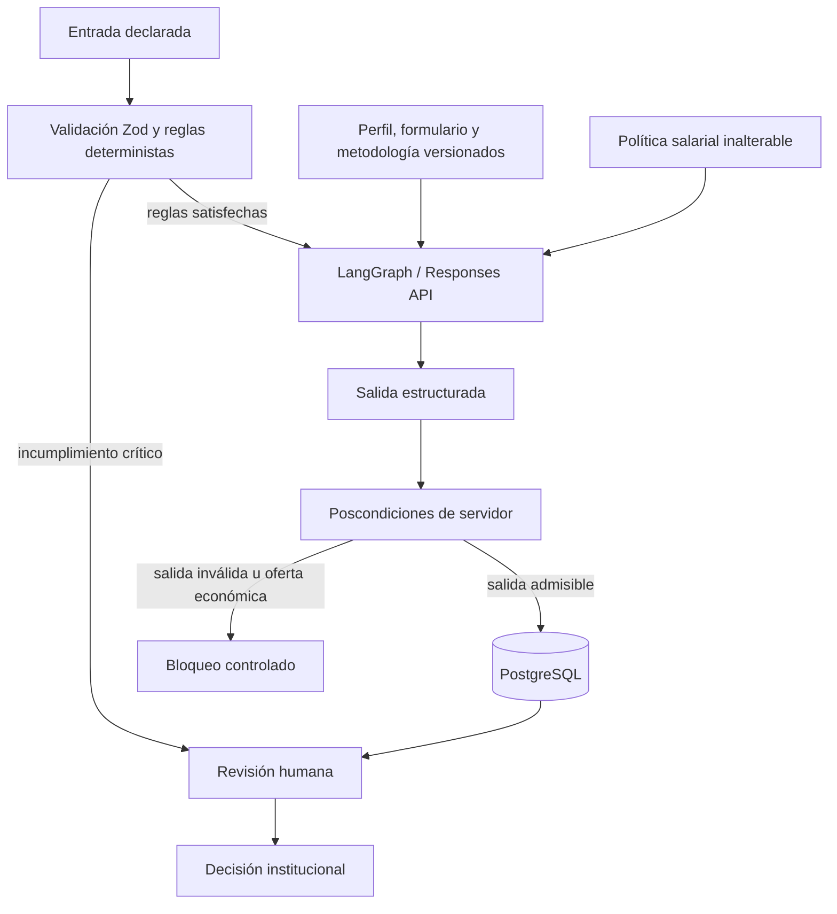

# Análisis metodológico de la capa cognitiva y resiliencia · JARVI RH 2.0.130

## Dictamen ejecutivo

La versión 2.0.130 es técnicamente viable como una ampliación gobernada de la arquitectura vigente: conserva a PostgreSQL como fuente de verdad, mantiene las decisiones laborales bajo autoridad humana y separa las reglas deterministas de las salidas probabilísticas de IA. El cambio aporta trazabilidad administrativa, configuración especializada de modelos, una bandeja de conversaciones, protocolos versionados de evaluación y controles explícitos sobre remuneración.

El resultado constituye una **línea base de ingeniería alineada con objetivos seleccionados de ISO y prácticas DORA**. No constituye certificación ISO, acreditación psicométrica, validación clínica, dictamen jurídico ni una medición DORA completa. Esas afirmaciones requieren procesos organizacionales, evidencia longitudinal y evaluaciones independientes que exceden una entrega de código.

| Estado       | Significado en este documento                                                                 |
| ------------ | --------------------------------------------------------------------------------------------- |
| Implementado | Existe contrato de servidor o interfaz, persistencia y caso automatizado asociado.            |
| Preparado    | Existe modelo de datos o servicio reutilizable, pero falta conectar todo el flujo productivo. |
| Pendiente    | Requiere operación, validación externa, infraestructura o decisión institucional adicional.   |

## Alcance real implementado

### Actividad administrativa y control trazable

- `ActivityAuditBar` se monta desde el layout administrativo y presenta en cada hoja la última actividad asociada a la ruta.
- La apertura se registra una vez por ruta y sesión del navegador mediante una correlación aleatoria. No registra valores de formularios, texto tecleado, coordenadas, contenido del portapapeles, credenciales ni respuestas de candidatos.
- `/admin/activity` muestra «Contribuciones a Talento AISA este año», actualiza por sondeo cada cinco segundos y permite abrir el detalle de un día.
- Cada evento proyecta un título determinista de 11 palabras y un resumen determinista de 35 palabras. El registro estructurado es la evidencia primaria; el texto es una representación derivada.
- Los estados usan etiqueta además del color: Guardado, Cambio de configuración, Trabajando o Error controlado.
- JARVI HR conserva la identidad institucional `adminit@aisa.com.gt`. La migración intenta vincularla con un usuario existente; si no existe, mantiene la identidad sin inventar una cuenta. Administración puede asignar el agente a un usuario activo y la operación queda auditada.

La vista se aproxima al tiempo real mediante _polling_, no mediante streaming ni garantías de entrega instantánea. `admin_activity_events` no es un log inmutable: una política de retención, protección contra actualización/borrado y exportación WORM siguen pendientes. La proyección transversal se intenta antes de responder, pero conserva un comportamiento _best effort_ para no interrumpir la operación principal; por ello todavía necesita _outbox_ transaccional, reintentos, DLQ y reconciliación para poder afirmarse que toda mutación conserva evidencia durable.

### Bandeja de entrada

- `/admin/inbox` lista hasta diez conversaciones de la última hora; un selector explícito habilita la consulta histórica de hasta 30 resultados. Filtra por nombre, teléfono, plaza y control de automatización.
- La selección muestra mensajes, ubicación, puntuación más reciente, prueba asociada, adjuntos registrados y expectativa salarial declarada.
- La lista se actualiza cada cuatro segundos y presenta un semáforo acompañado de texto: agente activo, traspaso/control humano o proceso finalizado/error.
- El teclado humano permanece bloqueado mientras JARVI HR conserva el control. El traspaso exige que conversación y prueba hayan finalizado; solo Administración puede usar una excepción, que queda en `audit_log`.
- El envío humano utiliza las credenciales ApiChat cifradas en PostgreSQL y registra el estado de entrega.
- Revisión Humana incorpora un acceso de WhatsApp que abre la conversación correspondiente.
- El workflow 04 publica `/webhook/apichat/incoming`, normaliza el sobre oficial `messages` de ApiChat y entrega únicamente texto entrante al receptor `POST /api/webhooks/apichat/incoming`. No evalúa ni envía mensajes. El receptor exige un secreto Bearer, valida un JSON cerrado y revalida identificador, teléfono, dirección y texto mediante `GET /v1/messages` antes de resolver o persistir. Después resuelve una sola conversación activa, deduplica por identificador del proveedor y pone en cuarentena, mediante huellas HMAC, los casos sin coincidencia o ambiguos.

El receptor implementado acepta **texto normalizado**. El adaptador n8n consume los campos nativos documentados `id`, `number`, `type`, `from_me` y `text`; ignora mensajes propios, grupos y tipos no textuales. Una discordancia con la consulta al proveedor responde `422`; un fallo de red o rechazo durante esa consulta responde `500`. Tras la verificación, un caso sin conversación responde `202`; una coincidencia ambigua responde `409` y exige corrección operativa. La cuarentena no permite recuperar el mensaje, pues solo conserva huellas. El workflow responde después del último nodo y desactiva la retención de ejecuciones correctas, erróneas, manuales y de progreso; por tanto, el acuse sigue la respuesta del backend. Estos controles requieren una prueba extremo a extremo en el ambiente objetivo. La descarga del medio remoto, detección real de MIME, análisis antimalware, almacenamiento de PDF/Word/audio y previsualización todavía no forman un flujo productivo completo.

El Bearer interno y la revalidación contra ApiChat reducen la aceptación de eventos fabricados, pero todavía faltan rate limiting, firma con timestamp, ventana anti-replay y rotación dual del secreto. La consulta al proveedor no sustituye esos controles ni garantiza por sí sola autenticidad criptográfica del webhook. La bóveda `enc:v2` incorpora identificador de clave y AAD por proveedor/campo, por lo que un ciphertext nuevo no puede intercambiarse entre credenciales. Los valores `enc:v1` conservan lectura compatible hasta rotarlos y carecen de esa vinculación. Sigue siendo necesaria una clave dedicada con entropía validada; los fallbacks existentes facilitan continuidad, pero no sustituyen una ceremonia formal de rotación.

### Protocolos de evaluación

- `/admin/assessments` permite crear protocolos por plaza y nivel: nivel, básica, técnica y avanzada.
- Cada protocolo conserva tipo, versión, modo de ejecución, saludo, despedida, metodología y evidencia de validación.
- Las preguntas conservan orden, enunciado, instrucción para IA, criterio de evaluación y estado.
- Una versión activa es inmutable; editarla genera un borrador nuevo y copia sus preguntas.
- La activación requiere al menos una pregunta habilitada y textos metodológicos mínimos. La etiqueta `psicometrica_validada` exige además evidencia extensa con términos mínimos de constructo, validez, confiabilidad, población, equidad, estandarización y aprobación.
- El catálogo contiene 64 criterios de gobierno divididos en ocho dominios y no verifica automáticamente su cumplimiento. No representa 64 preguntas ni demuestra validez psicométrica.

La ejecución conversacional de una sesión adaptativa, la administración recursiva de ítems y la estimación psicométrica calibrada permanecen pendientes. El modelo `psychometric_model` queda configurable, pero no debe interpretarse como un motor de prueba validado hasta completar esas etapas.

### Regla inalterable de remuneración

El evaluador incorpora una instrucción fija y una poscondición léxica de servidor para bloquear patrones conocidos de oferta, promesa, negociación o propuesta económica. Es defensa en profundidad y no una garantía semántica formal: una formulación no contemplada podría evadir el filtro, por lo que la autoridad y revisión humanas continúan siendo obligatorias.

`applications.salary_expectation_gtq` inicia en `0` y `salary_expectation_source` en `no_declarada`. El receptor de mensajes solo actualiza el monto cuando encuentra, en el mensaje de la persona, una intención explícita —por ejemplo, «expectativa salarial»— y una cantidad expresada en GTQ o quetzales. Una cifra relacionada con ventas, experiencia o presupuesto no es evidencia salarial.

La extracción desde CV y la captura humana están tipadas conceptualmente, pero no están conectadas todavía a un pipeline de documentos o a un formulario administrativo. Hasta entonces, la vía automática implementada es el mensaje entrante normalizado. Una negación como «no está definida» no extrae un monto; entre declaraciones explícitas, el servidor solo reemplaza el valor si el nuevo importe es menor. El extractor exige intención salarial y una cifra cercana en GTQ, pero sigue siendo heurístico y puede asociar erróneamente otro monto próximo. La actualización deja auditoría de fuente y regla de selección sin exponer la cifra; revisión humana y un ledger append-only vinculado con cada evidencia siguen pendientes.

## Arquitectura cognitiva y frontera de autoridad



La capa cognitiva es híbrida:

1. **Determinismo de contrato:** Zod, listas cerradas, límites, transacciones, bloqueos consultivos, reglas de descarte, política salarial y cálculo de puntuación controlan lo que puede persistirse.
2. **Inferencia probabilística:** el modelo interpreta evidencia abierta; su salida puede variar y no equivale a un hecho verificado.
3. **Gobierno humano:** una recomendación no contrata, no fija salario y no sustituye la entrevista ni la decisión del personal autorizado.
4. **Procedencia:** modelo, configuración, resultado, actor, entidad y tiempo deben quedar asociados a un evento reconstruible.

El selector `activity_summary_model` queda reservado para una futura transformación aprobada. En 2.0.130 los títulos y resúmenes de actividad se forman sin llamada a IA: esto reduce costo, latencia y variabilidad, y evita que una narración generativa reemplace la evidencia estructurada.

## Telemetría administrativa, privacidad y minimización

El propósito legítimo del registro es reconstruir operaciones autorizadas y diagnosticar fricción del sistema, no vigilar la identidad, personalidad, emociones o productividad individual.

| Se registra                                | Se excluye deliberadamente            |
| ------------------------------------------ | ------------------------------------- |
| Ruta administrativa normalizada            | Contenido de inputs y textareas       |
| Actor autenticado o tipo humano/IA/sistema | Contraseñas, tokens y secretos        |
| Acción, resultado y fecha/hora             | Pulsaciones de teclado o portapapeles |
| Entidad e identificador, cuando aplica     | Coordenadas finas del puntero         |
| Correlación técnica aleatoria              | Cuerpo de CV, audio o conversación    |
| Acción esperada y acción ejecutada         | Inferencias emocionales o clínicas    |

La correlación de una vista se conserva en `sessionStorage` y evita duplicar aperturas durante la misma sesión. Los conteos anuales excluyen aperturas y estados en curso para no inflar «contribuciones». Aun con esta minimización, AISA debe definir finalidad, acceso, retención, eliminación, comunicación interna y respuesta a solicitudes antes de usar telemetría para evaluar personas.

## Validez metodológica de evaluaciones laborales

Los [Standards for Educational and Psychological Testing](https://www.testingstandards.net/), elaborados conjuntamente por AERA, APA y NCME, exigen que la interpretación de puntuaciones tenga evidencia suficiente para su uso previsto. Las [directrices APA para evaluaciones ocupacionales](https://www.apa.org/practice/guidelines/psychological-evaluations.html) enfatizan instrumentos apropiados para la población, múltiples fuentes, imparcialidad y competencia cultural. Como referencia metodológica estadounidense —no como ley guatemalteca— la [EEOC](https://www.eeoc.gov/laws/guidance/employment-tests-and-selection-procedures) recuerda que un procedimiento debe guardar relación con el puesto y examinar impacto adverso.

Por tanto:

- una conversación, 64 criterios de gobierno no verificados o una puntuación de 0 a 100 no convierten el flujo en prueba psicométrica;
- una pregunta generada dinámicamente modifica dificultad y contenido, por lo que rompe comparabilidad salvo calibración y validación específicas;
- no deben inferirse emociones, personalidad, salud mental o atributos protegidos a partir de voz, escritura o tiempos de interacción;
- antes de usar resultados para selección deben documentarse constructo, población, análisis del puesto, administración, confiabilidad, evidencia de validez, equidad, accesibilidad y revisión profesional;
- el resultado debe permanecer impugnable y sujeto a decisión humana.

Hasta completar ese programa, la denominación académicamente precisa es **evaluación conversacional por competencias o conocimiento, experimental y no decisoria**.

## DORA: cobertura y brechas

La guía oficial vigente de [métricas DORA](https://dora.dev/guides/dora-metrics/) define cinco resultados de entrega. DORA es un programa de investigación y un marco de mejora; no ofrece una certificación de software. La actividad administrativa, cantidad de commits o mapa de contribuciones no sustituyen estas métricas.

En este documento, **DORA significa DevOps Research and Assessment**, el programa de dora.dev. No significa el [Reglamento (UE) 2022/2554 sobre resiliencia operativa digital del sector financiero](https://eur-lex.europa.eu/eli/reg/2022/2554/oj), también conocido como DORA. No se ha evaluado la aplicabilidad de ese reglamento europeo a AISA y no se afirma cumplimiento regulatorio.

| Métrica DORA vigente                         | Datos necesarios                                  | Cobertura 2.0.130                                                                |
| -------------------------------------------- | ------------------------------------------------- | -------------------------------------------------------------------------------- |
| Tiempo de entrega del cambio                 | Commit, inicio, despliegue exitoso y servicio     | Parcial: existe versión/commit; falta evento confiable de despliegue productivo. |
| Frecuencia de despliegue                     | Despliegues exitosos por servicio y ambiente      | Pendiente: no existe ingestión canónica del proveedor de despliegue.             |
| Tiempo de recuperación de despliegue fallido | Fallo causado por despliegue y recuperación       | Pendiente: faltan incidentes, relación con despliegue y `recovered_at`.          |
| Tasa de fallos de cambio                     | Despliegues que exigen intervención / total       | Pendiente: no se enlazan rollback, hotfix o degradación con cada despliegue.     |
| Tasa de retrabajo de despliegue              | Despliegues no planificados por incidente / total | Pendiente: falta clasificar causa y trabajo no planificado.                      |

La cobertura DORA actual es de **capacidades habilitadoras parciales**: control de versiones, migraciones versionadas, pruebas automatizadas y build reproducible. Para afirmar medición DORA se requiere integrar CI/CD e incidentes, identificar servicio/ambiente, fijar reglas de cómputo, controlar duplicados y mantener una serie temporal. La propia guía recomienda usar las métricas por aplicación o servicio y evitar comparaciones descontextualizadas.

## Matriz de alineación ISO

| Referencia                                                    | Evidencia técnica aportada                                                                                                     | Brecha organizacional o de prueba                                                                                                                              |
| ------------------------------------------------------------- | ------------------------------------------------------------------------------------------------------------------------------ | -------------------------------------------------------------------------------------------------------------------------------------------------------------- |
| [ISO/IEC 25010:2023](https://www.iso.org/standard/78176.html) | Contratos tipados, cuotas, estados explícitos, navegación responsive, pruebas funcionales y separación modular.                | Medidas para las nueve características, E2E productivo, carga, accesibilidad completa, mantenibilidad y recuperación.                                          |
| [ISO/IEC 27001:2022](https://www.iso.org/standard/27001)      | Roles, secretos AES-256-GCM, máscaras, listas cerradas, HTTPS, Bearer del webhook, minimización y auditoría.                   | SGSI, inventario, propietarios, evaluación de riesgos, retención, gestión de proveedores, respuesta a incidentes, restauración y revisión de accesos.          |
| [ISO 22301:2019](https://www.iso.org/standard/75106.html)     | Rotación de dos claves, timeouts, deduplicación entrante por identificador, fallo cerrado y migración expansiva compatible con rollback de aplicación. | BIA, RTO/RPO aprobados, plan de continuidad, copias verificadas, simulacros, reconciliación saliente, modos degradados y evidencia de recuperación. |
| [ISO/IEC 42001:2023](https://www.iso.org/standard/42001)      | Límites de autoridad, modelo y reglas configurables, procedencia, política salarial, checklist metodológico y revisión humana. | AIMS formal, inventario de sistemas IA, evaluación de impacto, responsables, monitoreo de deriva/sesgo, incidentes IA, retiro de modelos y revisión directiva. |

La implementación puede describirse como «alineada con objetivos seleccionados» o «informada por» estas normas. Certificación o conformidad requiere un sistema de gestión con alcance, políticas, evidencias, auditorías y evaluación independiente.

## OpenAI: endpoints, formatos y estado de integración

Los endpoints están definidos como constantes cerradas y se muestran en modo informativo. No se permite que Administración introduzca una URL arbitraria; esa decisión reduce riesgo SSRF. Modelos, voz y cuotas sí se leen desde PostgreSQL.

| Función                  | Endpoint                                         | Contrato 2.0.130                                                                                      |
| ------------------------ | ------------------------------------------------ | ----------------------------------------------------------------------------------------------------- |
| Respuestas estructuradas | `https://api.openai.com/v1/responses`            | Utilizado por el evaluador cuando Responses API está habilitada.                                      |
| Transcripción            | `https://api.openai.com/v1/audio/transcriptions` | Servicio implementado con cuota, español predeterminado, temperatura 0 y rotación principal/respaldo. |
| Texto a voz              | `https://api.openai.com/v1/audio/speech`         | Servicio implementado con modelo, voz, formato y rotación principal/respaldo.                         |

La [referencia oficial de transcripción](https://developers.openai.com/api/reference/cli/resources/audio/subresources/transcriptions/methods/create) admite `flac`, `mp3`, `mp4`, `mpeg`, `mpga`, `m4a`, `ogg`, `wav` y `webm`. La [referencia oficial de voz](https://developers.openai.com/api/reference/cli/resources/audio/subresources/speech/methods/create) admite salida `mp3`, `opus`, `aac`, `flac`, `wav` y `pcm`, y limita la entrada de texto a 4,096 caracteres.

Valores iniciales de la migración:

- transcripción: `gpt-4o-mini-transcribe`;
- texto a voz: `gpt-4o-mini-tts`;
- voz: `coral`;
- cuota de audio: 5 MB, administrable entre 1 y 25 MB;
- cuota documental: 5 MB, administrable entre 1 y 25 MB.

`voiceTranscription.ts` acepta una extensión declarada permitida o, si esta no aplica, un MIME presente en su tabla de mapeo; también valida tamaño y respuesta no vacía. No compara extensión y MIME entre sí ni detecta el formato por contenido. El cliente deshabilita reintentos internos del SDK, usa un timeout de 30 segundos y rota a la clave de respaldo si la principal falla. La salida Opus se entrega como `audio/ogg`.

**Límite operativo:** estos servicios están implementados y probados de forma aislada, pero el receptor ApiChat de 2.0.130 procesa texto. Falta enlazar la descarga autenticada del medio, el bucket, la tabla `candidate_attachments`, la transcripción y el reproductor. Para PDF y Word existen cuota y metadatos de persistencia, pero todavía faltan ingestión, detección de tipo por contenido, antivirus, URL prefirmada, vista paralela y política de eliminación. Antes de habilitarlo debe imponerse también la integridad que impida asociar a una aplicación un mensaje perteneciente a otra.

## Migración `0014_cognitive_governance.sql`

La migración es expansiva e idempotente: agrega columnas y crea entidades sin eliminar las tablas anteriores.

- expectativa salarial y procedencia en `applications`;
- control del agente, traspaso y tiempos en `conversations`;
- metadata de archivo y transcripción en `conversation_messages`;
- `candidate_attachments`;
- `agent_user_assignments`;
- `admin_activity_events`;
- `assessment_protocols`, `assessment_items` y `assessment_sessions`;
- preferencias especializadas de OpenAI y secreto vacío para webhook ApiChat;
- `inbound_message_quarantine`, que conserva solo huellas HMAC de eventos sin postulación asociada;
- índices de consulta para conversaciones, mensajes, adjuntos, actividad, auditoría, protocolos y cuarentena.

### Query inicial de ApiChat sin secretos

El siguiente query configura únicamente valores públicos y reserva filas secretas vacías. **No sustituya `NULL` por Client ID, token o secreto en SQL.** Ingréselos después en la interfaz segura para que el servidor los cifre.

```sql
BEGIN;

INSERT INTO integration_settings
  (provider, setting_key, setting_value, is_secret, updated_at)
VALUES
  ('apichat', 'api_mode', 'native', false, now()),
  ('apichat', 'api_endpoint', 'https://api.apichat.io/v1/sendText', false, now()),
  ('apichat', 'connect_to', 'apichat.io', false, now()),
  ('apichat', 'webhook_url', 'https://aisa-testing-n8n-testing.4ugrim.easypanel.host/webhook/apichat/incoming', false, now()),
  ('apichat', 'client_id', NULL, true, now()),
  ('apichat', 'token', NULL, true, now()),
  ('apichat', 'account_id', NULL, true, now()),
  ('apichat', 'webhook_secret', NULL, true, now())
ON CONFLICT (provider, setting_key) DO NOTHING;

COMMIT;
```

El query corresponde a una instalación inicial. `ON CONFLICT DO NOTHING` no
reemplaza una URL existente. La URL es operativa únicamente después de importar
el workflow 04, configurar su Header Auth interno, activarlo y ejecutar una
prueba extremo a extremo con contenido ficticio.

El webhook espera `Authorization: Bearer <secreto>` y un JSON normalizado:

```json
{
  "providerMessageId": "identificador-unico-del-proveedor",
  "phoneInternational": "+50255555555",
  "messageType": "text",
  "text": "Mensaje emitido por la persona candidata"
}
```

El valor del ejemplo no identifica a una persona real. El adaptador conserva el identificador original para deduplicación y no registra el cuerpo en logs de error. El backend consulta `GET /v1/messages` con sus credenciales cifradas antes de resolver o persistir el evento. El workflow responde después de esa llamada al backend y no conserva datos de ejecuciones en n8n. La estructura upstream se basa en el [OpenAPI oficial de ApiChat](https://panel.apichat.io/docs/swagger); el contrato normalizado es deliberadamente más pequeño.

## Protocolo de despliegue y rollback

### Antes del despliegue

- [ ] Congelar el alcance de 2.0.130 y registrar responsable y ventana.
- [ ] Confirmar que `main` y el commit objetivo son los aprobados.
- [ ] Ejecutar `pg_dump --format=custom` y comprobar que el archivo puede leerse.
- [ ] Registrar RPO/RTO de la ventana; no inventarlos a partir del timeout de una API.
- [ ] Verificar `DATABASE_URL`, `JWT_SECRET` y una `AGENT_SETTINGS_ENCRYPTION_KEY` estable.
- [ ] No eliminar variables antiguas hasta verificar que las credenciales cifradas pueden leerse desde la UI.
- [ ] Ejecutar en un ambiente equivalente: `pnpm release:verify`, `pnpm test:black-box`, `pnpm test`, `pnpm check` y `pnpm build`.
- [ ] Migrar una copia PostgreSQL desde `0013`, migrar una base vacía, repetir el migrador y comprobar que el journal registra `0014` una sola vez.
- [ ] Generar una comparación de esquema sin aplicarla y confirmar que no propone otra migración para los objetos de `0014`.
- [ ] Medir bloqueos y duración de la migración con un volumen representativo; definir `lock_timeout` y ventana según el resultado.
- [ ] Importar el workflow 04 como adaptador exclusivamente entrante, configurar el Header Auth interno y comprobar que no conserva ejecuciones en n8n.
- [ ] Probar que la revalidación `GET /v1/messages` ocurre antes de persistir, que una discordancia produce `422`, que un fallo de proveedor produce `500` y que el acuse llega después de la respuesta del backend.

### Aplicación

1. Aplicar `drizzle/migrations/0014_cognitive_governance.sql` mediante `pnpm db:push` o `psql --single-transaction`; el archivo está registrado en el diario de Drizzle.
2. Consultar existencia de tablas, columnas, restricciones e índices esperados.
3. Desplegar el artefacto 2.0.130.
4. Ingresar como Administración, asignar responsable de JARVI HR y guardar modelos/cuotas.
5. Guardar el secreto del webhook desde Configuración; nunca por SQL o consola compartida.
6. Probar con credenciales y datos ficticios: actividad, drilldown, bandeja, traspaso, protocolo en borrador, bloqueo salarial y servicios aislados de audio con transporte simulado. No afirmar por ello que existe un endpoint productivo de medios.
7. Activar un protocolo solo con aprobación metodológica real; no copiar texto para satisfacer mecánicamente la puerta.
8. No declarar auditoría durable hasta probar outbox/reintento/reconciliación ante una caída; conservar `audit_log` como evidencia primaria durante esta etapa.

### Verificación posterior

```sql
SELECT table_name
FROM information_schema.tables
WHERE table_schema = 'public'
  AND table_name IN (
    'admin_activity_events',
    'agent_user_assignments',
    'inbound_message_quarantine',
    'candidate_attachments',
    'assessment_protocols',
    'assessment_items',
    'assessment_sessions'
  )
ORDER BY table_name;

SELECT provider, setting_key, is_secret,
       CASE WHEN setting_value IS NULL THEN 'vacía' ELSE 'configurada' END AS estado
FROM integration_settings
WHERE provider IN ('ai_agent', 'apichat')
ORDER BY provider, setting_key;
```

La consulta de verificación no debe imprimir el valor de `setting_value`.

### Rollback

La estrategia preferida es **rollback de aplicación con esquema expandido**: 0014 no elimina columnas anteriores y una versión 2.0.129 puede ignorar las entidades nuevas. Esto permite retirar el artefacto sin destruir evidencia generada durante la ventana.

1. Deshabilitar temporalmente el webhook y la creación de nuevos eventos.
2. Replegar el artefacto anterior identificado por commit, sin revertir primero la base.
3. Verificar login, plazas, formularios, postulación y ApiChat saliente.
4. Conservar las tablas nuevas en cuarentena hasta decidir migración o eliminación con respaldo.
5. Si la base debe volver exactamente al estado anterior, restaurar el respaldo probado en una instancia controlada y validar conteos antes de conmutar. No ejecutar `DROP TABLE` improvisado en producción.

La capacidad de describir un rollback no prueba continuidad. ISO 22301 exige además practicarlo, cronometrarlo, registrar fallos y demostrar que los objetivos aprobados se cumplen.

## Protocolo de caja negra

La hoja [PRUEBAS_CAJA_NEGRA_2.0.130.md](PRUEBAS_CAJA_NEGRA_2.0.130.md) conserva las condiciones, estímulos y resultados observables del release para:

- actividad global, conteo, drilldown, minimización y asignación del agente;
- navegación de negocio y colapso persistente del menú;
- bandeja, semáforo con texto, bloqueo de teclado, traspaso y envío;
- protocolos, inmutabilidad, evidencia de activación y 64 criterios de gobierno no verificados automáticamente;
- política salarial y expectativa en cero sin evidencia explícita;
- endpoints cerrados, formatos, cuota, rotación y respuesta de audio;
- migración idempotente, secretos nulos y rollback compatible.

Una prueba automatizada en verde demuestra el contrato cubierto por ese oráculo. No demuestra ausencia de defectos, seguridad total, continuidad institucional, justicia laboral ni validez psicométrica.

## Fuentes primarias

- [DORA: métricas de desempeño de entrega](https://dora.dev/guides/dora-metrics/)
- [DORA Core](https://dora.dev/research/)
- [EUR-Lex: Reglamento (UE) 2022/2554, DORA financiero](https://eur-lex.europa.eu/eli/reg/2022/2554/oj)
- [ISO/IEC 25010:2023](https://www.iso.org/standard/78176.html)
- [ISO/IEC 27001:2022](https://www.iso.org/standard/27001)
- [ISO 22301:2019](https://www.iso.org/standard/75106.html)
- [ISO/IEC 42001:2023](https://www.iso.org/standard/42001)
- [AERA, APA y NCME: Standards for Educational and Psychological Testing](https://www.testingstandards.net/)
- [APA: evaluaciones psicológicas ocupacionales](https://www.apa.org/practice/guidelines/psychological-evaluations.html)
- [EEOC: pruebas y procedimientos de selección](https://www.eeoc.gov/laws/guidance/employment-tests-and-selection-procedures)
- [OpenAI: creación de transcripción](https://developers.openai.com/api/reference/cli/resources/audio/subresources/transcriptions/methods/create)
- [OpenAI: creación de voz](https://developers.openai.com/api/reference/cli/resources/audio/subresources/speech/methods/create)

Última revisión metodológica: **11 de septiembre de 2026**.
