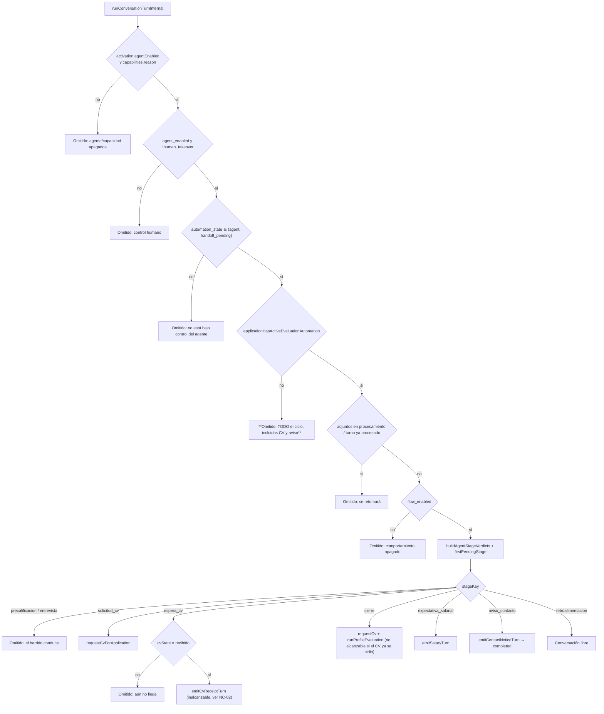

# Auditoría extrema de la inconsistencia del ciclo de nueve etapas · JARVI RH 2.0.233

## Dictamen ejecutivo

El panel «Etapas de la IA» declara que, con el interruptor maestro encendido, el motor ejecuta **exactamente** el paso 1, luego el 2, el 3, el 4, el 5, el 6, el 7, el 8 y termina con el 9. La lectura estática del código vigente (`2.0.233`) demuestra que **ese contrato no se cumple en al menos cinco escenarios reproducibles** y que hay **una etapa cuya acción principal es código inalcanzable**. No se trata de una decisión del modelo de lenguaje: todos los defectos viven en el motor determinista (`server/conversationEngine.ts`) y en el tablero de veredictos (`server/agentActivityLog.ts`).

| # | Hallazgo | Clase | Efecto observable |
| --- | --- | --- | --- |
| **NC-01** | La compuerta `applicationHasActiveEvaluationAutomation` bloquea **todo** el ciclo, no solo la conversación del perfil | No conformidad mayor | Plazas sin precalificación, sin entrevista y sin psicométrico automático: el CV nunca se solicita y los pasos 5 a 9 jamás se ejecutan |
| **NC-02** | La confirmación de recepción del CV (paso 7) es **código inalcanzable** | No conformidad mayor | La persona envía el CV y nunca recibe la confirmación; la bitácora muestra la etapa como cumplida |
| **NC-03** | El «Cierre del proceso» (paso 5) no ejecuta la evaluación automática si el paso 6 lo precede en el orden | No conformidad mayor | Con el orden visible en el panel, la evaluación del cierre no se ejecuta nunca y nadie lo advierte |
| **NC-04** | El orden administrado es una permutación libre, pero el motor asume el orden oficial | No conformidad mayor | Saltos de etapa reproducibles (salario antes del perfil, aviso de contacto antes de recibir el CV) |
| **NC-05** | La precalificación queda pendiente de forma indefinida cuando la plaza la desactiva y conserva preguntas | No conformidad mayor | Interbloqueo: los pasos 3 a 9 no se ejecutan |
| **NC-06** | «Espera del currículum» se asienta como completada mientras el CV sigue pendiente | No conformidad menor | Falso positivo de bitácora: ciclo aparentemente íntegro sin mensaje emitido |
| **NC-07** | El descarte en precalificación emite el aviso de contacto legado fuera del motor | No conformidad menor | Superficie doble de configuración y paso 9 fuera de su etapa |
| **NC-08** | La expectativa salarial se omite sin rastro si el formulario ya la declaró | Observación | El QA no ve el paso 8 y lo reporta como defecto |
| **NC-09** | Los estados de espera no tienen caducidad | Observación | Una persona que abandona a mitad suspende el ciclo para siempre |
| **NC-10** | La captura salarial puede re-preguntar en bucle | Observación | El paso 8 no concluye con respuestas no parseables |

El orden 1→9 **no está garantizado**; la secuencia depende de (a) la configuración de la plaza, (b) el orden administrado en el panel y (c) el estado del currículum. Las secciones siguientes documentan cada defecto con su evidencia exacta.

---

## 1. Objeto, alcance y criterios

- **Objeto:** determinar qué etapas del ciclo conversacional no se ejecutan, en qué condiciones y por qué, para sustentar la prueba de QA y la declaración ISO/DORA.
- **Alcance:** análisis estático del código fuente en la versión vigente (`package.json` → `2.0.233`); reconstrucción de la cadena de decisión de `runConversationTurnInternal`, del barrido `server/conversationWorker.ts` y del tablero puro `buildAgentStageVerdicts`. Configuración declarada en el panel aportado por la operación (nueve etapas habilitadas, interruptor maestro encendido, orden reordenado por arrastre). Sin acceso a la base de producción.
- **Criterios normativos:**
  1. El enunciado del panel: «encendido, el agente determinista ejecuta exactamente el paso 1, luego el 2, el 3, el 4, el 5, el 6, el 7, el 8 y termina con el 9: no puede hacer nada más que estas nueve etapas».
  2. El catálogo institucional `AGENT_STAGES` (`server/agentStages.ts:96-160`): orden fijo y «cualquier etapa anterior pendiente detiene las siguientes».
  3. La bitácora de la IA: «una etapa omitida no se silencia: queda asentada con su motivo» (`server/agentActivityLog.ts:10-20`).

## 2. Método

1. Trazado de las compuertas de `runConversationTurnInternal` (`server/conversationEngine.ts`) en su orden real de evaluación.
2. Análisis de alcanzabilidad del `switch (pendingStage.stageKey)` (`server/conversationEngine.ts:841-942`) contra los veredictos puros de `buildAgentStageVerdicts` (`server/agentActivityLog.ts:141-333`).
3. Trazado de las vías alternas que emiten mensajes: `dispatchWelcomeMessage`, `runScreeningStepSweep`, `closeScreening`, `runCvReminderSweep`.
4. Contraste del orden administrado (arrastrable) contra las dependencias que el motor asume.

## 3. Cadena de decisión del turno (orden real)



**Observación estructural:** la compuerta `applicationHasActiveEvaluationAutomation` (`server/conversationEngine.ts:709`) se evalúa **antes** de `flow_enabled` (`:798`) y **antes** del tablero de etapas (`:817-841`). Es la primera causa de ciclos truncados.

---

## 4. Hallazgos

### NC-01 — No conformidad mayor: la compuerta de protocolos bloquea todo el ciclo, no solo la conversación del perfil

**Evidencia.** `server/conversationEngine.ts:709-716` devuelve `skipped` antes de leer el flujo y las etapas. El comentario de la propia función (`server/conversationEngine.ts:400-408`) declara otra cosa:

> «Con la prueba psicométrica apagada y las dos fases del banco de preguntas apagadas, el agente no conversa: **solo solicita el CV una vez** y deja el resto en silencio.»

El código no solicita el CV: regresa antes de `case "solicitud_cv"` (`:851`) y de `case "cierre"` (`:884`). La única vía que emite `cv_request:<id>` es el motor de etapas (`requestCvForApplication` solo se invoca en `:852` y `:890` y en el modo excluyente de evaluación automática). La recepción del formulario **no** solicita el CV: solo despacha la bienvenida (`server/routers.ts:1997`).

**Condición de reproducción.** Plaza con `screening_precalificacion_enabled = false`, `screening_entrevista_enabled = false` y `psychometric_autostart` ausente o `false`. Con el flujo encendido y las nueve etapas habilitadas: el motor devuelve siempre «La postulación no tiene ningún protocolo de evaluación activo»; se ejecuta el paso 1 y **nada más**. Los pasos 2 a 9 nunca ocurren.

**Consecuencia.** El enunciado del panel es falso para esa configuración; el expediente queda sin solicitud de CV, sin expectativa salarial y sin aviso de contacto.

---

### NC-02 — No conformidad mayor: la confirmación de recepción del CV (paso 7) es inalcanzable

**Evidencia.** El veredicto de `espera_cv` (`server/agentActivityLog.ts:286-305`) marca la etapa **completada** tanto con `cvState = 'recibido'` como con `cvState = 'pendiente'`; solo queda pendiente con `'sin_solicitud'`. Como `firstPendingStage` (`server/agentActivityLog.ts:337-341`) devuelve la primera etapa **no completada**, y `cvState` rige el flujo del currículum:

- con `'pendiente'` la etapa está completada → nunca se selecciona;
- con `'recibido'` la etapa está completada → nunca se selecciona;
- con `'sin_solicitud'` la etapa está pendiente, pero `case "espera_cv"` (`server/conversationEngine.ts:862-880`) solo emite si `cvState === 'recibido'`, condición imposible en ese estado.

`emitCvReceiptTurn` (`server/conversationEngine.ts:530`) tiene un único punto de llamada (`:864`), por lo que **el mensaje `confirmacion_cv` no se emite nunca**. El texto administrable del paso 7 —«Al recibir el documento se confirma su recepción y se entrega de nuevo el aviso de contacto»— no se cumple en ninguna de sus dos partes.

**Consecuencia.** La persona adjunta el CV y no recibe confirmación; la bitácora, sin embargo, asienta la etapa 7 como ejecutada («Se supervisa el correo del solicitante…», `server/agentActivityLog.ts:296-301`). Es un falso positivo de la evidencia de auditoría, del mismo tipo que el hallazgo H-03 de `2.0.223`.

---

### NC-03 — No conformidad mayor: el «Cierre del proceso» no ejecuta la evaluación automática cuando el paso 6 lo precede

**Evidencia.** El veredicto de `cierre` (`server/agentActivityLog.ts:250-263`) marca la etapa **completada** si `cvState ∈ {pendiente, recibido}`. La **única** vía que ejecuta `runProfileEvaluation` es `case "cierre"` (`server/conversationEngine.ts:884-899`), y solo se alcanza cuando la etapa está pendiente, es decir, con `cvState = 'sin_solicitud'`.

En el orden administrado que muestra el panel (paso 5 «Solicitud del currículum» **antes** del paso 7 «Cierre del proceso»), al ejecutarse `case "solicitud_cv"` la marca `cv_request:<id>` deja `cvState = 'pendiente'`; en el turno siguiente el cierre ya aparece completado y **`runProfileEvaluation` no se ejecuta jamás**. El paso 5 declara en su descripción «la evaluación se vuelve a ejecutar con la conversación»; esa acción no ocurre.

**Nota:** en el orden de fábrica (cierre antes de la solicitud) el caso sí se alcanza; por eso el defecto es **dependiente del orden** y no se detecta con la secuencia por omisión.

---

### NC-04 — No conformidad mayor: el orden es una permutación libre, pero el motor asume el orden oficial

**Evidencia.** El panel permite arrastrar las etapas (`client/src/pages/AgentStages.tsx:127-150`) y el servidor acepta **cualquier** permutación de las nueve claves: `normalizeStageOrder` solo exige unicidad y longitud (`server/agentStages.ts:368-386`); únicamente reconduce la secuencia legada de `2.0.218`. Sin embargo, los veredictos del tablero dependen de consecuencias, no de actos:

- `expectativa_salarial` queda **pendiente** en cuanto la precalificación termina y la expectativa no consta (`server/agentActivityLog.ts:307-326`). Con el orden visible en el panel (paso 4 = expectativa salarial), el agente **pregunta el salario antes** de la conversación del perfil (paso 6) y antes de solicitar el CV (paso 5).
- `aviso_contacto` queda pendiente al concluir el cierre y puede emitirse **antes** de recibir el CV, porque `espera_cv` se marca completada con «pendiente» (NC-02/NC-06).
- `cierre` se marca completado al existir la solicitud de CV, sin haber ejecutado su evaluación (NC-03).

**Consecuencia.** El mismo motor produce secuencias distintas según el arrastre del panel; los «saltos de etapa» reportados en producción (auditoría `2.0.223`) son reproducibles sin ninguna vía legada, solo reordenando el ciclo.

---

### NC-05 — No conformidad mayor: interbloqueo de la precalificación con preguntas activas y la plaza desactivada

**Evidencia.** El veredicto de `precalificacion` usa `signals.precalificacionActive`, que cuenta preguntas activas de la plaza (`server/agentActivityLog.ts:473-477`) y **no consulta** `job_positions.screening_precalificacion_enabled`. La creación de la máquina de estados exige ese interruptor: `ensureScreeningRunsForReceivedCv` requiere `p.screening_precalificacion_enabled = true` (`server/screeningEngine.ts:512-524`), y el barrido solo la invoca si la etapa está habilitada (`server/screeningEngine.ts:845-848`).

Resultado: con la plaza desactivada pero con preguntas activas, **nunca se crea el `screening_run`**, `phase` queda en `null`, el veredicto devuelve `pending("precalificacion")` (`server/agentActivityLog.ts:190-196`) y el motor responde siempre «La etapa ‹Precalificación› del ciclo administrado aún no se completa» (`server/conversationEngine.ts:845-850`). Los pasos 3 a 9 quedan detenidos.

**Asimetría del defecto:** la entrevista **sí** considera su interruptor (`entrevista_enabled`, `server/agentActivityLog.ts:208-215`); la precalificación no.

---

### NC-06 — No conformidad menor: la espera del CV se asienta como completada sin emitir nada

**Evidencia.** `server/agentActivityLog.ts:296-301`: con `cvState = 'pendiente'` la etapa se marca `executed` con la justificación «Se supervisa el correo del solicitante para confirmar la recepción». No hay mensaje emitido ni recordatorio en ese instante (el recordatorio llega recién a las 24 h, `server/cvRequest.ts:62-131`).

**Consecuencia.** La bitácora presenta un ciclo «íntegro» para un expediente que no recibió la confirmación del paso 7 (agravado por NC-02: ni siquiera al recibirlo). Es evidencia interna que contradice la evidencia de la persona.

---

### NC-07 — No conformidad menor: el aviso de contacto del descarte se emite fuera del motor y con otra fuente de texto

**Evidencia.** En el descarte, `closeScreening` (`server/screeningEngine.ts:544-597`) compone el cierre con `composeCvClosingFromSettings` leyendo la clave **legada** `recruitment.cv_contact_notice` (`server/screeningEngine.ts:575-590`) y lo emite con la marca `screening_close:<run>`; el motor de etapas nunca interviene. Es la clase de defecto de la no conformidad mayor H-01 de `2.0.223`, ahora acotada al descarte: el texto del paso 9 administrado en el panel **no** es el que rige, y el aviso se emite sin que las etapas 5 a 8 hayan ocurrido.

**Mitigación ya aplicada:** el cierre ordinario (no descarte) **no** emite mensaje (`server/screeningEngine.ts:568-573`), de modo que el salto 2→6+9 del incidente ya no ocurre en el camino feliz.

---

### NC-08 — Observación: la expectativa salarial se omite sin rastro visible

**Evidencia.** `server/agentActivityLog.ts:307-326` omite la etapa cuando `source.salary.declared` (`server/conversationContext.ts:732-735`: `salary_expectation_gtq > 0` y fuente distinta de `no_declarada`). El formulario público puede declarar la expectativa, de modo que un QA con ese dato no verá el paso 8.

**Acción:** declarar el formulario **sin** expectativa salarial antes de la prueba, o leer el motivo de omisión en la bitácora.

---

### NC-09 — Observación: los estados de espera no tienen caducidad

**Evidencia.** El barrido solo avanza cuando existe un mensaje entrante pendiente (`server/conversationWorker.ts:26-51`); `planScreeningStep` devuelve `esperar` mientras la persona no responde (`server/screeningEngine.ts:278-330`, `:1000`). No hay caducidad ni re-enganche. Una persona que abandona a mitad de la precalificación deja el run `en_curso` de forma indefinida y detiene los pasos 3 a 9.

---

### NC-10 — Observación: la captura salarial puede re-preguntar en bucle

**Evidencia.** `closeAnsweredCycles` cierra todos los ciclos abiertos con el mensaje entrante (`server/conversationEngine.ts:314-328`), de modo que `emitSalaryTurn` considera «respondido» (`:547-553`) y llama a `extractExplicitSalaryExpectation`; si la respuesta no contiene un monto explícito, **vuelve a formular la pregunta y abre un ciclo nuevo** (`:666-676`). Respuestas como «depende» o «lo conversamos» mantienen la etapa 8 abierta y, con ella, el paso 9 pendiente.

---

## 5. Matriz de ejecución por etapa

| Paso | Etapa | ¿Se ejecuta siempre? | Compuertas que la detienen |
| --- | --- | --- | --- |
| 1 | Recepción del formulario | Sí, salvo configuración | `flow_enabled=false`; etapa apagada; `welcome:<id>` ya emitida |
| 2 | Precalificación | **No** | NC-01; NC-05; barrido apagado; control humano; sin respuesta de la persona |
| 3 | Entrevista guiada | **No** | NC-01; NC-05; `screening_entrevista_enabled=false`; sin preguntas activas |
| 4 | Conversación del perfil | **No** | NC-01; NC-04 (orden); sin protocolo activo; adjuntos en proceso; escalamiento a humano |
| 5 | Cierre del proceso | **No** | NC-01; NC-03 (orden); NC-04 |
| 6 | Solicitud del currículum | **No** | NC-01; NC-04; `cv_request:<id>` ya emitida |
| 7 | Espera del currículum | **Nunca emite la confirmación** | NC-02 (código inalcanzable); CV no clasificado `document_class='cv'` |
| 8 | Expectativa salarial | **No** | NC-01; NC-04; NC-08; NC-10 |
| 9 | Aviso de contacto | **No** | NC-01; NC-04; NC-07 (descarte por vía legada) |

## 6. Verificación requerida en producción antes de la QA

```sql
-- 1. Flujo encendido y etapas habilitadas (panel «Etapas de la IA»)
SELECT setting_key, setting_value FROM integration_settings
 WHERE provider='agent_stages'
   AND setting_key IN ('flow_enabled','enabled','order')
 ORDER BY setting_key;

-- 2. Orden administrado vigente (debe ser el oficial o justificarse)
SELECT setting_value AS orden FROM integration_settings
 WHERE provider='agent_stages' AND setting_key='order';

-- 3. Interruptores de la plaza y del proveedor psicométrico (NC-01, NC-05)
SELECT p.title, p.screening_precalificacion_enabled, p.screening_entrevista_enabled,
       (SELECT count(*) FROM screening_questions q
         WHERE q.job_position_id=p.id AND q.active) AS preguntas_activas
  FROM job_positions p WHERE p.title = '<plaza de la QA>';
SELECT setting_key, setting_value FROM integration_settings
 WHERE provider='assessments' AND setting_key='psychometric_autostart';

-- 4. Veredicto congelado: etapa pendiente por expediente (NC-01..NC-06)
SELECT c.id AS candidate_id, c.full_name, conv.id AS conversation_id,
       conv.automation_state, conv.conversation_stage, conv.agent_enabled,
       conv.human_takeover,
       sr.phase, sr.status AS screening_status,
       EXISTS (SELECT 1 FROM candidate_knowledge_files f
                WHERE f.application_id=a.id AND f.document_class='cv') AS cv_recibido,
       EXISTS (SELECT 1 FROM conversation_messages m
                WHERE m.message_key='cv_request:'||a.id::text) AS cv_solicitado,
       EXISTS (SELECT 1 FROM conversation_turns t
                WHERE t.conversation_id=conv.id AND t.model IS NOT NULL
                  AND t.model<>'deterministic') AS conversacion_libre
  FROM applications a
  JOIN candidates c ON c.id=a.candidate_id
  JOIN conversations conv ON conv.application_id=a.id
  LEFT JOIN screening_runs sr ON sr.application_id=a.id
 WHERE c.full_name ILIKE '%<apellido de la QA>%';

-- 5. Confirmación del paso 7 (NC-02): debe existir la marca del mensaje
SELECT m.message_key, m.delivery_status, m.body, m.created_at
  FROM conversation_messages m
  JOIN conversations conv ON conv.id=m.conversation_id
  JOIN applications a ON a.id=conv.application_id
 WHERE a.id = <applicationId>
 ORDER BY m.created_at;

-- 6. Evaluación del cierre (NC-03): debe existir el asiento de la evaluación
SELECT action, created_at FROM audit_log
 WHERE entity_type='application' AND entity_id=<applicationId>
   AND action ILIKE '%evaluat%'
 ORDER BY created_at;
```

## 7. Correcciones propuestas (no aplicadas en esta auditoría)

1. **NC-01** — Mover la compuerta `applicationHasActiveEvaluationAutomation` **después** del despacho de las etapas deterministas, o limitarla a la rama de conversación libre (`case "retroalimentacion"`), que es lo que su propio comentario declara.
2. **NC-02** — Separar el veredicto del acto: `espera_cv` debe quedar **pendiente** hasta que exista la marca `confirmacion_cv` emitida (o una columna de confirmación), no al existir el CV.
3. **NC-03** — Ejecutar `runProfileEvaluation` en el paso de cierre **con independencia del estado del CV** (por ejemplo, ligado a la marca de cierre emitido), no como efecto colateral de `case "cierre"`.
4. **NC-04** — Restringir el orden administrado a las permutaciones que respetan las dependencias (precalificación ⇄ entrevista ⇄ perfil ⇄ cierre ⇄ solicitud ⇄ espera ⇄ salario ⇄ aviso) o derivar el orden efectivo de las dependencias declaradas.
5. **NC-05** — Incorporar `screening_precalificacion_enabled` al veredicto de precalificación, con la misma simetría que la entrevista.
6. **NC-06** — Asentar la etapa 7 como completada solo al emitirse la confirmación.
7. **NC-07** — Componer el cierre del descarte con la plantilla administrada `aviso_contacto`.
8. **NC-08/NC-09/NC-10** — Caducidad y recordatorio de la precalificación; registro del motivo de omisión salarial en la ficha; y confirmación o segundo intento acotado en la captura salarial.

## 8. Dictamen

El ciclo de nueve etapas **no es determinista respecto de su propio enunciado**: depende de la configuración de la plaza (NC-01, NC-05), del orden arrastrado en el panel (NC-03, NC-04) y del estado del currículum (NC-02, NC-06). Dos acciones del ciclo —la confirmación de recepción del CV y la evaluación automática del cierre— **no se ejecutan en configuraciones ordinarias**, y la bitácora puede presentarlas como cumplidas. Para la prueba de QA de hoy se recomienda: plaza con precalificación **y** entrevista habilitadas y con preguntas activas; orden de fábrica sin reordenar; formulario sin expectativa salarial declarada; un CV en PDF clasificable; una sola conversación sin tráfico concurrente; y verificar la evidencia con las consultas de la sección 6 antes de atribuir la omisión al modelo de lenguaje.

---

## 9. Addendum · Corrección aplicada

Los hallazgos de la sección 4 quedaron resueltos con el **ejecutor secuencial por orden administrado**:

- **NC-01 resuelto** — se retiró la compuerta `applicationHasActiveEvaluationAutomation`; ninguna configuración de plaza detiene las etapas deterministas.
- **NC-02 resuelto** — la espera del currículum es un **monitor que no detiene el ciclo** y confirma la recepción cuando el documento llega; la confirmación ya es alcanzable.
- **NC-03 resuelto** — el cierre se ejecuta por su propio acto (evaluación y despacho del CV) y su memoria vive en `agent_ai_log`, con independencia de la posición de la solicitud del currículum.
- **NC-04 resuelto** — el ejecutor recorre `order` y omite las etapas apagadas sin detenerse; reordenar el panel conserva la memoria del paso alcanzado.
- **NC-05 resuelto** — el veredicto de precalificación considera el interruptor de la plaza y la serie arranca en la entrevista si la precalificación está apagada.
- **NC-06 resuelto** — la etapa 7 no se asienta como ejecutada mientras solo se supervisa.
- **NC-07 resuelto** — el descarte toma su aviso de la plantilla administrada `aviso_contacto`; se retiró `composeCvClosingFromSettings`.
- **Paso 9 y psicométrico** — el ciclo concluye en el aviso de contacto y solo entonces se programa la prueba psicométrica, si la operación la tiene encendida. La evaluación automática sigue siendo el modo excluyente.

La verificación se ejecutó con `pnpm check`, `pnpm test` (802 pruebas), `pnpm build`, `pnpm text:verify` y `pnpm docs:verify`.

