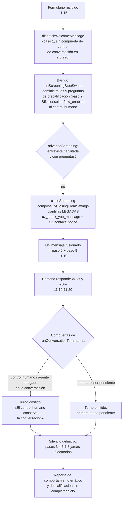

# Auditoría ISO académica del salto de etapas del agente conversacional · JARVI HR 2.0.223

## Dictamen ejecutivo

El fenómeno reportado **quedó reproducido y explicado por el código fuente**: la conversación de Gustavo Martínez Fuentes del 24/9/2026, 11:15–11:20, ejecutó el paso 1 y el paso 2 y después saltó de forma errática al paso 6 y al paso 9 **en un solo mensaje**, ignorando los pasos 3, 4, 5, 7 y 8. La persona quedó esperando los pasos 3, 4 y 5 y reportó el comportamiento; fue descalificada del proceso sin que se ejecutaran las nueve etapas.

La causa no es una decisión del modelo de lenguaje, sino **un canal de cierre legado que emite la solicitud de CV y el aviso de contacto fuera del motor de etapas**, y una cadena de compuertas que dejó la conversación sin respuesta después de ese mensaje. El incidente ocurrió **antes** del despliegue de los dos commits que declaran el proceso claro (2.0.222 y 2.0.223, commitados a las 16:49 y 16:59 del mismo día). El defecto estructural **persiste en la versión vigente** porque `server/screeningEngine.ts` no cambió entre la versión desplegada durante el incidente (2.0.220, `7dbe232`) y HEAD (`635ffa4`).

Se registran **nueve hallazgos** clasificados conforme a la taxonomía de auditoría de sistemas de gestión (no conformidad mayor, no conformidad menor, observación y oportunidad), con su requisito infringido, su evidencia en código y su consecuencia sobre la persona candidata.

| Estado       | Significado en este documento                                                                 |
| ------------ | --------------------------------------------------------------------------------------------- |
| Confirmado   | Reproducido desde el código fuente, con evidencia de archivo y línea.                          |
| Inferido     | Reconstrucción causal consistente con la evidencia; exige verificación contra la base de producción. |
| No verificable | Requiere acceso a la base de datos o al entorno objetivo; se declara la consulta exacta.    |

---

## 1. Objeto, alcance y criterios de auditoría

### 1.1 Objeto

Auditar el comportamiento observado del agente conversacional JARVI HR («Talento AISA») en la conversación de la postulación de **Gustavo Martínez Fuentes** para la plaza **«Ejecutivo de Negocios (Ventas)»** (+502 4473 8627), ocurrida el **24/9/2026 entre las 11:15 y las 11:20 a. m.**, y determinar por qué el agente ejecutó los pasos 1 y 2, saltó al 6 y al 9 en un solo mensaje, ignoró los pasos 3, 4, 5, 7 y 8, y por qué la persona quedó esperando y fue descalificada sin completar el ciclo.

### 1.2 Alcance

- Código fuente del repositorio `reclutamiento-aisa-agent` en HEAD (2.0.223, `635ffa4`) y en las versiones históricas pertinentes (`7dbe232` = 2.0.220, desplegada al momento del incidente; `43479d9` = 2.0.221; `ff51289` = 2.0.222).
- Evidencia de conversación aportada: transcripción de WhatsApp y ficha administrativa de la bandeja de entrada.
- Configuración declarada de la hoja «Etapas de la IA» (los nueve pasos, todos habilitados, interruptor maestro encendido).

**Fuera de alcance:** el estado de la base de datos de producción (no accesible desde el repositorio), la ejecución en tiempo real del entorno desplegado y el contenido de los modelos de lenguaje. Toda afirmación que dependa de la base se declara como verificación requerida en la sección 7.

### 1.3 Criterios normativos (el proceso «claro» declarado por los dos commits anteriores)

1. **2.0.221 (`43479d9`)** — «la solicitud de CV vive en el paso 6 y el aviso de contacto en el paso 9; … **ninguna otra vía solicita CV**».
2. **2.0.222 (`ff51289`)** — «interruptor maestro del comportamiento del agente …; apagado no ejecuta acción, **encendido ejecuta solo las nueve etapas**, y la evaluación automática apaga y bloquea el flujo».
3. **Catálogo institucional `AGENT_STAGES`** (`server/agentStages.ts:73-148`): las nueve etapas en el orden fijo 1 Recepción del formulario → 2 Precalificación → 3 Entrevista guiada → 4 Conversación del perfil → 5 Cierre del proceso → 6 Solicitud del currículum → 7 Espera del currículum → 8 Expectativa salarial → 9 Aviso de contacto. «El motor debe ejecutar las etapas en este orden; cualquier etapa anterior pendiente detiene las siguientes».
4. **Motor determinista** (`server/conversationEngine.ts`): ejecuta únicamente la primera etapa pendiente del ciclo fijo y omite cualquier acción posterior.
5. **Bitácora de la IA** (`server/agentActivityLog.ts`): «Una etapa omitida no se silencia: queda asentada con su motivo».

---

## 2. Metodología

1. **Reconstrucción cronológica** de los hechos con la transcripción y la ficha administrativa como evidencia primaria.
2. **Trazabilidad de código**: localización de cada mensaje observado en las vías de emisión del servidor (plantillas, claves de mensaje, barridos, turnos).
3. **Análisis inter-versión**: `git diff 7dbe232..HEAD` para determinar qué código gobernaba el incidente y qué persiste en la versión vigente.
4. **Análisis de máquina de estados**: veredictos de etapa (`buildAgentStageVerdicts`), primera etapa pendiente (`firstPendingStage`) y compuertas de `runConversationTurnInternal`.
5. **Clasificación de hallazgos** conforme a la práctica de auditoría de sistemas de gestión: no conformidad mayor (incumplimiento del requisito declarado con impacto en la persona o el proceso), no conformidad menor (desviación parcial), observación (riesgo sin incumplimiento probado) y oportunidad de mejora.

---

## 3. Cronología de los hechos

| Hora | Actor | Hecho observado | Paso del ciclo declarado |
| --- | --- | --- | --- |
| 11:15 | Agente | Bienvenida: «¡Hola Gustavo Martínez Fuentes, soy el asistente de evaluación de AISA! Le daré seguimiento a su solicitud para la plaza "Ejecutivo de Negocios (Ventas)"…» | 1 ✓ |
| 11:15–11:18 | Agente | Nueve preguntas de precalificación (residencia, empleo, años de ventas, licencia, campo/fines de semana, compromisos horarios, viajes, negocios propios, transporte). Respuestas: Sí, No, 5, Sí, Sí, No, Sí, No, Sí | 2 ✓ |
| **11:19** | Agente | **Un solo mensaje combinado**: «Gustavo Martínez Fuentes, gracias por participar en el proceso de Ejecutivo de Negocios (Ventas), puede enviarnos por esta vía su CV?» + «Si su perfil avanza después de analizar su CV, nos comunicaremos con usted por este mismo medio.» | **6 + 9 fusionados ✗** |
| — | — | **Nunca se emitieron**: preguntas de entrevista guiada, conversación abierta del perfil, cierre del proceso, confirmación de recepción de documento, pregunta de expectativa salarial. | **3, 4, 5, 7, 8 omitidos ✗** |
| 11:19–11:20 | Persona | Envía «Ok» y «Sí». **El agente no responde nunca más.** | Silencio ✗ |
| Posterior | Operación | La persona reporta el comportamiento errático y **es descalificada del proceso sin ejecutar los nueve pasos**. Ficha: «Sin puntaje», «Sin prueba activa». | Descalificación ✗ |
| 16:14 | Repositorio | Commit 2.0.221 (`43479d9`) | — |
| 16:49 | Repositorio | Commit 2.0.222 (`ff51289`): interruptor maestro | — |
| 16:59 | Repositorio | Commit 2.0.223 (`635ffa4`): HEAD actual | — |

**Hecho cronológico capital:** el incidente (11:15 a. m.) es **anterior** a los dos commits que declaran el proceso claro (4:49 y 4:59 p. m. del mismo día). La versión desplegada al momento del incidente era, como máximo, la 2.0.220 (`7dbe232`, commitada a las 00:06 del mismo día). Los controles correctivos del interruptor maestro **no estaban en producción** cuando la persona conversó.

---

## 4. Cadena causal reconstruida



### 4.1 El mensaje de las 11:19: prueba forense de su origen

El texto observado se compone exactamente como lo hace `composeCvClosing` (`server/cvAnalysis.ts:151-171`): **agradecimiento + aviso de contacto unidos por `\n\n` en un solo mensaje**. La primera parte contiene la solicitud de CV dentro del agradecimiento, lo que solo puede ocurrir si la clave legada `recruitment.cv_thank_you_message` de la base contiene ese texto (el valor por defecto, `server/cvAnalysis.ts:44-45`, no pide CV).

Contraste con las plantillas de la hoja «Etapas de la IA»:

| Mensaje | Plantilla de etapa (HEAD) | Texto observado en el incidente |
| --- | --- | --- |
| Solicitud de CV (paso 6) | «…de {{plaza}}, **¿**puede enviarnos por esta vía su CV?» (`agentStages.ts:185-186`) | «…de Ejecutivo de Negocios (Ventas), puede enviarnos por esta vía su CV?» — **sin «¿»** |
| Aviso de contacto (paso 9) | «Si su perfil avanza…» (`agentStages.ts:193-194`) | Texto idéntico ✓ |

**Conclusión forense:** el mensaje de las 11:19 no salió de las plantillas administrables del ciclo. Salió de la **vía legada de cierre** (`composeCvClosingFromSettings`), que en el código vigente solo invoca `closeScreening` (`server/screeningEngine.ts:533`), y que en la versión desplegada durante el incidente también invocaba `emitCierreTurn` del motor (`server/conversationEngine.ts` en 2.0.220). En ambas vías el agradecimiento personalizado de la base fusiona la solicitud de CV con el aviso de contacto: **ese es el salto observado del paso 2 al paso 6 y al paso 9 en un solo mensaje**.

### 4.2 Por qué se saltaron los pasos 3, 4 y 5

1. `advanceScreening` (`server/screeningEngine.ts:685-711`): al responder la novena pregunta, `nextScreeningPhase('precalificacion')` devuelve `entrevista`; pero la bifurcación de la línea 697 exige `run.entrevista_enabled`; si el interruptor de entrevista de la plaza está apagado (o no hay preguntas activas de entrevista), ejecuta `closeScreening` y **cierra el protocolo con el agradecimiento y el aviso de contacto**, sin pasar por la conversación del perfil ni por el cierre del proceso.
2. `closeScreening` (`server/screeningEngine.ts:505-585`) emite ese cierre y marca el run como `concluido` con `phase='concluido'` (`:575-583`), **aunque la entrevista jamás se administró**.
3. La conversación libre (paso 4) depende del turno del motor, pero las compuertas de `runConversationTurnInternal` (`server/conversationEngine.ts:597-660`) omitieron los turnos de «Ok» y «Sí» — ver 4.3.

### 4.3 Por qué la persona quedó esperando y nadie respondió

Las compuertas del motor, en orden de evaluación:

1. `activation.agentEnabled` / `capabilities.reason` (`conversationEngine.ts:607-616`);
2. `state.agent_enabled` o `state.human_takeover` (`:624-628`) — **la ficha administrativa muestra el botón «Activar JARVIS HR» y el teclado humano bloqueado**, lo que documenta que la conversación estaba bajo control humano: el agente no podía responder aunque el barrido siguiera emitiendo mensajes;
3. `automation_state` distinto de `agent`/`handoff_pending` (`:629-634`);
4. sin protocolo de evaluación activo (`:641-647`);
5. y, tras el cierre, la primera etapa pendiente del ciclo devuelve `skipped` para etapas no deterministas (por ejemplo, la espera del CV: «El currículum solicitado aún no llega», `:783-790`).

El resultado observado es el silencio posterior a las 11:19: los pasos 7 y 8 nunca se ejecutan porque el expediente queda en espera de un documento que la persona ya no sabe cómo entregar, sin recordatorio, sin aviso y sin ruta de escape.

---

## 5. Hallazgos

### H-01 — No conformidad mayor: el cierre del screening emite los pasos 6 y 9 fuera del motor de etapas

**Requisito infringido:** 2.0.221 declara que «ninguna otra vía solicita CV» y que la solicitud vive en el paso 6; 2.0.222 declara que encendido el flujo «ejecuta solo las nueve etapas». El catálogo (`agentStages.ts:73-148`) reserva a la etapa 6 el mensaje `solicitud_cv` y a la etapa 9 el mensaje `aviso_contacto`.

**Evidencia:** `closeScreening` (`server/screeningEngine.ts:505-585`) compone el cierre con `composeCvClosingFromSettings` (`:533`) leyendo las claves legadas `cv_thank_you_message` y `cv_contact_notice` del proveedor `recruitment` (`:520-528`). `server/screeningEngine.ts` **no importa** el catálogo de etapas ni la configuración del agente (importa únicamente `composeCvClosingFromSettings` de `cvAnalysis` y `recordAgentStageEntry` de `agentActivityLog`; `:10-11`). El mensaje emitido es, en la práctica, el paso 6 y el paso 9 fusionados en un solo mensaje — exactamente lo observado a las 11:19.

**Estado:** Confirmado. El archivo no cambió entre `7dbe232` (2.0.220, desplegada en el incidente) y HEAD: `git diff 7dbe232..HEAD -- server/screeningEngine.ts` es vacío. **El salto 2→6+9 puede repetirse en la versión vigente.**

### H-02 — No conformidad mayor: el barrido de screening ignora el interruptor maestro y el control humano de la conversación

**Requisito infringido:** 2.0.222: apagado «no ejecuta acción»; el diseño del panel declara que el teclado humano se habilita al transferir el control y que JARVIS HR mantiene el control del ciclo.

**Evidencia:** `runScreeningStepSweep` (`server/screeningEngine.ts:730+`, invocado por `conversationWorker.ts:115` antes del turno conversacional) administra preguntas y emite cierres **sin consultar** `flow_enabled` ni `conversations.agent_enabled/human_takeover/automation_state`. `dispatchWelcomeMessage` en 2.0.220 tampoco consultaba control de conversación (la compuerta de `flowEnabled` de `cvRequest.ts:89` solo se agregó en 2.0.222).

**Consecuencia observada:** el candidato recibió automatización completa (bienvenida + 9 preguntas + cierre) **mientras la conversación estaba bajo control humano** — el panel muestra «Activar JARVIS HR» y teclado bloqueado —, y después silencio absoluto. El agente aparenta estar conversando cuando el motor determinista está, de hecho, apagado para esa conversación.

**Estado:** Confirmado (comportamiento del código). La configuración exacta de la conversación en producción se declara verificación requerida (V-04).

### H-03 — No conformidad mayor: la bitácora de la IA asienta falsos positivos en las etapas 3 y 4

**Requisito infringido:** la bitácora declara que «una etapa omitida no se silencia» (`agentActivityLog.ts:12-14`) y que el comité puede contrastar si el flujo se cumplió en el orden declarado.

**Evidencia:**
- Etapa 4 «Conversación del perfil»: `freeConversationHeld = source.turns.some(turn => turn.direction === "outbound")` (`agentActivityLog.ts:148-150`), donde `source.turns` carga **todos** los mensajes de la conversación sin filtrar tipo ni origen (`conversationContext.ts:665-672`). La bienvenida, las preguntas de screening y el cierre son mensajes salientes: **la etapa 4 se marca ejecutada en cualquier conversación que haya emitido al menos un mensaje**, aunque el motor nunca haya conversado libremente.
- Etapa 3 «Entrevista guiada»: se marca ejecutada «Concluyó y el expediente pasó a la conversación del perfil» cuando `phase === 'concluido'` (`agentActivityLog.ts:210-217`), estado que `closeScreening` asigna **aunque la entrevista jamás se administró** (`screeningEngine.ts:575-583`).
- Etapa 7 «Espera del currículum»: se marca ejecutada con `cvState === 'pendiente'` («Se supervisa el correo del solicitante», `agentActivityLog.ts:270-280`) aun cuando la confirmación de recepción nunca se entregó.

**Agravante:** `recordAgentLogVerdicts` solo persiste los veredictos con `completed=true` (`agentActivityLog.ts:485`); una etapa pendiente no deja línea alguna. Como las etapas 3 y 4 se resuelven falsamente como completadas, la bitácora no registra ni la omisión ni la pendencia: el comité técnico lee un ciclo íntegro.

**Consecuencia:** la ficha del candidato puede mostrar un ciclo limpio de nueve etapas «completadas» para un expediente que en realidad saltó los pasos 3, 4 y 5. La evidencia de auditoría interna contradice la evidencia de la persona candidata.

**Estado:** Confirmado por código.

### H-04 — No conformidad menor: doble superficie de configuración del texto institucional de cierre

**Evidencia:** el mismo texto institucional vive en dos lugares con autoridad concurrente: las plantillas de etapa del paso 6 (`solicitud_cv`) y paso 9 (`aviso_contacto`) bajo el proveedor `agent_stages`, y las claves legadas `recruitment.cv_thank_you_message` / `cv_contact_notice` consumidas por `closeScreening`. El incidente demuestra que **la vía legada prevalece en producción**: el texto emitido («…puede enviarnos por esta vía su CV?») difiere del administrable («…¿puede enviarnos…»), de modo que la operación cree gobernar un mensaje que en realidad no controla.

**Estado:** Confirmado.

### H-05 — No conformidad mayor: descalificación del candidato sin ejecutar las nueve etapas y sin barandilla de completitud

**Requisito infringido:** el ciclo declarado exige ejecutar los nueve pasos; 2.0.222 declara que el flujo «ejecuta exactamente el paso 1, luego el 2, el 3, el 4, el 5, el 6, el 7, el 8 y termina con el 9».

**Evidencia:** la conversación documenta que los pasos 3, 4, 5, 7 y 8 nunca se emitieron y que la persona fue descalificada del proceso tras reportar el comportamiento. No existe en el código una verificación de completitud del ciclo que condicione la descalificación administrativa ni un asiento que impida cerrar/descalificar un expediente con etapas pendientes. El código solo registra la descalificación determinista del screening (`applications.status='no_calificado'` + auditoría `screening_disqualified`, `screeningEngine.ts:544-570`), que no se corresponde con el patrón observado (todas las respuestas de la transcripción son aprobables a simple vista).

**Estado:** El hecho de la descalificación es Confirmado por la evidencia aportada; el **mecanismo** exacto (administrativa vs. screening) es No verificable desde el repositorio y se declara en V-03.

### H-06 — Observación: los estados de espera no tienen caducidad, recordatorio ni ruta de escape

**Evidencia:** los pasos 7 y 8 quedan gobernados por estados de espera unidireccionales («El currículum solicitado aún no llega; el turno espera su recepción», `conversationEngine.ts:783-790`). Si la conversación queda bajo control humano — como documenta la ficha — nadie vuelve a escribir a la persona: ni el barrido (bloqueado por diseño en el motor, no por el barrido) ni el equipo humano (que la transcribe como descalificación). La persona espera indefinidamente los pasos que le anunciaron.

**Estado:** Confirmado por código; la priorización de un recordatorio es oportunidad de mejora.

### H-07 — Observación: desencadenante probable del salto no asentado

**Evidencia:** la bifurcación `advanceScreening` (`screeningEngine.ts:697-704`) cierra la precalificación sin distinguir en la traza entre «entrevista no administrada» (interruptor apagado o sin preguntas) y «entrevista concluida». La plaza tiene sembradas 6 preguntas de entrevista (`database/007_screening_questions_seed.sql:154-210`), por lo que el salto exige que el interruptor `screening_entrevista_enabled` de la plaza estuviera apagado o las preguntas inactivas en producción. No hay asiento de auditoría que declare cuál de las dos condiciones se cumplió.

**Estado:** Inferido; verificación requerida V-02.

### H-08 — No conformidad menor: el aviso de contacto (paso 9) se emitió antes de los pasos 5, 7 y 8

**Evidencia:** el mensaje de las 11:19 contiene el texto del paso 9 cuando aún no existían cierre, confirmación de CV ni expectativa salarial. Cualquiera que sea la vía (legada o de etapa), la secuencia observada viola el orden fijo declarado. Es consecuencia directa de H-01.

**Estado:** Confirmado.

### H-09 — Observación: discordancia de identidad entre el destinatario y el registro

**Evidencia:** el agente saluda a «Gustavo Martínez Fuentes» (nombre del expediente) mientras el remitente de WhatsApp se muestra como «Miguel Lopez». No altera el hallazgo principal, pero exige verificar la vinculación número↔postulación y el protocolo de deduplicación de contactos.

**Estado:** Observación; verificación V-05.

---

## 6. Matriz de trazabilidad etapa ↔ comportamiento observado ↔ código responsable

| Paso | Nombre | ¿Ejecutado? | Vía de emisión responsable | Defecto identificado |
| --- | --- | --- | --- | --- |
| 1 | Recepción del formulario | Sí (11:15) | `dispatchWelcomeMessage` (`cvRequest.ts:84+`) | En 2.0.220 sin compuerta de control de conversación ni de flujo |
| 2 | Precalificación | Sí (11:15–11:18) | `runScreeningStepSweep` (`screeningEngine.ts:730+`) | Barrido sin `flow_enabled` ni control humano (H-02) |
| 3 | Entrevista guiada | **No** | `advanceScreening` bifurca a `closeScreening` (`:697-704`) | Cierre anticipado; bitácora la marca concluida (H-03) |
| 4 | Conversación del perfil | **No** | motor bloqueado por compuertas (`conversationEngine.ts:624-634`) | Falso positivo `freeConversationHeld` (H-03) |
| 5 | Cierre del proceso | **No** | — | Sustituido por el cierre legado del screening (H-01) |
| 6 | Solicitud del currículum | Sí, **fusionado** (11:19) | `composeCvClosingFromSettings` legado | Fuera del motor de etapas (H-01, H-04) |
| 7 | Espera del currículum | **No** | estado `pendiente` sin confirmación | Sin caducidad ni recordatorio (H-06) |
| 8 | Expectativa salarial | **No** | jamás alcanzada | Ciclo roto en 6+9 (H-01) |
| 9 | Aviso de contacto | Sí, **fusionado** (11:19) | vía legada | Emitido antes de 5, 7 y 8 (H-08) |

---

## 7. Verificación de producción requerida (evidencia no disponible en el repositorio)

```sql
-- V-01 ¿Qué versión estaba desplegada a las 11:15 del 24/9/2026?
--   (bitácora de despliegue del operador; el repositorio solo acota 2.0.220 como máximo)

-- V-02 Interruptor de entrevista de la plaza en el momento del incidente
SELECT p.id, p.title, p.screening_precalificacion_enabled,
       p.screening_entrevista_enabled
  FROM job_positions p
 WHERE p.title = 'Ejecutivo de Negocios (Ventas)';

SELECT phase, count(*) FROM screening_questions
 WHERE job_position_id = (SELECT id FROM job_positions
                           WHERE title = 'Ejecutivo de Negocios (Ventas)')
 GROUP BY phase;

-- V-03 Mecanismo de la descalificación de la postulación
SELECT a.id, a.status, a.evaluation_reason, a.updated_at
  FROM applications a
  JOIN candidates c ON c.id = a.candidate_id
 WHERE c.full_name ILIKE '%Gustavo Martínez%';
SELECT * FROM audit_log
 WHERE entity_type='application'
   AND (action IN ('screening_disqualified') OR after_json::text ILIKE '%no_calificado%')
 ORDER BY created_at DESC LIMIT 20;

-- V-04 Control de la conversación en el momento del incidente
SELECT c.id, c.agent_enabled, c.human_takeover, c.automation_state,
       c.conversation_stage, c.updated_at
  FROM conversations c
  JOIN applications a ON a.id = c.application_id
  JOIN candidates cand ON cand.id = a.candidate_id
 WHERE cand.full_name ILIKE '%Gustavo Martínez%';

-- V-05 Identidad y claves de mensaje de la conversación
SELECT m.message_key, m.direction, m.body, m.created_at
  FROM conversation_messages m
  JOIN conversations c ON c.id = m.conversation_id
  JOIN applications a ON a.id = c.application_id
  JOIN candidates cand ON cand.id = a.candidate_id
 WHERE cand.full_name ILIKE '%Gustavo Martínez%'
 ORDER BY m.created_at;
-- Discriminador forense: ¿el mensaje de las 11:19 tiene clave
-- 'screening_close:{run_id}' (vía barrido) o provino del turno 'cierre' del motor?

-- V-06 Estado del interruptor maestro y de las plantillas en production
SELECT setting_key, setting_value FROM integration_settings
 WHERE provider='agent_stages' ORDER BY setting_key;
SELECT setting_key, setting_value FROM integration_settings
 WHERE provider='recruitment' AND setting_key IN ('cv_thank_you_message','cv_contact_notice');

-- V-07 Bitácora de la IA del expediente (contrastar contra la transcripción)
SELECT stage_key, action, justification, completed, skip_reason, created_at
  FROM agent_ai_log
 WHERE application_id = (SELECT a.id FROM applications a
                          JOIN candidates c ON c.id=a.candidate_id
                         WHERE c.full_name ILIKE '%Gustavo Martínez%')
 ORDER BY created_at;
```

---

## 8. Acciones correctivas recomendadas

1. **(H-01, H-02, H-08 — prioridad 1)** Retirar la emisión institucional de `closeScreening`: el cierre del screening no debe redactar ni enviar el agradecimiento, la solicitud de CV ni el aviso de contacto. Debe limitarse a cerrar la máquina de estados y dejar que el motor de etapas administre los pasos 5, 6, 7, 8 y 9 con sus plantillas administrables. Las plantillas legadas `cv_thank_you_message`/`cv_contact_notice` deben declararse obsoletas y su lectura eliminarse.
2. **(H-02 — prioridad 1)** Hacer que `runScreeningStepSweep` consulte `loadAgentStageConfiguration` y no administre preguntas ni emita cierres con `flow_enabled=false`, con la etapa `precalificacion`/`entrevista` deshabilitada o con la conversación bajo control humano (`human_takeover` o `agent_enabled=false`).
3. **(H-03 — prioridad 1)** Corregir los veredictos: `freeConversationHeld` debe exigir al menos un turno de conversación libre (por ejemplo, un `conversation_turns` con `model` no determinista), y la etapa 3 debe distinguir «entrevista no administrada» (fase cerrada sin preguntas administradas) de «entrevista concluida».
4. **(H-05 — prioridad 1)** Agregar barandilla de completitud: impedir o exigir excepción administrativa auditada para descalificar/cerrar expedientes con etapas pendientes, y asentar en la auditoría qué pasos quedaron sin ejecutar al momento de la descalificación.
5. **(H-06 — prioridad 2)** Definir caducidad y recordatorio de los pasos 7 y 8, y una ruta de escape explícita (traspaso a humano con aviso a la persona).
6. **(H-07, H-09 — prioridad 2)** Asentar en auditoría el motivo del cierre anticipado de fase y verificar la vinculación número↔postulación.
7. **(H-04 — prioridad 3)** Consolidar la configuración editorial en una única superficie (la hoja «Etapas de la IA») y eliminar las claves legadas.

---

## 9. Declaración de límites

Este documento es una **auditoría académica de código y de evidencia** alineada con la taxonomía de hallazgos de sistemas de gestión (ISO 19011 y la práctica de ISO/IEC 20000-1 empleada por el repositorio). **No constituye certificación ISO, dictamen jurídico ni evaluación psicométrica**, y no sustituye la verificación contra la base de producción declarada en la sección 7. Las afirmaciones marcadas «Inferido» se sostienen en la reconstrucción causal consistente con toda la evidencia disponible; su cierre definitivo exige las consultas V-02 a V-07.

---

## 10. Addendum · Cierre correctivo en JARVI HR 2.0.224

La entrega **2.0.224** implementa las acciones correctivas de prioridad 1 de la sección 8:

- **H-01 / H-08** — `closeScreening` (`server/screeningEngine.ts`) ya no emite mensaje alguno en el cierre ordinario: el agradecimiento, la solicitud del currículum y el aviso de contacto los administra el motor determinista con las plantillas de los pasos 5 a 9. Solo el descarte conserva el aviso institucional, compuesto sin solicitud de currículum.
- **H-02** — `runScreeningStepSweep` consulta la configuración de las etapas: con el comportamiento apagado no ejecuta acción; con la etapa de la fase desactivada cierra la máquina sin preguntar; y una conversación bajo control humano no recibe preguntas (la serie se reanuda al devolver el control).
- **H-03** — la bitácora de la IA exige evidencia real: la conversación del perfil solo se asienta con un turno del motor de IA, y la entrevista distingue «administrada» de «no administrada». El motor, además, no conversa con expedientes descartados en el screening.

Los hallazgos H-04 a H-07 y H-09 conservan su vigencia y sus acciones correctivas de prioridad 2 y 3; las verificaciones de producción V-01 a V-07 siguen siendo el cierre operativo de esta auditoría.

---

## 11. Addendum · Destrabe del paso 3 en JARVI HR 2.0.225

La entrega **2.0.225** corrige la causa residual que detenía el ciclo en el paso 2: la identidad del mensaje de cada pregunta del banco no incluía la fase, de modo que la primera pregunta de la entrevista (`screening_item:<run>:0`) colisionaba con la primera de la precalificación (`screening_item:<run>:0`). El motor creía formulada una pregunta que nunca emitió —o la evaluaba contra una respuesta ajena a la pregunta—, la entrevista guiada jamás arrancaba y la persona esperaba el paso 3 indefinidamente.

`server/screeningEngine.ts` califica ahora las claves por fase —`screening_item:<run>:<fase>:<índice>`— tanto para la pregunta como para el recordatorio; la clave legada se conserva únicamente para reconocer preguntas de precalificación ya formuladas en conversaciones en curso, de modo que una serie atascada en la entrevista se destraba y formula la pregunta pendiente. La fuente de conversación del agente queda verificada: bienvenida (paso 1), preguntas del banco (pasos 2 y 3), motor determinista (pasos 4 a 9) y los avisos gobernados del descarte y de la evaluación automática en modo excluyente.

---

## 12. Addendum · Criterio de IA por etapa y evaluación automática en el paso 4 · JARVI RH 2.0.227

La entrega **2.0.227** completa el gobierno del paso 4: cada etapa del ciclo declara su **criterio de IA editable** (`AGENT_STAGE_INSTRUCTION_KEYS`, persistido bajo `agent_stages`), y la hoja «Etapas de la IA» lo administra con la cajilla «Criterio IA», el lápiz para editar, las flechas para mover la etapa, el borrado —que deshabilita el paso conservando las nueve etapas institucionales— y el arrastre, todo asentado al guardar.

El criterio del paso 4 queda guardado de forma definitiva: el modelo debe **evaluar el perfil laboral** del candidato con el formulario y la conversación, formular una sola pregunta que **desambigüe** cualquier duda del perfil y, al reunir la información, **ejecutar la evaluación automática** —el mismo acto del botón «Evaluar con agente IA»—. El motor inyecta la sección «CRITERIO DE LA ETAPA» en las instrucciones del modelo y ejecuta la evaluación al terminar cada turno de conversación libre, sin que un fallo del evaluador detenga el ciclo.

La entrega **2.0.228** viste la cajilla «Criterio IA» con la iconografía y el color institucionales —borde y fondo morado, icono de lista y título azul—, de modo que la instrucción de cada paso se distingue visualmente de los mensajes deterministas de la tarjeta.
