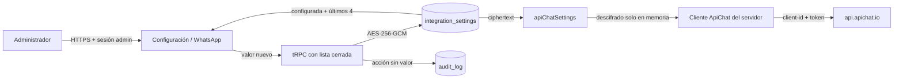

# Mapa vigente de configuración e integraciones

## Principio de fuente única

JARVI RH 2.0.129 separa secretos del servidor y configuración administrable. EasyPanel conserva únicamente las variables necesarias para iniciar la aplicación; ApiChat y OpenAI se administran desde interfaces protegidas y se persisten cifrados en PostgreSQL.

| Integración       | Fuente de configuración                      | Consumidor runtime                    | Exposición al navegador |
| ----------------- | -------------------------------------------- | ------------------------------------- | ----------------------- |
| PostgreSQL        | `DATABASE_URL` de EasyPanel                  | Pool del servidor                     | Ninguna                 |
| Sesiones          | `JWT_SECRET` de EasyPanel                    | Autenticación del servidor            | Ninguna                 |
| Cifrado           | `AGENT_SETTINGS_ENCRYPTION_KEY` de EasyPanel | AES-256-GCM del servidor              | Ninguna                 |
| SMTP              | Variables SMTP de EasyPanel                  | Correo de acceso                      | Ninguna                 |
| ApiChat           | `integration_settings`, proveedor `apichat`  | `apiChatSettings.ts` y `cvRequest.ts` | Estado y máscara        |
| OpenAI / Langfuse | `integration_settings`, proveedor `ai_agent` | Agente y control editorial            | Estado y máscara        |
| n8n opcional      | URLs de webhook específicas                  | Adaptadores explícitos                | Solo estado operativo   |

## ApiChat

Las antiguas variables de entorno de ApiChat están retiradas del runtime de la aplicación. Sus equivalencias dentro de `integration_settings` son:

| Clave de PostgreSQL | Clasificación   | Uso                          |
| ------------------- | --------------- | ---------------------------- |
| `api_mode`          | Configuración   | Contrato `native` o `legacy` |
| `api_endpoint`      | Configuración   | Endpoint HTTPS de envío      |
| `connect_to`        | Configuración   | Identificador de conexión    |
| `webhook_url`       | Configuración   | URL de eventos entrantes     |
| `client_id`         | Secreto cifrado | Encabezado de API nativa     |
| `token`             | Secreto cifrado | Autenticación ApiChat        |
| `account_id`        | Secreto cifrado | Compatibilidad heredada      |

El servidor no admite una caída silenciosa al entorno. Si falta una credencial, si una fila secreta está en texto plano o si el ciphertext no puede descifrarse, el envío falla de forma cerrada con un mensaje controlado. La interfaz no dispone de un endpoint que devuelva el secreto original.

## Flujo de lectura y rotación

## Migración y operación

1. Respaldar PostgreSQL.
2. Ejecutar `drizzle/migrations/0013_apichat_credential_vault.sql`.
3. Desplegar JARVI RH 2.0.129 conservando una fuente estable de cifrado.
4. Ingresar Client ID y token desde Administración > Configuración > WhatsApp.
5. Ejecutar **Verificar**; esta acción usa `GET /v1/status` y no envía mensajes.
6. Eliminar las antiguas variables ApiChat de EasyPanel y redesplegar.
7. Ejecutar un envío controlado solo después de una verificación satisfactoria.

## n8n

`04_whatsapp_apichat.json` se conserva como artefacto histórico inactivo y no forma parte del envío runtime. No debe activarse ni recibir credenciales: `server/cvRequest.ts` realiza el envío directo después del commit y obtiene su configuración del almacén cifrado.

## Controles verificables

- `server/integrations.secrets.test.ts` impide reintroducir lectura de entorno en el cliente runtime de ApiChat.
- `server/apiChatSettings.test.ts` verifica cifrado, máscara, rechazo de texto plano y comprobación sin envío.
- `server/apichat.test.ts` valida encabezados, payload, HTTPS, dominio/ruta nativos y errores controlados.
- `server/releaseGovernance.test.ts` mantiene el contrato de caja negra del release.

Este mapa describe controles técnicos implementados. Las referencias ISO/IEC 25010, ISO/IEC 27001 e ISO/IEC/IEEE 29119 se emplean como guía metodológica y no constituyen una certificación.
