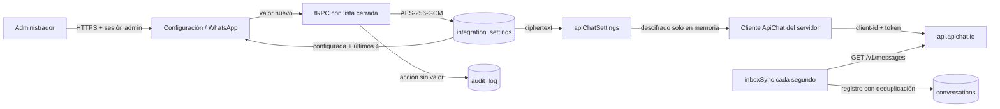

# Mapa vigente de configuración e integraciones

## Principio de fuente única

JARVI RH separa secretos del servidor y configuración administrable. EasyPanel conserva únicamente las variables necesarias para iniciar la aplicación; ApiChat y OpenAI se administran desde interfaces protegidas y se persisten cifrados en PostgreSQL.

| Integración       | Fuente de configuración                      | Consumidor runtime                    | Exposición al navegador |
| ----------------- | -------------------------------------------- | ------------------------------------- | ----------------------- |
| PostgreSQL        | `DATABASE_URL` de EasyPanel                  | Pool del servidor                     | Ninguna                 |
| Sesiones          | `JWT_SECRET` de EasyPanel                    | Autenticación del servidor            | Ninguna                 |
| Cifrado           | `AGENT_SETTINGS_ENCRYPTION_KEY` de EasyPanel | AES-256-GCM del servidor              | Ninguna                 |
| SMTP              | Variables SMTP de EasyPanel                  | Correo de acceso                      | Ninguna                 |
| ApiChat           | `integration_settings`, proveedor `apichat`  | `apiChatSettings.ts`, `cvRequest.ts`, `inbox.ts` y `inboxSync.ts` | Estado y máscara |
| OpenAI / Langfuse | `integration_settings`, proveedor `ai_agent` | Agente y control editorial            | Estado y máscara        |

## ApiChat

Las antiguas variables de entorno de ApiChat están retiradas del runtime de la aplicación. Sus equivalencias dentro de `integration_settings` son:

| Clave de PostgreSQL | Clasificación   | Uso                          |
| ------------------- | --------------- | ---------------------------- |
| `api_mode`          | Configuración   | Contrato `native` o `legacy` |
| `api_endpoint`      | Configuración   | Endpoint HTTPS de envío      |
| `connect_to`        | Configuración   | Identificador de conexión    |
| `client_id`         | Secreto cifrado | Encabezado de API nativa     |
| `token`             | Secreto cifrado | Autenticación ApiChat        |
| `account_id`        | Secreto cifrado | Compatibilidad heredada      |

El servidor no admite una caída silenciosa al entorno. Si falta una credencial, si una fila secreta está en texto plano o si el ciphertext no puede descifrarse, el envío falla de forma cerrada con un mensaje controlado. La interfaz no dispone de un endpoint que devuelva el secreto original.

## Flujo de lectura y rotación

## Migración y operación

1. Respaldar PostgreSQL.
2. Ejecutar `drizzle/migrations/0013_apichat_credential_vault.sql` y después `drizzle/migrations/0014_cognitive_governance.sql`.
3. Desplegar el artefacto aprobado conservando una fuente estable de cifrado.
4. Ingresar Client ID y token desde Administración > Configuración > WhatsApp.
5. Ejecutar **Verificar**; esta acción usa `GET /v1/status` y no envía mensajes.
6. Eliminar las antiguas variables ApiChat de EasyPanel y redesesplegar.
7. Ejecutar un envío controlado solo después de una verificación satisfactoria.
8. Confirmar que la bandeja rellena entradas y salidas desde `GET /v1/messages` con deduplicación por `providerMessageId`.

## OpenAI

Las API keys principal y de respaldo permanecen cifradas bajo el proveedor
`ai_agent`. Los modelos y cuotas administrables tienen estas claves:

| Clave de PostgreSQL | Valor inicial | Uso |
| --- | --- | --- |
| `model` | `gpt-5.2` | Evaluación general mediante Responses API. |
| `psychometric_model` | `gpt-4.1-mini` | Selector reservado para ejecución futura de protocolos. |
| `activity_summary_model` | `gpt-4o-mini` | Selector reservado; el resumen vigente es determinista. |
| `transcription_model` | `gpt-4o-mini-transcribe` | Transcripción aislada. |
| `tts_model` | `gpt-4o-mini-tts` | Texto a voz aislado. |
| `tts_voice` | `coral` | Voz TTS predeterminada. |
| `audio_max_mb` | `5` | Cuota por archivo de audio. |
| `document_max_mb` | `5` | Cuota preparatoria por documento. |

Los endpoints no son variables ni campos editables:

- `https://api.openai.com/v1/responses`;
- `https://api.openai.com/v1/audio/transcriptions`;
- `https://api.openai.com/v1/audio/speech`.

La transcripción acepta `flac`, `mp3`, `mp4`, `mpeg`, `mpga`, `m4a`, `ogg`,
`wav` y `webm`; TTS devuelve `mp3`, `opus`, `aac`, `flac`, `wav` o `pcm`.
Referencias oficiales: [transcripción](https://developers.openai.com/api/reference/cli/resources/audio/subresources/transcriptions/methods/create) y [texto a voz](https://developers.openai.com/api/reference/cli/resources/audio/subresources/speech/methods/create).

`voiceTranscription.ts` acepta una extensión declarada permitida o, en su
defecto, un MIME presente en una tabla de mapeo; también aplica cuota, timeout y
rotación. No compara extensión y MIME ni detecta el formato por contenido. Esto
no equivale a un pipeline de medios completo: la sincronización vigente admite
texto, enlace y ubicación; endpoint productivo, bucket, antivirus, descarga del
proveedor, retención y reproductor permanecen pendientes.

## Sincronización de recepción

La recepción no depende de ningún intermediario. `server/inboxSync.ts` recorre cada segundo las conversaciones activas y consulta `GET /v1/messages` con los encabezados oficiales; registra entradas y salidas que falten, con deduplicación por `providerMessageId`. Ante el límite de tasa del proveedor (HTTP 429), el puente se pausa y retoma con espaciamiento automático. La deduplicación documentada se limita a los mensajes por `providerMessageId`. El envío saliente conserva estado local, pero no ofrece una garantía de entrega exactamente una vez; un resultado desconocido requiere conciliación antes de reintentar. Los receptores de alertas internas disponen de CRUD de configuración, no de un canal de entrega implementado.

## Controles verificables

- `server/apiChatSettings.test.ts` verifica cifrado, máscara, rechazo de texto plano y comprobación sin envío.
- `server/apichat.test.ts` valida encabezados, payload, HTTPS, dominio/ruta nativos y errores controlados.
- `server/inbox.test.ts` y `server/inboxSync.test.ts` comprueban envío multi-tipo, borrado, sincronización cada segundo y cuarentena minimizada.
- `server/agentSettings.test.ts` verifica modelos, voz y cuotas especializadas.
- `server/releaseGovernance.test.ts` mantiene el contrato de caja negra del release.

Este mapa describe controles técnicos implementados. Las referencias ISO/IEC 25010, ISO/IEC 27001, ISO 22301, ISO/IEC 42001 e ISO/IEC/IEEE 29119 se emplean como guía metodológica y no constituyen una certificación.
