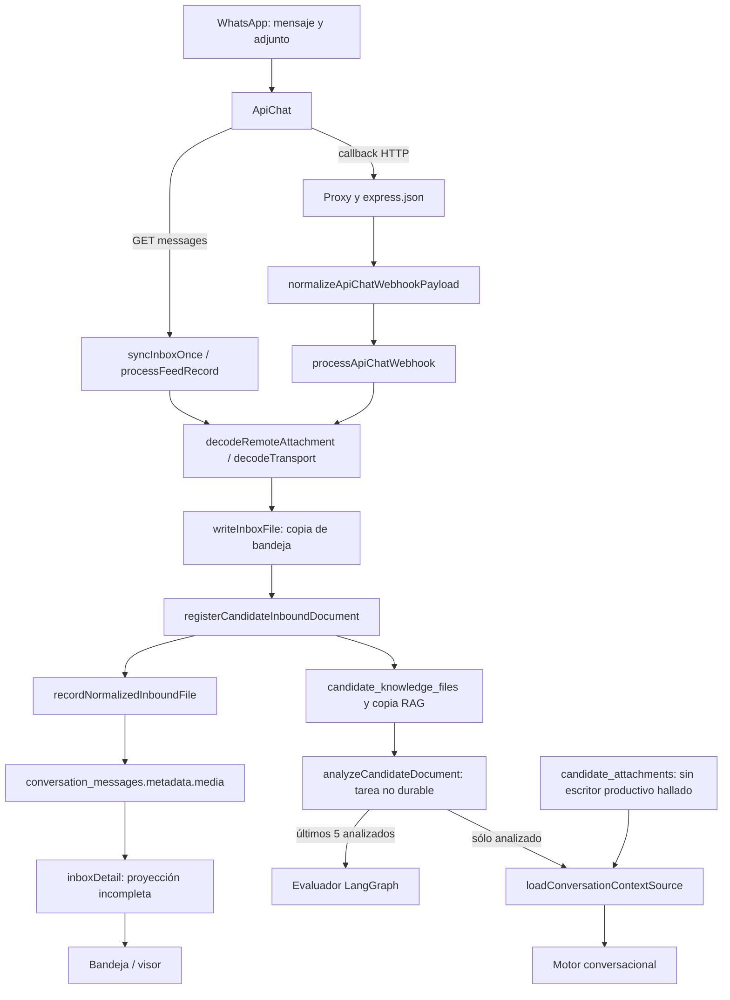
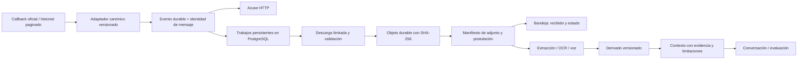

# Auditoría del transporte y consumo de evidencia documental en Talento AISA

**Objeto:** recepción de PDF, Word y audio mediante ApiChat, representación en bandeja y utilización por los motores de RR. HH.  
**Fecha de corte:** 18 de septiembre de 2026.  
**Software examinado:** JARVI RH 2.0.179, commit `b450bdbcfa9c1225221936206220a46117c2d77e`.  
**Naturaleza:** auditoría documental, análisis estático y comprobación local de contraejemplos contractuales. No constituye certificación del despliegue ni atribución definitiva del incidente fotografiado.

## Dictamen

El código examinado **no garantiza continuidad entre mensaje recibido, archivo persistido, documento visible y evidencia disponible para el agente**. Hay rupturas independientes en esas cuatro representaciones. El problema excede un códec o un ajuste de LangGraph.

La incompatibilidad contractual más temprana está en el webhook: el callback publicado por ApiChat contiene `messages[]`, mientras que `normalizeApiChatWebhookPayload` espera un mensaje individual, un objeto `message` o determinados sobres `params`. Una notificación con la colección documentada termina en `forma-no-reconocida`; el controlador responde HTTP 200. El sondeo alternativo permite recuperar texto y archivos `file`, pero descarta tipos oficiales como `image` y `audio`. La combinación es compatible con observar textos en la bandeja y perder medios, aunque **no prueba que ése haya sido el cuerpo recibido durante el incidente**. El PDF clasificado oficialmente como `file` podría recuperarse por sondeo si aparece en la ventana consultada y se resuelve su destinatario.

Más adelante, la consulta de bandeja omite los campos que necesita su componente de adjuntos. El motor conversacional obtiene la lista de documentos de `candidate_attachments`, mientras los receptores escriben `candidate_knowledge_files` y `conversation_messages.metadata.media`. Puede, por tanto, recibir instrucciones que afirman ausencia documental aunque exista un archivo en otra entidad. La utilidad de transcripción de audio está definida, pero no conectada a la recepción.

La propia instrumentación presenta defectos: una consulta utiliza una columna inexistente en el esquema versionado; los errores se convierten en cero recepciones; y el resumen de trazas atribuye la pérdida al proveedor sin examinar contenido anidado. Sus indicadores actuales no permiten exonerar al artefacto ni responsabilizar a ApiChat.

**Conclusión causal admisible:** existen defectos demostrables suficientes para impedir el funcionamiento troncal solicitado. **Conclusión causal todavía inadmisible:** afirmar cuál eliminó ese PDF, que ApiChat nunca lo envió o que el hardware se saturó. Para ello falta correlacionar la entrega concreta del proveedor con la entrada HTTP, la persistencia y el documento.

## 1. Alcance, método y límites de conocimiento

Se examinaron las funciones de ingreso, sondeo, normalización, descarga, almacenamiento, persistencia, extracción, contexto conversacional, evaluación, visualización, observabilidad y despliegue. Las capturas aportadas se trataron como evidencia visual secundaria; no se dispone de sus archivos originales, metadatos de adquisición ni hashes. No se accedió a la base productiva, al panel privado de ApiChat, al contenedor desplegado ni al historial real del candidato. No se enviaron mensajes ni se ejecutaron sondas contra el aplicativo.

El entorno de trabajo no presenta `DATABASE_URL` configurada ni archivos `.env*` en la raíz. La revisión de ese acceso comprobó únicamente presencia de configuración, sin extraer ni imprimir secretos. Se entregan consultas para la instancia autorizada, en lugar de presentar resultados de una base a la que no se tuvo acceso.

La unidad de análisis es **un evento de mensaje con un adjunto**, no el candidato. Las afirmaciones se clasifican así:

| Nivel | Significado | Ejemplo |
| --- | --- | --- |
| V — Visual | Se observa en las capturas suministradas | WhatsApp muestra un PDF; la porción de bandeja mostrada contiene texto |
| C — Código | Se demuestra siguiendo instrucciones y esquema versionados | El normalizador no recorre `messages[]` |
| K — Contrato | Consta en el OpenAPI oficial recuperado | `ReceiveAudio` tiene tipo `audio` |
| R — Reproducción local | Una entrada ficticia determina un resultado en la función real | El sobre contractual devuelve `null` |
| H — Hipótesis del incidente | Explicación compatible, pendiente de correlación histórica | Ese PDF se descartó al normalizar el callback |
| D — Diseño propuesto | Decisión de ingeniería derivada de los hallazgos | Persistir un evento antes del acuse |

Se evita la prueba por ensayo y error sobre producción. Las comprobaciones locales verifican consecuencias deterministas del código y del contrato; no reconstruyen tráfico que no se conservó. Una investigación forense no puede sustituir evidencia de ejecución por prestigio académico o deducción. La separación entre archivos, tráfico, sistema operativo y aplicaciones es coherente con el enfoque técnico de Kent et al. (2006), utilizado aquí como apoyo metodológico, no como definición de endpoints. [NIST SP 800-86](https://csrc.nist.gov/pubs/sp/800/86/final).

La documentación de ApiChat es la fuente exclusiva para atribuir capacidades a **su API**. Las mejoras locales propuestas se identifican como diseño del auditor. No se presupone que ApiChat tenga un endpoint de descarga, firma HMAC, política de reintentos o garantía de entrega que su contrato consultado no especifica.

Se emplean referencias de **APA 7**. La página oficial consultada identifica la séptima edición como la publicación vigente; no se encontró fundamento oficial para presentar este trabajo como APA 8. El formato Markdown es un informe técnico con referencias de estilo APA, no una maqueta editorial de tesis. [American Psychological Association, manual oficial](https://www.apa.org/pubs/books/publication-manual-7th-edition-paperback).

## 2. Reconstrucción fenomenológica del caso

Se usa «fenomenológico» en un sentido operacional: reconstrucción de lo que aparece a cada participante y de las representaciones que median esa experiencia. No se afirma haber realizado entrevistas, reducción fenomenológica formal ni validación cualitativa con participantes.

| Momento visible, sin conversión de zona horaria | Perspectiva del candidato en WhatsApp | Perspectiva del aplicativo |
| --- | --- | --- |
| 13:24 | Grupo de imágenes y un texto que las presenta como CV | Aparece el texto en la porción de conversación mostrada |
| 13:25 | Documento PDF de aproximadamente 1 MB y texto adicional | Respuesta automática que declara no encontrar documento |
| 13:26 | Nueva petición de adjuntar PDF | La misma petición aparece en la bandeja |
| 13:36 | Respuesta que cita el PDF anterior | Aparece el texto de la respuesta |
| 13:37 | El agente vuelve a pedir el CV | Continúa la afirmación de ausencia de adjuntos |

Las imágenes no acreditan el cuerpo HTTP enviado por ApiChat, el estado de su callback, los bytes almacenados o las consultas ejecutadas. La ausencia en el recorte mostrado tampoco acredita ausencia en todo el historial. Un recibo visual de WhatsApp no prueba el commit de la base del aplicativo.

El nombre y la miniatura del PDF parecen corresponder a documentación técnica; eso no permite calificar definitivamente su contenido curricular. Aun si no fuera un CV, el sistema debería distinguir **archivo recibido** de **archivo identificado como CV**. Rechazar su pertinencia semántica después de recibirlo sería un resultado diferente de decir que no existe adjunto.

La repetición de solicitudes convierte una falla técnica posible en una atribución al candidato: «no lo ha enviado». Esa atribución no está respaldada cuando el sistema desconoce el estado de transporte o análisis. La respuesta correcta ante incertidumbre técnica debe expresar ese estado y preservar la evaluación hasta disponer de evidencia suficiente.

## 3. Contrato oficial recuperado y discrepancias

El sitio de documentación enlaza Swagger. Su JavaScript público carga `https://panel.apichat.io/openapi.yaml?version=1.7`. El documento declara `openapi: 3.0.0`, `info.version: 1.0.0` y servidor base `https://api.apichat.io/v1`. El parámetro `version=1.7` del recurso **no debe confundirse** con la versión semántica declarada de la API. Se registró SHA-256 `eb487f5bb20300298fbfe53e39b9d36589e1bf3a76335534c7efb5729c33c68d`, longitud 51.022 bytes y fecha de recuperación en el manifiesto.

Los elementos contractuales relevantes son callback `messages[]`, medios en `url`, historial paginado de objetos `MessageDB`, configuración `notify_format` y `notify_attachment_base64`, y dirección `from_me`. La API requiere `client-id` y `token` para las peticiones al proveedor. El historial dispone de `page`, `limit`, `number`, `messageId` y `fromMe`; no se documenta como lectura destructiva. [ApiChat, OpenAPI](https://panel.apichat.io/openapi.yaml?version=1.7).

| Elemento oficial y localizador en el YAML recuperado | Implementación local | Evaluación |
| --- | --- | --- |
| `callbacks.Messages`, líneas 1754–1764; `requestBodies.receivedMessage`, 1736–1741; `schemas.Messages`, 1079–1087 | `normalizeApiChatWebhookPayload`, `apiChatWebhook.ts:120–181` | No admite la colección contractual; tampoco procesa lotes |
| `ReceiveBase` / `ReceiveAudio` / `ReceiveFile` / `ReceiveImage`, 1104–1204 | `processFeedRecord`, `inboxSync.ts:319–366` | El sondeo sólo implementa la rama binaria `file`; `image` y `audio` quedan fuera |
| `MediaBase`, 829–835 | Webhook busca numerosos alias | `url` tiene respaldo contractual; los alias extra son compatibilidad local no acreditada por este documento |
| `AccountUpdate`, 1312–1356 | Normalizador entiende sólo ciertos sobres | `notify_format` puede crear una envoltura que el normalizador no entiende; debe leerse la configuración efectiva |
| `GET /messages`, 554–582; parámetros 666–687; `MessagesDB`, 1004–1007 | `syncInboxOnce`, `inboxSync.ts:438–453` | Se pide `limit=50` sin recorrer `page`; una ventana fija no equivale a reconciliación histórica |
| `FromMe`, 1407–1410 | `classifyFeedDirection`, `inboxSync.ts:163–172` | Se sustituye la dirección del proveedor por presencia en los IDs salientes locales |
| `POST /sendAudio`, 338–358 | Código/catálogo anuncian `/v1/sendPTT` | Ese nombre no está en el contrato nativo recuperado; afecta salida y no explica por sí mismo la recepción |
| `SendFile`, 860–871 | `sendApiChatFile`, `apichat.ts:452–453`, envía `file` y `name` | El contrato exige `url` y define `filename`; divergencia complementaria de salida |

Hay una inconsistencia **en la especificación del proveedor**: el resumen de `/messages` menciona 100 elementos por página y la definición de `limit` establece máximo 50. Debe conservarse como discrepancia contractual y obtenerse aclaración; pedir 50 respeta el límite más restrictivo. No se debe afirmar que el sondeo consume y elimina mensajes: el contrato presenta la eliminación mediante un método separado.

Los callbacks muestran una respuesta 200, pero no detallan reintentos ni firma de autenticación. Tampoco convierten el límite general de solicitudes al API en un límite demostrado de callbacks entrantes. Los parámetros y métodos anteriores provienen de la [especificación oficial recuperada](https://panel.apichat.io/openapi.yaml?version=1.7); las consecuencias sobre el programa son deducciones de esta auditoría.

El aviso de `apiChatSettings.ts:405–406` afirma que desactivar la notificación base64 impide entregar el archivo. Esa afirmación no está sustentada: el contrato también admite una URL. Activar base64 puede modificar el transporte, pero no corrige un sobre rechazado ni garantiza el resto del procesamiento. El normalizador omite además `time` y `caption`, perdiendo la fecha de origen y la descripción que puede acompañar al medio.

## 4. Recorrido real y mapa de funciones



| Capa | Funciones / evidencia local | Transformación y límite |
| --- | --- | --- |
| Entrada HTTP | `server/_core/index.ts:64–72`; `registerApiChatWebhook`, `apiChatWebhook.ts:420` | JSON/urlencoded hasta 50 MiB antes del controlador |
| Normalización y ruta de postulación | `normalizeApiChatWebhookPayload:120`; `conversationForPhone:184` | Reduce el evento a un mensaje; teléfono a 12 dígitos; selecciona conversación activa más reciente |
| Reconciliación | `syncInboxOnce`, `inboxSync.ts:377`; `processFeedRecord:225` | Feed global contra una página local de conversaciones; tipos limitados |
| Bytes | `decodeRemoteAttachment`, `base64Transport.ts:304`; `decodeTransport:388` | Base64 o HTTPS; detección parcial de firma, nombre, MIME y SHA-256 |
| Bandeja física | `buildInboxFileKey`, `inboxFiles.ts:29`; `writeInboxFile:33` | Clave con `/`, almacenamiento en disco local |
| Expediente | `registerCandidateInboundDocument`, `candidateKnowledge.ts:582` | Política propia, dedupe SHA, segunda copia, registro y análisis diferido |
| Mensaje | `recordNormalizedInboundEventInternal`, `inbox.ts:928`; `recordNormalizedInboundFile:1158` | Transacción de mensaje con medio dentro de JSON, posterior al almacenamiento |
| Extracción | `extractKnowledgeText`, `knowledge.ts:386`; `analyzeCandidateDocument`, `candidateKnowledge.ts:304` | Texto de PDF/DOCX; extracción vacía y ciertos errores se confunden |
| Contexto | `loadConversationContextSource`, `conversationContext.ts:551`; `buildConversationUserInput`, `conversationEngine.ts:179` | Une fuentes divergentes; excluye documentos no analizados |
| Evaluación | `loadCandidateEvidence`, `agentEvaluator.ts:425`; grafo en `:261–272` | Recibe derivados textuales, no el archivo original |
| Presentación | `inboxDetail`, `inbox.ts:275`; `Inbox.tsx:452`; `inboxFiles.ts:144` | DTO sin campos del medio y URL que no coincide con ruta |
| Trazabilidad | `recordTransportTrace`, `transportTrace.ts:182`; `summarizeTransportTrace:296` | Registro posterior al procesamiento, errores ocultos y diagnóstico no válido |

El agente evaluador sí construye un grafo `START → evaluate → END`. La conversación ordinaria llama directamente a `responses.parse` en `conversationEngine.ts:210`. Las etiquetas de observabilidad no convierten ese motor en un grafo. Ninguna de esas dos capas repara por sí misma una notificación que no se normalizó o un documento excluido del contexto.

## 5. Hallazgos y correcciones especificadas

Prioridad **P1**: bloquea la función troncal, altera atribución de evidencia o afecta su integridad. **P2**: agrava recuperación, capacidad, observabilidad o acceso. Son prioridades técnicas de esta auditoría, no puntuaciones CVSS. Los hallazgos C/K/R no implican que todas sus condiciones ocurrieran en producción.

### H01 — P1. Rechazo del callback contractual

**Evidencia:** K/C/R; `normalizeApiChatWebhookPayload`, `server/apiChatWebhook.ts:120–148`; ruta `:424–460`. Un objeto cuya única clave superior es `messages` no proporciona `id` ni `number` al normalizador y retorna `null`.

**Efecto:** el lote completo puede terminar sin mensajes, con HTTP 200. **Corrección:** un adaptador canónico debe desenvolver el formato configurado, validar la colección y generar un resultado por elemento. Un elemento defectuoso no debe eliminar los válidos del mismo lote. Mantener compatibilidad individual explícita, sin atribuir a ApiChat alias no documentados. Registrar versión del adaptador y hash del evento antes del procesamiento de medios.

### H02 — P1. El sondeo no constituye respaldo equivalente

**Evidencia:** C/K; `server/inboxSync.ts:319–366,438–453,485–490`. Sólo procesa `file` como medio; consulta una ventana de 50 sin página; resuelve números contra sólo 200 conversaciones por ronda, con recorrido local limitado a 2.000.

**Efecto:** omite medios admitidos por contrato, mensajes fuera de ventana y candidatos fuera de página. La omisión no implica destrucción de datos en ApiChat. **Corrección:** reutilizar el mismo normalizador y procesador de medios; paginar mediante los parámetros publicados; resolver la postulación por identidad estable en base, independientemente de la página de interfaz. Aplicar solapamiento, deduplicación y registro persistente del avance. El orden y retención del historial requieren confirmación para demostrar completitud.

### H03 — P1. Acuse positivo sin evento durable

**Evidencia:** C; `registerApiChatWebhook`, `server/apiChatWebhook.ts:431–460`; escrituras `:378–415`. La ruta responde 200 cuando no hay base y cuando se captura una excepción. No hay persistencia previa del evento ni reintento durable del webhook.

**Efecto:** el emisor puede observar una aceptación HTTP sin mensaje recuperable. Hay ventanas entre disco, expediente y mensaje. **Corrección:** confirmar 200 sólo después de persistir durablemente el evento aceptado; descargar y analizar con trabajadores posteriores. Si no se puede aceptar durablemente, devolver un fallo explícito; verificar con ApiChat la política de reintentos, sin presuponerla. Si un evento inválido se confirma para evitar repeticiones, debe quedar durablemente clasificado y recuperable según política.

### H04 — P1. Tres representaciones de adjunto sin identidad común

**Evidencia:** C; `inbox.ts:1014–1037,1173–1190`; `candidateKnowledge.ts:613–626`; `conversationContext.ts:645–648`; `conversationEngine.ts:186–188`. El repositorio contiene lecturas de `candidate_attachments`, pero no se halló su escritor productivo.

**Efecto:** se construye «Documentos recibidos: ninguno» desde una entidad distinta a las que alimenta la recepción. Las columnas estructuradas del mensaje también permanecen sin alimentar cuando el medio sólo reside en JSON.

**Corrección:** establecer una identidad de adjunto vinculada al evento, mensaje y postulación. Tanto bandeja como contexto deben consumir su manifiesto de estados. Una reparación inmediata puede proyectar coherentemente los registros existentes; no basta con duplicarlos en otra tabla y perpetuar dos fuentes autoritativas. La migración debe conservar procedencia y marcar vínculos inferidos como tales.

### H05 — P1. La bandeja no puede construir el enlace correcto

**Evidencia:** C/R; `inboxDetail`, `inbox.ts:305–310`; `Inbox.tsx:452–462`; `CandidateConversationPanel.tsx:517–527`; `inboxFiles.ts:29,144`.

**Efecto:** la API omite `media_storage_key` y `media_file_name`, que la UI exige. Incluso agregándolos, una clave `in-ID/UUID` interpolada sin codificar produce dos segmentos donde Express espera uno. El fallback SPA puede devolver HTML con 200; eso tampoco prueba una descarga válida.

**Corrección inmediata específica:** proyectar `metadata->'media'->>'storageKey' AS media_storage_key` y `metadata->'media'->>'fileName' AS media_file_name`, o entregar un DTO equivalente estable; aplicar `encodeURIComponent` a la clave completa en ambos componentes y en el URL saliente de `inbox.ts:851`. Verificar ruta, MIME y bytes, además del estado HTTP. Este defecto explica un adjunto sin enlace, **no por sí solo la ausencia completa de su burbuja**, pues el cuerpo textual sí se inserta.

### H06 — P1. Análisis diferido sin garantía de finalización

**Evidencia:** C; `candidateKnowledge.ts:655`; `conversationWorker.ts:32–43`; `conversationEngine.ts:378–386`; `conversationContext.ts:661–670`.

**Efecto:** el análisis se ejecuta con `void ...catch`, sin trabajo persistente. El motor puede responder antes de su finalización; al terminar no se reactiva el turno. Un reinicio puede dejar registros pendientes. Las consultas de contexto sólo incluyen documentos analizados y degradan errores SQL a listas vacías.

**Corrección:** trabajo durable con estado, intento, lease, próximo reintento y error tipado; evento de finalización que invalide contexto y programe reevaluación controlada. El agente puede contestar «archivo recibido, en procesamiento» sin esperar el resultado analítico. No debe pedir reenviar un archivo por una espera interna.

### H07 — P1. Audio, DOC e imágenes carecen de interpretación integrada

**Evidencia:** C; `knowledge.ts:360–397`; `candidateKnowledge.ts:317–352`; `voiceTranscription.ts:123–169`; búsquedas de llamadas productivas al transcriptor.

**Efecto:** PDF/DOCX con texto pueden producir análisis. DOC, imágenes y MP3 pueden almacenarse pero no generan interpretación documental; no hay OCR en este recorrido. El transcriptor existe sin conexión a los receptores. Otros audios no están admitidos en el expediente por la whitelist actual.

**Corrección:** separar admisión del medio de su procesador: PDF textual, PDF que requiere OCR, DOCX, DOC heredado y audio con transcripción. Cada formato debe anunciar sólo la capacidad efectiva instalada y probada. Integrar la utilidad de voz mediante trabajos, vincular transcripción al original y distinguir contenedor, códec e idioma. No basta activar una etiqueta del catálogo de códecs.

### H08 — P1. Observabilidad produce ausencia y culpabilidad falsas

**Evidencia:** C/R; `recentAttachmentReceipts`, `apiChatSettings.ts:516–529`, consulta `created_at`; `0026_candidate_knowledge.sql:54–56` declara `uploaded_at`. `transportTrace.ts:100–102,278,296–315` no examina objetos anidados y transforma errores de lectura en lista vacía.

**Efecto:** documentos existentes pueden contarse como cero; un cuerpo con `message.url` puede clasificarse «sin adjuntos» y responsabilizar al proveedor. **Corrección:** consultar `uploaded_at`; representar `observabilidad_no_disponible` por separado de cero; recorrer estructura normalizada y preservar cobertura. El veredicto debe decir «no observado en esta fuente/ventana» cuando eso sea todo lo demostrado.

El sondeo registra trazas de los casos no procesados (`inboxSync.ts:509–521`), pero no de todos sus éxitos. El número de trazas tampoco representa, por tanto, el total de mensajes recibidos por ambas vías.

### H09 — P1. Integridad de procedencia y descarga insuficientes

**Evidencia:** C; ruta pública `apiChatWebhook.ts:420–463`; `base64Transport.ts:339–349`. No se valida autenticidad del webhook en este código. Cualquier URL HTTPS elegible se descarga sin control de host/IP/redirección y sin política de autenticación de medios.

**Efecto:** riesgo de inyección de evidencia, SSRF y consumo de recursos; no se ha demostrado explotación. **Corrección:** verificar los mecanismos que soporte realmente ApiChat, configurar controles perimetrales compatibles y restringir descargas a orígenes autorizados con validación de DNS/IP y de cada redirección. No reenviar credenciales del API a dominios arbitrarios. Añadir lectura incremental limitada, cuarentena y validación del contenido antes de interpretar o publicar el objeto.

### H10 — P1. Identidad, dirección y postulación pueden divergir

**Evidencia:** C/K; `apiChatWebhook.ts:145–148,199–204,298`; `inboxSync.ts:163–172,465–470`. El webhook recorta teléfonos a 12 dígitos; el sondeo no. El webhook elige la conversación reciente y el `Map` del sondeo puede sobrescribirla por otra anterior del mismo teléfono. Los IDs no conocidos localmente como salientes se tratan como entrantes aunque `from_me` indique lo contrario.

**Efecto:** un envío efectuado desde el teléfono de la empresa puede convertirse en evidencia del candidato, o un archivo asociarse a otra postulación. **Corrección:** conservar dirección oficial y evidencia de reconciliación por separado; clasificar discrepancias como indeterminadas. Normalizar números sin truncamiento destructivo y resolver explícitamente múltiples postulaciones. Incorporar cuenta/canal a identidad e idempotencia.

### H11 — P2. Idempotencia posterior a efectos físicos

**Evidencia:** C; `apiChatWebhook.ts:378–403`; `inbox.ts:990–1017`; `candidateKnowledge.ts:599–617`; esquema de `candidate_knowledge_files` sin unicidad aplicación/SHA.

**Efecto:** los replays pueden crear copias de bandeja huérfanas antes de detectar un mensaje duplicado. Dos procesos pueden superar el `SELECT` de deduplicación documental y crear duplicados. **Corrección:** reservar identidad del evento antes de efectos; usar restricciones y operaciones atómicas en la base. Distinguir idempotencia del mensaje de deduplicación física por hash: dos envíos legítimos del mismo archivo siguen siendo eventos diferentes.

### H12 — P2. Límites y tipos incoherentes entre capas

**Evidencia:** C; `index.ts:67`; `apiChatWebhook.ts:356`; `base64Transport.ts:176–177,345–349`; `candidateKnowledge.ts:591–598`; `knowledge.ts:19–35`.

**Efecto:** 50 MiB de JSON no contienen 50 MiB binarios en base64; el expediente admite por defecto 20 MiB. Un rechazo de política devuelve `{id:0,created:false}` y el webhook no inspecciona el resultado. Una descarga sin longitud fiable se lee entera antes de comprobar el tamaño final. La detección genérica `ftyp → video/mp4` puede confundir audio M4A.

**Corrección:** política de capacidad única por canal y formato, con rechazo tipado y visible. Límite de bytes aplicado durante streaming; separación entre tipo declarado, detectado y validado. La fórmula base64 es `B64(n)=4×ceil(n/3)`; con un cuerpo de 50 MiB, el binario debe ser menor de 37,5 MiB al añadir el sobre JSON. Esta deducción deriva de la codificación descrita por Josefsson (2006). El PDF de aproximadamente 1 MB mostrado **no sustenta** esta causa de tamaño. [RFC 4648](https://www.rfc-editor.org/rfc/rfc4648).

### H13 — P2. La traza no establece una cadena de custodia suficiente

**Evidencia:** C/R; `transportTrace.ts:112–119,137–168,204–205`; `inboxSync.ts:214`; `0035_transport_traces.sql:43–59`.

**Efecto:** textos y valores cortos pueden conservar datos personales; incluso una clave `secret` con valor alfanumérico corto se conserva en `shape`, aunque se enmascare en `payload`. Los sobres JSON serializados no se redactan estructuralmente. Truncar el JSON serializado a 65.536 caracteres puede invalidarlo y perder el asiento en el `catch`. Las huellas parciales no identifican integralmente el evento. Falta fecha original, cuenta, versión contractual y relación evento→mensaje→archivo. El respaldo del sondeo puede almacenar contenido completo; no hay consumidor de replay identificado. La retención automática de trazas es de 14 días.

Además, `inboxSync.ts:349` registra el documento con `source: "webhook"`, aunque lo haya recuperado por consulta de historial. Ese campo no permite reconstruir el origen de adquisición; debe distinguirse de la procedencia de negocio del documento y corregirse junto con el esquema que admite sus valores.

**Corrección:** registro operativo mínimo y archivo probatorio restringido con finalidades y retenciones separadas. Hash completo del cuerpo recibido, hash del binario y metadatos de adquisición; cifrado y acceso controlado si se conserva contenido para investigación. Redactar antes de exportar y limitar estructuras preservando JSON válido. Un hash demuestra correspondencia de bytes con una referencia conservada; por sí solo no acredita origen ni momento. Preservar la evidencia del incidente antes del vencimiento de retención.

### H14 — P2. «CV recibido» y evidencia analítica no son equivalentes

**Evidencia:** C; `cvAnalysis.ts:171–176`; `knowledge.ts:688–696,760–761`; `conversationContext.ts:487–517,661–679`; `agentEvaluator.ts:425–465`.

**Efecto:** cualquier archivo no manual puede marcar CV recibido. El análisis automático usa una instrucción de conocimiento institucional, con resúmenes de 66 y 325 palabras. El contexto conversa con hasta 12 documentos y el evaluador con hasta cinco; sólo entran estados analizados. La huella del contexto omite documentos y adjuntos. El recorte global de 60.000 caracteres puede eliminar evidencia del candidato si capas anteriores consumen ese espacio.

**Corrección:** estados independientes para «archivo recibido», «CV identificado» y «evidencia interpretable»; extracción curricular con trazabilidad a páginas/fragmentos. Reservar presupuesto de contexto para evidencia y explicitar exclusiones. Incorporar IDs, hashes, estados y versiones de derivados a la huella de evaluación. La extracción de esencia curricular existe, pero su disparador administrativo no equivale a integración automática de recepción.

### H15 — P2. Persistencia física y despliegue no acreditados

**Evidencia:** C/H; `Dockerfile:10–22`; `knowledge.ts:195–199`; `inboxFiles.ts:19–24`; `docs/GUIA_EASYPANEL_CONVERSACION_2.0.142.md:92–102`.

**Efecto condicional:** el Dockerfile crea `/app/uploads`, pero el valor predeterminado de almacenamiento usa `/app/data/knowledge-files`. No se versiona aquí el montaje real. Sin volumen persistente/compartido, los metadatos pueden sobrevivir a bytes perdidos o invisibles para otra réplica. La imagen runner copia `dist`, mientras la guía separada propone ejecutar fuentes `server/services/*.ts` que esa imagen no copia.

**Corrección:** declarar y verificar ruta efectiva, montaje, UID, permisos, réplica, respaldo y restauración. Empaquetar entradas de servicio que realmente existan. No se recomienda comprar hardware sobre esta evidencia: faltan métricas de CPU, RAM, IOPS, espacio y límites del contenedor.

### H16 — P2. Acceso, paginación y presión de lectura

**Evidencia:** C; `inbox.ts:310`; `inboxFiles.ts:79–85,107–128`; `routers.ts:223,2287`; `Inbox.tsx:79–95`.

**Efecto:** se muestran los primeros 500 mensajes, no necesariamente los recientes; un reclutador autorizado para bandeja puede no satisfacer el acceso administrativo al archivo; el rango sufijo `bytes=-500` se interpreta incorrectamente. Consultar lista y detalle cada segundo y localizar medios por expresión JSON sin índice equivalente puede aumentar la carga.

**Corrección:** paginación por cursor, autorización del recurso coherente con su postulación, implementación correcta de rangos y una consulta indexable de la identidad del medio. Medir latencias y planes SQL antes de atribuir saturación o dimensionar servidores.

## 6. Matriz de soporte efectivo

La tabla describe rutas de código y políticas predeterminadas; una configuración productiva distinta debe comprobarse.

| Formato | Recepción/persistencia local posible | Interpretación automática actual | Consecuencia para RR. HH. |
| --- | --- | --- | --- |
| PDF con texto | Sí, si supera ingreso y política | `PDFParse.getText()` y análisis textual | Puede aportar evidencia resumida |
| PDF escaneado | Sí | Sin OCR en esta ruta; texto vacío → `no_aplica` | No equivale a ausencia de archivo |
| DOCX | Sí | `mammoth.extractRawText()` | Texto, con pérdida posible de estructura visual |
| DOC binario | Extensión admitida | Analizador sólo acepta PDF/DOCX | Conservado sin análisis |
| JPG/PNG | Sí | Sin OCR/visión integrada en este recorrido | Imagen presente sin evidencia textual derivada |
| MP3 | Sí | Se marca no aplicable como documento; transcriptor no invocado | Voz sin transcripción para el agente |
| OGG/WAV/M4A y otros audios | Transporte y clasificación variables | Fuera de whitelist de expediente o sin trabajador de voz | Capacidad anunciada no equivale a consumo efectivo |

`codecRegistry` describe herramientas como Poppler, FFmpeg, antiword y LibreOffice, pero sus entradas e interruptores no prueban instalación ni controlan estos receptores. El Dockerfile no instala esas herramientas. Esto no invalida la extracción PDF textual existente, que utiliza JavaScript; sí impide dar por implementados OCR, conversión DOC o transcodificación.

## 7. Marco ontológico y propiedades del transporte correcto

La propuesta usa entidades distintas para evitar equivalencias falsas:

| Entidad | Identidad mínima | Relación / propiedad |
| --- | --- | --- |
| Evento de proveedor | cuenta, ID de evento o identidad de entrega, hash de cuerpo | Puede contener varios mensajes; conserva tiempo de proveedor y de recepción |
| Mensaje | cuenta/canal e ID del mensaje | Tiene dirección y vínculo de conversación; puede repetirse en varios eventos |
| Objeto binario | ID de objeto y SHA-256 completo | Contenido inmutable; almacenamiento verificable; no depende del nombre |
| Adjunto | ID y vínculo mensaje–objeto | Tipo declarado/detectado, tamaño, estado, procedencia |
| Postulación | ID independiente de persona/teléfono | Relaciona evidencia con la plaza correcta |
| Derivado | ID, hash del original, procesador y versión | Texto, OCR, transcripción o análisis; nunca sustituye al original |
| Evidencia evaluable | derivado, localizador y estado de calidad | Permite justificar afirmaciones curriculares |
| Decisión | ID, conjunto de evidencias, versión de contexto/modelo | Debe declarar limitaciones o faltantes técnicos |

Estados independientes recomendados:

```text
recepción:     observado → validado → persistido | rechazado
binario:       pendiente → descargando → disponible | error_reintentable | cuarentena
interpretación: pendiente → extrayendo → interpretable | requiere_ocr | no_soportado | error
clasificación: desconocido → cv | otro_documento | audio | imagen
evaluación:    esperando_evidencia → lista → evaluada | revisión_humana
```

No existe una implicación válida `HTTP 200 ⇒ CV evaluable`. Tampoco `sin_derivado ⇒ candidato_no_envió`.

Invariantes propuestos, susceptibles de verificación:

1. **Conservación:** cada mensaje del evento aceptado queda asociado a un estado durable, incluso si se rechaza; ningún elemento desaparece por un retorno temprano.
2. **Acuse:** `ack_aceptado(e) ⇒ evento_durable(e)`. El contrato de retención y recuperación debe cubrir los bytes o una referencia recuperable; una URL temporal no basta si expira antes del trabajador.
3. **Identidad:** webhook y sondeo generan el mismo ID lógico para el mismo mensaje/cuenta; recibirlo dos veces no duplica sus efectos de negocio.
4. **Integridad:** `SHA256(bytes_almacenados) = SHA256(bytes_validados)`. Cada derivado declara el objeto del que proviene.
5. **Convergencia:** bandeja, expediente y motor leen el mismo manifiesto de adjuntos para una postulación.
6. **Veracidad:** pendiente, fallo técnico y no soportado no se convierten en ausencia documental ni penalización del candidato.
7. **Vivacidad condicionada:** con almacenamiento/procesadores disponibles y reintentos acotados, cada trabajo termina o se deriva a revisión con causa. No se promete procesamiento exactamente una vez; se construye entrega repetible con efectos idempotentes.
8. **Reproducibilidad:** la huella de una evaluación incluye la evidencia realmente suministrada y sus transformaciones, no sólo respuestas de formulario.

## 8. Arquitectura de corrección compatible con el software actual

Puede implementarse con Node/TypeScript, Express, PostgreSQL y el almacenamiento existente, una vez comprobada su persistencia. No requiere introducir Kafka, otro proveedor de WhatsApp o una GPU para corregir H01–H06.



La transacción de ingreso reserva identidad y trabajo. El binario se escribe con clave temporal, se valida y se publica de forma controlada; base y filesystem no comparten una transacción ACID, por lo que hacen falta reconciliación y limpieza de objetos huérfanos. Si el cuerpo lleva base64, el evento durable necesita conservar recuperablemente esos bytes hasta su procesamiento. Si sólo lleva URL, hay que conocer su vigencia o descargar dentro de una ventana garantizada. Esas garantías no están descritas en el OpenAPI consultado.

Los trabajadores se coordinan con reclamación transaccional y leases; el detalle del mecanismo debe adaptarse a los roles existentes. El webhook integrado y el receptor separado no deben lanzar tareas redundantes sin esa coordinación. La finalización de extracción publica un evento local para reconstruir contexto; la idempotencia de respuesta evita contestaciones duplicadas.

La consulta de la API se mantiene dentro de sus métodos documentados: lectura de cuenta y webhook para diagnosticar configuración; historial con filtros/paginación para reconciliar. Una configuración de `notify_format` sólo se cambia después de conocer el valor efectivo y disponer de compatibilidad de transición. La autenticación específica de descarga o del callback debe confirmarse con el proveedor; no se inventan parámetros o cabeceras.

## 9. Software, hardware y dimensionamiento

**Acreditado por archivos:** imagen Node 22 Alpine, aplicación TypeScript compilada a `dist/index.js`, dependencias `pdf-parse`/Mammoth, base PostgreSQL y archivos locales; tareas integradas de recepción, conversación y evaluación. Los rangos de dependencias y la imagen nominal no identifican el digest desplegado. El manifiesto incluye hashes de configuración y lockfile.

**No acreditado:** CPU/RAM disponibles, límites cgroup, almacenamiento montado, persistencia compartida, IOPS, réplicas, proxy inverso, tiempos de espera, backlog, versión efectiva de PostgreSQL o digest del contenedor. La captura identifica una superficie EasyPanel, no las propiedades del servidor.

El flujo HTTPS actual acumula buffer, cadena base64 y decodificación adicional; por ello la memoria máxima supera el tamaño del archivo. No se fija un múltiplo exacto sin perfilar el runtime. Una estimación operativa debe separar tasa de llegada `λ`, duración media de procesamiento `W`, concurrencia `L≈λW`, tamaño máximo permitido y copias simultáneas. Son relaciones de dimensionamiento, no mediciones de este despliegue.

El orden recomendado es reparar contrato/estados, establecer métricas y después medir carga representativa. Indicadores: latencia de acuse, retraso de trabajos, latencia hasta archivo disponible, latencia de extracción, rechazos por causa, huérfanos, duplicados evitados, memoria máxima y disponibilidad del volumen. Un hardware mayor no repara una clave JSON que nunca se lee.

## 10. Protocolo forense para atribuir el incidente

El archivo acompañante `consultas_solo_lectura.sql` contiene consultas parametrizables y minimizadas, sin cambios de datos. No se han ejecutado contra producción.

1. **Fijar el objeto investigado:** obtener el ID del mensaje del PDF, cuenta ApiChat, hora y zona originales; identificar la postulación mediante su ID interno. La cita posterior y la miniatura no sustituyen el mensaje original.
2. **Preservar fuentes:** exportación autorizada de entrega del proveedor, acceso del proxy, logs de aplicación, filas relevantes y archivo original si existe; hashes completos, fecha de adquisición, responsable, fuente y registro de accesos. Conservar originales restringidos y copias redactadas para el informe.
3. **Verificar configuración por lectura:** versión/imagen, migraciones, cuenta/modo nativo o compatibilidad, webhook efectivo, `notify_format`, notificación base64 y dirección. Los secretos no deben copiarse al informe.
4. **Reconciliar el ID:** proveedor → entrada HTTP → normalizador → mensaje → adjunto/objeto → derivado → contexto/decisión. Registrar el primer límite que cuenta con evidencia positiva y el siguiente que falla; no inferir un salto a partir de ausencia de logs.
5. **Clasificar el desenlace:** no entregado por proveedor; rechazado antes del controlador; sobre no reconocido; sin destino; medio no resuelto; almacenamiento fallido; mensaje sin adjunto; adjunto sin derivado; derivado excluido; defecto de UI. Cada conclusión requiere su fuente específica.
6. **Recuperar tras corregir:** si el historial/original conserva el evento o los bytes, reprocesar con identidad original y estado de recuperación; si el vínculo documental es inferido, declararlo. No inventar una fila con fecha/ID de envío atribuidos al candidato.

| Evidencia disponible | Afirmación permitida | Afirmación que no permite |
| --- | --- | --- |
| Entrega del proveedor y proxy correlacionados | El HTTP alcanzó una frontera identificada | Que llegó a PostgreSQL |
| Cuerpo conservado con hash y rechazo del adaptador | Ese formato fue rechazado en normalización | Que todos los mensajes del proveedor usan ese formato |
| Mensaje con `metadata.media`, bytes verificables y sin enlace UI | Falla de presentación | Pérdida de transporte |
| Documento pendiente/error y contexto sin él | Exclusión o carrera analítica | Que el candidato no envió CV |
| Cero trazas con consulta fallida | Instrumentación no disponible | Que ApiChat no llamó |

El script preexistente `scripts/auditar-conducto-apichat.sh` no se ejecutó: contiene sondas POST, conclusiones causales excesivas y descripciones anteriores a las trazas de 2.0.179. Un PDF sintético que entra por otra forma no exoneraría al receptor del evento real. Tampoco es prudente llamar «sólo lectura» a una sonda que puede insertar trazas.

## 11. Validación realizada y criterios de aceptación

Se ejecutaron ocho archivos de pruebas existentes: webhook, sondeo, transporte base64, trazas, expediente candidato, configuración ApiChat, contexto y bandeja. **125 pruebas pasaron, 0 fallaron**, con Vitest 2.1.9. El lanzador `pnpm exec` falló al preparar su directorio de store; se ejecutó directamente el Vitest ya instalado con Node, sin instalar dependencias.

Ese resultado valida los contratos que las pruebas contienen, no la integración completa. Por ejemplo, las pruebas de trazas aceptan que una lista vacía implique que el proveedor no llama, y varios receptores/persistencias están simulados. La ausencia de casos del callback oficial permite que H01 conviva con una suite verde.

`contraejemplos.ts` y `resultado.json` aportan comprobaciones locales con funciones reales y datos ficticios: sobre oficial rechazado, ruta de archivo no coincidente, contenido anidado mal clasificado, truncamiento de JSON y minimización insuficiente. **Su éxito confirma defectos existentes; no certifica una reparación.** No usan red, base de datos ni archivos de candidatos.

Para aceptar una corrección se requieren, al menos:

| Prueba contractual o de falla controlada | Resultado exigido |
| --- | --- |
| Callback oficial con uno y varios medios; un elemento inválido | Todo elemento obtiene estado durable; los válidos continúan |
| Mismo mensaje por webhook y por historial | Un mensaje lógico; sin nuevos objetos huérfanos ni doble respuesta |
| PDF textual, PDF sin texto, DOCX, DOC y audios declarados | Estado real por formato; ningún archivo pendiente se presenta como ausente |
| Base no disponible antes de aceptación | Sin acuse positivo de recepción durable |
| Caída tras escribir bytes / tras commit / durante extracción | Reconciliación y reintento sin pérdida de identidad |
| Consulta histórica paginada y más de 200 conversaciones | Asociación correcta sin depender de la página local |
| Envío desde teléfono empresarial fuera del aplicativo | Dirección preservada; no se atribuye evidencia al candidato |
| Reclutador autorizado abre adjunto; usuario ajeno intenta abrirlo | Bytes/MIME correctos en el primero; acceso denegado en el segundo |
| Análisis tarda más que un turno conversacional | Acuse de recepción y estado pendiente; finalización reactiva contexto |
| Falla SQL de instrumentación / colección anidada / sobre grande | Error de observabilidad explícito, JSON válido y ninguna culpabilidad inferida |
| Reinicio/despliegue/réplica | Archivos previamente aceptados permanecen recuperables |
| Contexto con cambios documentales | Cambia huella y se conserva manifiesto de evidencia usada |

Estas pruebas deben ejecutarse en un entorno controlado y con datos sintéticos. La atribución del incidente requiere además los registros históricos del apartado anterior.

## 12. Orden de ejecución de la solución

**Primera entrega:** corregir adaptador oficial y lotes; unificar tipos con el sondeo; corregir consulta de bandeja/URL y columna de auditoría; sustituir diagnósticos categóricos por estados de conocimiento; impedir que un error interno se traduzca en «no envió». Son cambios acotados, pero deben pasar las pruebas contractuales conjuntas.

**Segunda entrega:** ingreso durable, manifiesto único de adjunto, restricciones de identidad, procesamiento por trabajos y evento de finalización; alinear conversación y evaluador con el mismo estado. Añadir descarga limitada, controles de procedencia y reconciliación de objetos.

**Tercera entrega:** integrar voz, OCR y DOC según alcance contratado; corregir catálogo para mostrar capacidades verificadas; ajustar presupuesto de contexto, métricas y despliegue persistente. Reconciliar históricos conservados y documentar los que no puedan reconstruirse.

El criterio de cierre funcional es que cada archivo aceptado sea visible con su estado, pueda recuperarse y tenga una ruta explícita a interpretación o revisión. La evaluación del candidato debe poder explicar qué evidencia recibió, cuál utilizó y qué limitaciones técnicas existían. El criterio de cierre forense es identificar, con trazas correlacionadas, el punto de ruptura del mensaje investigado.

Esta entrega contiene auditoría y especificación de corrección. **No modifica la aplicación ni acredita una reparación desplegada.** Los defectos estáticos están establecidos; la atribución histórica y la validación productiva permanecen pendientes de evidencia de ejecución.

## Referencias

American Psychological Association. (2020). *Publication manual of the American Psychological Association* (7.ª ed.). https://www.apa.org/pubs/books/publication-manual-7th-edition-paperback

ApiChat. (s. f.). *API para WhatsApp: Documentación*. Recuperado el 18 de septiembre de 2026, de https://apichat.io/api-docs

ApiChat. (s. f.). *Whatsapp API—Swagger* [Especificación OpenAPI 3.0.0; `info.version` 1.0.0; recurso consultado `version=1.7`]. Recuperado el 18 de septiembre de 2026, de https://panel.apichat.io/openapi.yaml?version=1.7

Josefsson, S. (2006). *The Base16, Base32, and Base64 data encodings* (RFC 4648). RFC Editor. https://www.rfc-editor.org/rfc/rfc4648

Kent, K., Chevalier, S., Grance, T., & Dang, H. (2006). *Guide to integrating forensic techniques into incident response* (NIST Special Publication 800-86). National Institute of Standards and Technology. https://doi.org/10.6028/NIST.SP.800-86

*Reclutamiento AISA agent: JARVI RH 2.0.179* [Código fuente; commit b450bdbcfa9c1225221936206220a46117c2d77e]. (2026). Repositorio local sometido a auditoría. Autoría no establecida en esta revisión; archivos y huellas identificados en `manifiesto.json`.
